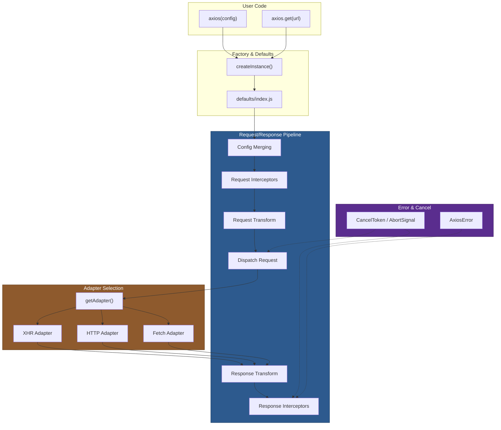

# 01 — Architecture Overview

## Relevant Source Files

- `lib/axios.js` — Main export and instance factory
- `lib/core/Axios.js` — Core class and request orchestration
- `lib/defaults/index.js` — Default configuration
- `lib/adapters/adapters.js` — Adapter resolution
- `lib/core/InterceptorManager.js` — Interceptor chain management
- `package.json` — Dependencies and scripts

## TL;DR

Axios is a promise-based HTTP client built on a request/response pipeline orchestrated by the `Axios` class. Requests flow through interceptor chains, config merging, request transformation, adapter dispatch, response transformation, and then back through response interceptors. The adapter pattern abstracts environment differences: XHR for browsers, HTTP for Node.js, and Fetch API as a fallback.

## Overview

Axios is a lightweight but fully-featured HTTP library for making requests in JavaScript environments. It runs on three primary transports: the browser's XMLHttpRequest (XHR) API, Node.js's HTTP module, and the modern Fetch API. The architecture revolves around a single concept: **requests are processed through a deterministic pipeline** with extension points (interceptors) and environment-aware transport selection (adapters).

At the highest level, a developer calls `axios(config)` or `axios.get(url)`, which invokes the `Axios.request()` method. This method orchestrates a five-stage pipeline:

1. **Config Merging:** Combine instance defaults with request-specific config.
2. **Request Interceptors:** Run user-provided middleware to modify the request.
3. **Request Transformation & Dispatch:** Serialize data, set headers, select an adapter, and send.
4. **Response Transformation:** Deserialize response data and format headers.
5. **Response Interceptors:** Run user-provided middleware to process the response.

This architecture mirrors popular server frameworks (Express, Django) and makes HTTP feel like a single abstraction rather than a browser-vs-Node.js split.

## Architecture Diagram



## Key Concepts

| Concept | Description | Source |
|---------|-------------|--------|
| **Axios Instance** | A request function with methods (get, post, etc.) and interceptor stacks. Created via `new Axios(config)` and bound to the user-facing API. | `lib/axios.js:L28-L44`, `lib/core/Axios.js:L22-L29` |
| **Config Object** | Plain JavaScript object with URL, method, headers, data, timeout, and other request/response options. Merged from defaults and per-request overrides. | `lib/core/mergeConfig.js`, `lib/defaults/index.js` |
| **Interceptor Chain** | Stack of (fulfilled, rejected) handler pairs stored in `InterceptorManager`. Requests run interceptors in order; responses run them in reverse. | `lib/core/InterceptorManager.js:L5-L70` |
| **Adapter** | Environment-specific transport function `(config) => Promise<response>`. Hides XHR/HTTP/Fetch differences. | `lib/adapters/adapters.js:L63-L113` |
| **Dispatch Request** | Central orchestrator that transforms request data, checks cancellation, invokes the adapter, transforms response, and handles errors. | `lib/core/dispatchRequest.js:L34-L77` |
| **AxiosError** | Custom error class wrapping request config, request object, and response (if available). Always thrown on failure. | `lib/core/AxiosError.js:L5-L60` |
| **Cancellation** | Two mechanisms: `CancelToken` (promise-based) and `AbortSignal` (modern). Both integrate into `dispatchRequest()`. | `lib/cancel/CancelToken.js`, `lib/core/dispatchRequest.js:L17-L25` |

## How It Works

### Entry Point: Creating an Instance

When you `import axios from 'axios'`, you get a pre-configured instance of `Axios` created by `createInstance()` in `lib/axios.js:L28-L44`. This function:

1. Creates a new `Axios` object with default config.
2. Binds the `request()` method to the instance so `this` always refers to the config context.
3. Copies all prototype methods (get, post, put, patch, delete, head, options) onto the instance.
4. Attaches helper methods like `axios.all()`, `axios.spread()`, and `axios.create()`.

Key: The instance is a **bound function**, not a class. You call it like `axios(config)` (via `request()`), not `axios.request(config)`.

### Creating Custom Instances

Calling `axios.create(customConfig)` invokes `createInstance(mergeConfig(defaults, customConfig))`, returning a new instance with merged defaults. This allows:

```javascript
const instance = axios.create({ baseURL: 'https://api.example.com' });
instance.get('/users'); // Uses baseURL in all requests
```

### The Request Pipeline

When you call `axios.get('/users')` (or `axios(config)`), the `Axios.request()` method executes in this order:

1. **Argument Parsing** (`lib/core/Axios.js:L66-L74`): If the first arg is a string, treat it as URL; otherwise, use it as config.

2. **Config Merging** (`lib/core/Axios.js:L76`): Call `mergeConfig(this.defaults, config)` to combine instance defaults with request-specific overrides.

3. **Config Validation** (`lib/core/Axios.js:L78-L150`): Validate `transitional`, `paramsSerializer`, and `headers` options.

4. **Request Interceptors** (`lib/core/Axios.js:L150-L180`): Build a promise chain that runs all request interceptors in order. Each interceptor can modify the config or reject.

5. **Dispatch Request** (`lib/core/Axios.js:L180`): Call `dispatchRequest(config)`, which:
   - Transforms the request data via `transformRequest`.
   - Selects an adapter via `getAdapter(config.adapter || defaults.adapter)`.
   - Invokes the adapter: `adapter(config)`.

6. **Response Interceptors** (`lib/core/Axios.js:L180-L200`): Run response interceptors in reverse order. Each can modify the response or reject.

7. **Error Handling**: If any step throws or rejects, the error is wrapped in `AxiosError` and passed through the promise chain.

### Cancellation & Error Recovery

At multiple points, the pipeline checks for cancellation:

- Before dispatch: `throwIfCancellationRequested()` in `lib/core/dispatchRequest.js:L17-L25`.
- After response: Another cancellation check to prevent processing a canceled response.

Both `CancelToken` (legacy) and `AbortSignal` (modern) are supported. When either is triggered, a `CanceledError` is thrown, stopping the pipeline.

### Config Merging Strategy

`mergeConfig()` uses property-specific strategies:

- **Headers**: Deep merge with case-insensitive keys (via `AxiosHeaders`).
- **Data, Params**: Use the source value directly (no merge).
- **Timeout, MaxRedirects**: Use the source value.
- **Custom properties**: Use source if defined, else target.

This allows instance defaults to provide baseURL and default headers while request-specific config overrides them. See [06 — Configuration & Config Merging](06-config-merging.md) for details.

## Component Reference

| Component | Type | Responsibility | Source |
|-----------|------|----------------|--------|
| `Axios` | class | Holds instance config, interceptor stacks; implements HTTP method shortcuts; orchestrates request pipeline. | `lib/core/Axios.js:L22-L400` |
| `createInstance()` | factory fn | Creates an Axios instance, binds methods, attaches helpers. | `lib/axios.js:L28-L44` |
| `InterceptorManager` | class | Manages a stack of (fulfilled, rejected) handlers. Supports add, remove, clear, iterate. | `lib/core/InterceptorManager.js:L5-L70` |
| `dispatchRequest()` | function | Orchestrates request transformation, adapter dispatch, response transformation, cancellation checks. | `lib/core/dispatchRequest.js:L34-L77` |
| `mergeConfig()` | function | Merges two config objects using property-specific strategies. Returns new config object. | `lib/core/mergeConfig.js:L17-L95` |
| `getAdapter()` | function | Selects the appropriate transport adapter (XHR, HTTP, or Fetch) based on config and environment. | `lib/adapters/adapters.js:L63-L113` |
| `AxiosError` | class | Custom error wrapping request, response, and error context. Thrown on any failure. | `lib/core/AxiosError.js:L5-L60` |
| `AxiosHeaders` | class | Header management with case-insensitive lookups and normalization. | `lib/core/AxiosHeaders.js:L1-L250+` |
| `CancelToken` | class | Promise-based cancellation mechanism. Deprecated in favor of AbortSignal. | `lib/cancel/CancelToken.js:L12-L120` |

## Environment Detection & Adapters

Axios automatically detects its runtime environment:

- **Browser**: Uses XHR via `lib/adapters/xhr.js`.
- **Node.js**: Uses HTTP/HTTPS via `lib/adapters/http.js`.
- **Fetch API support**: Uses `lib/adapters/fetch.js` if configured.

The `getAdapter()` function in `lib/adapters/adapters.js:L63-L113` implements this selection logic. It tries each adapter in the configured list (`['xhr', 'http', 'fetch']` by default) and returns the first one that works. If none are available, it throws an `AxiosError` with a detailed message.

## Extension Points

### Interceptors

Modify requests and responses before transmission and after receipt:

```javascript
instance.interceptors.request.use(config => {
  config.headers.Authorization = `Bearer ${token}`;
  return config;
});

instance.interceptors.response.use(
  response => response,
  error => {
    if (error.response.status === 401) {
      // redirect to login
    }
    return Promise.reject(error);
  }
);
```

### Transform Functions

Custom serialization/deserialization:

```javascript
axios.create({
  transformRequest: [data => {
    // Custom serialization
    return customSerialize(data);
  }],
  transformResponse: [response => {
    // Custom deserialization
    return customDeserialize(response);
  }]
});
```

### Config Defaults

Set instance-level defaults:

```javascript
const instance = axios.create({
  baseURL: 'https://api.example.com',
  timeout: 10000,
  headers: { 'X-Custom': 'value' }
});
```

## Gotchas & Conventions

> **Gotcha**: Interceptors are not executed in LIFO order for requests. Request interceptors run in the order they were added (FIFO), while response interceptors run in reverse (LIFO). This can be surprising.
> See `lib/core/Axios.js:L150-L200` for the promise chain construction.

> **Gotcha**: The `data` config property is always serialized in-place by `transformRequest`. Custom transform functions must return the transformed value.
> See `lib/core/dispatchRequest.js:L40`.

> **Convention**: All adapters follow the contract `(config) => Promise<response>`. They must handle cancellation, errors, and timeouts uniformly.
> See `lib/adapters/http.js` and `lib/adapters/xhr.js` for examples.

> **Tip**: To debug the request pipeline, enable debug logging at multiple points:
> - Set `config.transitional.clarifyTimeoutError = true` to get clearer timeout errors.
> - Inspect `config.headers` in interceptors to see current headers.
> - Use `config.signal` to check the AbortSignal state.

## Cross-References

- For details on the `Axios` class and HTTP methods, see [02 — HTTP Client Core](02-http-client-core.md).
- For the request/response flow, see [03 — Request Pipeline](03-request-pipeline.md).
- For interceptor implementation, see [04 — Interceptors & Middleware](04-interceptors.md).
- For adapter details, see [05 — Adapters](05-adapters.md).
- For config merging, see [06 — Configuration & Config Merging](06-config-merging.md).
- For error handling and cancellation, see [07 — Error Handling & Cancellation](07-error-handling.md).
