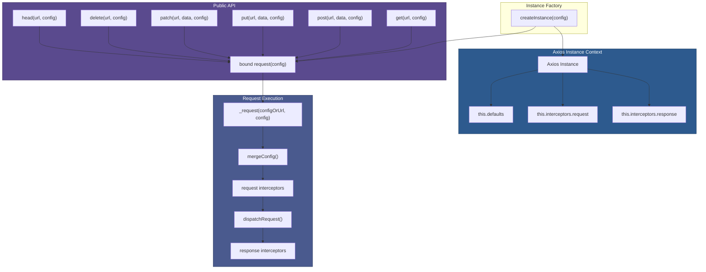

# 02 — HTTP Client Core

## Relevant Source Files

- `lib/core/Axios.js` — The `Axios` class, request method, and HTTP shortcuts
- `lib/axios.js` — Instance factory and export
- `lib/helpers/bind.js` — Function binding utility
- `lib/utils.js` — Utility functions for object manipulation
- `lib/defaults/index.js` — Default configuration

## TL;DR

The `Axios` class is the backbone of the library. It holds instance configuration and interceptor stacks, implements HTTP method shortcuts (get, post, put, patch, delete, etc.), and exports the `request()` method that drives the request pipeline. Every instance is created via `axios.create(config)`, which merges config with defaults and returns a bound function that looks like `axios(config)` but is actually `Axios.prototype.request.bind(context)`.

## Overview

The `Axios` class (in `lib/core/Axios.js`) is a simple yet powerful abstraction that orchestrates HTTP requests. It is never instantiated directly by users; instead, it is instantiated once per Axios instance and its `request()` method is bound to a public function.

The class serves two main purposes:

1. **Storage**: Hold instance defaults (baseURL, timeout, headers, etc.) and interceptor stacks (request and response).
2. **API**: Provide the `request()` method plus convenient HTTP method shortcuts (get, post, put, patch, delete, head, options).

When you call `axios.get(url)`, it internally calls `axios.request({ method: 'get', url })`. All HTTP methods simply invoke `request()` with the appropriate method and config.

## Architecture Diagram



## Key Concepts

| Concept | Description | Source |
|---------|-------------|--------|
| **Axios Instance** | An object with a `request()` method, HTTP shortcuts (get, post, etc.), and interceptor stacks. Created by `createInstance()`. | `lib/core/Axios.js:L22-L29` |
| **Bound Request Function** | The `request()` method bound to the instance context so `this` refers to the Axios instance. Allows `axios(config)` syntax. | `lib/axios.js:L30` |
| **HTTP Method Shortcuts** | Functions like `get()`, `post()`, etc., that invoke `request()` with the appropriate HTTP method. | `lib/core/Axios.js:L200-L250+` |
| **Instance Defaults** | Configuration object (`this.defaults`) merged with every request config. Set via `axios.create({ ... })`. | `lib/core/Axios.js:L23-L24`, `lib/axios.js:L39-L40` |
| **Interceptor Stacks** | `this.interceptors.request` and `this.interceptors.response` are `InterceptorManager` instances that hold middleware. | `lib/core/Axios.js:L25-L28` |
| **Config Validation** | Checks transitional options, param serializers, and headers config before executing the pipeline. | `lib/core/Axios.js:L78-L150` |

## How It Works

### Instance Creation

When you call `axios.create(config)`, the factory function in `lib/axios.js:L28-L44` executes:

```javascript
function createInstance(defaultConfig) {
  const context = new Axios(defaultConfig);
  const instance = bind(Axios.prototype.request, context);
  utils.extend(instance, Axios.prototype, context, { allOwnKeys: true });
  utils.extend(instance, context, null, { allOwnKeys: true });
  instance.create = function create(instanceConfig) {
    return createInstance(mergeConfig(defaultConfig, instanceConfig));
  };
  return instance;
}
```

**Step-by-step:**

1. **Create context**: `new Axios(defaultConfig)` creates an instance object with `defaults` and `interceptors`.
2. **Bind request**: `bind(Axios.prototype.request, context)` creates a function that, when called, invokes `Axios.prototype.request` with `this === context`.
3. **Copy methods**: `utils.extend(instance, Axios.prototype, context)` copies all prototype methods (get, post, request, etc.) to the instance function.
4. **Copy properties**: `utils.extend(instance, context)` copies `defaults` and `interceptors` to the instance function.
5. **Add factory**: `instance.create = function(cfg) { ... }` allows creating new instances with merged config.
6. **Return instance**: The final `instance` is a function that behaves like a method-laden object.

### The Constructor

The `Axios` constructor in `lib/core/Axios.js:L22-L29` is minimal:

```javascript
class Axios {
  constructor(instanceConfig) {
    this.defaults = instanceConfig || {};
    this.interceptors = {
      request: new InterceptorManager(),
      response: new InterceptorManager(),
    };
  }
}
```

It stores the config and initializes empty interceptor stacks. Nothing more.

### The Request Method

The `request()` method in `lib/core/Axios.js:L39-L64` is an async wrapper around `_request()`:

```javascript
async request(configOrUrl, config) {
  try {
    return await this._request(configOrUrl, config);
  } catch (err) {
    // Error stack trace enhancement
    if (err instanceof Error) {
      let dummy = {};
      Error.captureStackTrace ? Error.captureStackTrace(dummy) : (dummy = new Error());
      const stack = dummy.stack ? dummy.stack.replace(/^.+\n/, '') : '';
      try {
        if (!err.stack) {
          err.stack = stack;
        } else if (stack && !String(err.stack).endsWith(stack.replace(/^.+\n.+\n/, ''))) {
          err.stack += '\n' + stack;
        }
      } catch (e) {
        // ignore
      }
    }
    throw err;
  }
}
```

The outer async wrapper improves stack traces by capturing the call site. The actual work is in `_request()`.

### The _request Method (Detailed)

`_request()` in `lib/core/Axios.js:L66-L300+` is where the pipeline lives. Here's the flow:

#### 1. Parse Arguments

```javascript
if (typeof configOrUrl === 'string') {
  config = config || {};
  config.url = configOrUrl;
} else {
  config = configOrUrl || {};
}
```

Allow both `axios('/url')` and `axios({ url: '/url' })` syntaxes.

#### 2. Merge Config

```javascript
config = mergeConfig(this.defaults, config);
```

Combine instance defaults with request-specific config. See [06 — Configuration & Config Merging](06-config-merging.md).

#### 3. Validate Config

```javascript
const { transitional, paramsSerializer, headers } = config;

if (transitional !== undefined) {
  validator.assertOptions(
    transitional,
    {
      silentJSONParsing: validators.transitional(validators.boolean),
      forcedJSONParsing: validators.transitional(validators.boolean),
      clarifyTimeoutError: validators.transitional(validators.boolean),
      legacyInterceptorReqResOrdering: validators.transitional(validators.boolean),
    },
    false
  );
}
```

Validate transitional options and other config properties. Throws if invalid.

#### 4. Build Promise Chain

```javascript
let promise = Promise.resolve(config);

this.interceptors.request.forEach(function unshiftRequestInterceptors(interceptor) {
  promise = promise.then(
    interceptor.fulfilled,
    interceptor.rejected
  );
});

promise = promise.then(dispatchRequest, undefined);

this.interceptors.response.forEach(function pushResponseInterceptors(interceptor) {
  promise = promise.then(
    interceptor.fulfilled,
    interceptor.rejected
  );
});

return promise;
```

This is the heart of the pipeline. A promise chain is built:
- Start with a resolved promise of the config.
- Add request interceptors (unshift them, so they run in FIFO order).
- Add the dispatch step.
- Add response interceptors (push them, so they run in LIFO order).
- Return the final promise chain.

### HTTP Method Shortcuts

HTTP method shortcuts are defined on the Axios prototype:

```javascript
Axios.prototype.get = function(url, config) {
  return this.request(mergeConfig(config || {}, { method: 'get', url: url }));
};

Axios.prototype.post = function(url, data, config) {
  return this.request(mergeConfig(config || {}, { method: 'post', url: url, data: data }));
};

// ... similar for put, patch, delete, head, options, request
```

Each shortcuts simply invokes `request()` with the appropriate method. This is how `axios.get('/users')` works.

## Component Reference

| Component | Type | Responsibility | Source |
|-----------|------|----------------|--------|
| `Axios` | class | Stores instance config, interceptor stacks; provides request() method and HTTP shortcuts. | `lib/core/Axios.js:L22-L400` |
| `Axios.prototype.request()` | async method | Entry point for HTTP requests. Wraps `_request()` and enhances stack traces. | `lib/core/Axios.js:L39-L64` |
| `Axios.prototype._request()` | method | Parses config, merges with defaults, validates, and builds the promise chain. Core pipeline logic. | `lib/core/Axios.js:L66-L300+` |
| `Axios.prototype.get()` | shortcut | Calls `request({ method: 'get', url, ... })`. | `lib/core/Axios.js:L200-L210` |
| `Axios.prototype.post()` | shortcut | Calls `request({ method: 'post', url, data, ... })`. | `lib/core/Axios.js:L220-L230` |
| `Axios.prototype.put()` | shortcut | Calls `request({ method: 'put', url, data, ... })`. | `lib/core/Axios.js:L240-L250` |
| `Axios.prototype.patch()` | shortcut | Calls `request({ method: 'patch', url, data, ... })`. | `lib/core/Axios.js:L260-L270` |
| `Axios.prototype.delete()` | shortcut | Calls `request({ method: 'delete', url, ... })`. | `lib/core/Axios.js:L280-L290` |
| `Axios.prototype.head()` | shortcut | Calls `request({ method: 'head', url, ... })`. | `lib/core/Axios.js:L300-L310` |
| `createInstance()` | factory | Creates a new Axios instance, binds methods, returns as a callable function. | `lib/axios.js:L28-L44` |

## Data Flow

A typical request flow:

```
User Code
  ↓
axios.get('/api/users')
  ↓ (HTTP shortcut)
axios.request({ method: 'get', url: '/api/users' })
  ↓ (bound function)
Axios.prototype.request.call(context, config)
  ↓ (async wrapper)
Axios.prototype._request(config, undefined)
  ↓ (argument parsing & merging)
config = mergeConfig(this.defaults, config)
  ↓ (build promise chain)
promise = Promise.resolve(config)
  → add request interceptors
  → add dispatchRequest
  → add response interceptors
  ↓ (chain returns)
Promise<response>
  ↓ (user code)
.then(response => { ... })
.catch(error => { ... })
```

## Config Example

When you call:

```javascript
const instance = axios.create({
  baseURL: 'https://api.example.com',
  timeout: 5000,
  headers: { 'X-Custom': 'value' }
});

instance.get('/users', {
  headers: { 'X-Request-ID': '123' }
});
```

The config merging produces:

```javascript
{
  baseURL: 'https://api.example.com',  // from defaults
  timeout: 5000,                       // from defaults
  method: 'get',                       // from shortcut
  url: '/users',                       // from shortcut
  headers: {
    'X-Custom': 'value',               // from defaults (merged)
    'X-Request-ID': '123'              // from request (merged)
  }
}
```

Headers are merged; other properties are overridden.

## Gotchas & Conventions

> **Gotcha**: The `request()` method is async, but the actual dispatch happens inside the promise chain returned by `_request()`. You must `await` or `.then()` to wait for the request to complete.
> See `lib/core/Axios.js:L39`.

> **Gotcha**: HTTP shortcuts like `post()` take `(url, data, config)` as arguments, not `(config)`. This is different from `request()`, which takes `(config)` or `(url, config)`.
> See `lib/core/Axios.js:L220-L230`.

> **Convention**: All HTTP methods are lowercase: `get`, `post`, `put`, `patch`, `delete`, `head`, `options`. There is no `GET`, `POST`, etc.

> **Tip**: To add global interceptors, attach to `axios.interceptors.request` or `axios.interceptors.response`. Instance-specific interceptors are attached to `instance.interceptors.*`.

## Cross-References

- For the full request pipeline, see [03 — Request Pipeline](03-request-pipeline.md).
- For interceptor details, see [04 — Interceptors & Middleware](04-interceptors.md).
- For config merging, see [06 — Configuration & Config Merging](06-config-merging.md).
- For dispatcher implementation, see [03 — Request Pipeline](03-request-pipeline.md).
- For errors, see [07 — Error Handling & Cancellation](07-error-handling.md).
