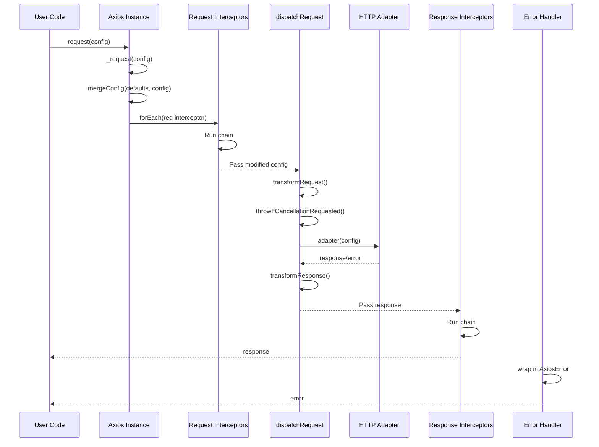

# 03 — Request Pipeline

## Relevant Source Files

- `lib/core/Axios.js` — Promise chain construction in `_request()`
- `lib/core/dispatchRequest.js` — Request dispatch orchestrator
- `lib/core/transformData.js` — Request/response transformation
- `lib/core/AxiosHeaders.js` — Header normalization
- `lib/adapters/adapters.js` — Adapter selection
- `lib/cancel/CanceledError.js` — Cancellation error

## TL;DR

The request pipeline is a six-stage promise chain: (1) merge config, (2) run request interceptors, (3) transform request data and dispatch via adapter, (4) run response interceptors, (5) transform response data, and (6) return or reject. Cancellation is checked before dispatch and after response. Errors are wrapped in `AxiosError` and propagated through the chain.

## Overview

The request pipeline is the beating heart of Axios. It orchestrates the journey from a user's `axios.get('/url')` call to the final response or error. The pipeline is built as a **promise chain** in `_request()` and executed synchronously, with each step waiting for the previous one to complete.

The pipeline stages are:

1. **Config Merge**: Combine instance defaults with request-specific config.
2. **Request Interceptors**: Run user middleware to modify the config before sending.
3. **Dispatch**: Transform request data, select adapter, invoke it, transform response.
4. **Response Interceptors**: Run user middleware to process the response.
5. **Error Handling**: Catch and wrap errors in `AxiosError`.

This design mirrors server frameworks (Express) and makes HTTP requests feel like a single, composable abstraction.

## Architecture Diagram



## Key Concepts

| Concept | Description | Source |
|---------|-------------|--------|
| **Promise Chain** | Sequential execution of interceptors and dispatch steps via `.then()` chaining. | `lib/core/Axios.js:L150-L200` |
| **Request Interceptor** | Middleware that runs before dispatch. Receives config, can modify it or reject. | `lib/core/InterceptorManager.js` |
| **Response Interceptor** | Middleware that runs after adapter response. Receives response, can modify or reject. | `lib/core/InterceptorManager.js` |
| **dispatchRequest** | Central orchestrator that transforms data, checks cancellation, invokes adapter, handles errors. | `lib/core/dispatchRequest.js:L34-L77` |
| **Transform Request** | Serialize request data (JSON, FormData, URL-encoded) based on content-type. | `lib/core/transformData.js` |
| **Transform Response** | Deserialize response data (JSON parse, etc.) based on content-type. | `lib/core/transformData.js` |
| **Adapter** | Environment-specific transport (XHR, HTTP, Fetch). Selected via `getAdapter()`. | `lib/adapters/adapters.js` |
| **Cancellation Check** | `throwIfCancellationRequested()` throws `CanceledError` if request was aborted. | `lib/core/dispatchRequest.js:L17-L25` |

## How It Works

### 1. Promise Chain Construction

In `lib/core/Axios.js:L150-L200`, `_request()` builds a promise chain from scratch:

```javascript
let promise = Promise.resolve(config);

// Unshift request interceptors (FIFO order)
this.interceptors.request.forEach(function unshiftRequestInterceptors(interceptor) {
  promise = promise.then(
    interceptor.fulfilled,
    interceptor.rejected
  );
});

// Add the dispatch step
promise = promise.then(dispatchRequest, undefined);

// Push response interceptors (LIFO order)
this.interceptors.response.forEach(function pushResponseInterceptors(interceptor) {
  promise = promise.then(
    interceptor.fulfilled,
    interceptor.rejected
  );
});

return promise;
```

**Key insight**: The chain is built by successive `.then()` calls. Request interceptors are added in FIFO order (first-in, first-out), but since they're chained, they execute in the order they were added. Response interceptors are added last but execute in LIFO order because they're chained after dispatch.

### 2. Request Interceptors

Request interceptors are executed before `dispatchRequest`. Each interceptor receives the `config` object and can:

- **Modify it**: `config.headers.Authorization = 'Bearer ' + token;`
- **Replace it**: `return mergeConfig(config, { newProp: 'value' });`
- **Reject it**: `return Promise.reject(new Error('auth failed'));`

Example:

```javascript
instance.interceptors.request.use(
  config => {
    config.headers.Authorization = `Bearer ${getToken()}`;
    return config;
  },
  error => {
    console.error('Request interceptor error:', error);
    return Promise.reject(error);
  }
);
```

### 3. dispatchRequest() — The Core Orchestrator

`dispatchRequest()` in `lib/core/dispatchRequest.js:L34-L77` is where the actual HTTP request happens:

```javascript
export default function dispatchRequest(config) {
  throwIfCancellationRequested(config);

  config.headers = AxiosHeaders.from(config.headers);

  // Transform request data
  config.data = transformData.call(config, config.transformRequest);

  if (['post', 'put', 'patch'].indexOf(config.method) !== -1) {
    config.headers.setContentType('application/x-www-form-urlencoded', false);
  }

  const adapter = adapters.getAdapter(config.adapter || defaults.adapter, config);

  return adapter(config).then(
    function onAdapterResolution(response) {
      throwIfCancellationRequested(config);
      response.data = transformData.call(config, config.transformResponse, response);
      response.headers = AxiosHeaders.from(response.headers);
      return response;
    },
    function onAdapterRejection(reason) {
      if (!isCancel(reason)) {
        throwIfCancellationRequested(config);
        if (reason && reason.response) {
          reason.response.data = transformData.call(config, config.transformResponse, reason.response);
          reason.response.headers = AxiosHeaders.from(reason.response.headers);
        }
      }
      return Promise.reject(reason);
    }
  );
}
```

**Step-by-step:**

#### 3a. Check Cancellation

```javascript
throwIfCancellationRequested(config);
```

If the request was canceled (via `CancelToken` or `AbortSignal`), throw `CanceledError` immediately. See [07 — Error Handling & Cancellation](07-error-handling.md).

#### 3b. Normalize Headers

```javascript
config.headers = AxiosHeaders.from(config.headers);
```

Convert headers to an `AxiosHeaders` instance for case-insensitive lookups and normalization.

#### 3c. Transform Request Data

```javascript
config.data = transformData.call(config, config.transformRequest);
```

Invoke the `transformRequest` function (or array of functions) to serialize request data. Default behavior:

- Convert FormData to JSON or form-encoded.
- Stringify objects to JSON.
- Leave buffers and streams as-is.

See `lib/core/transformData.js` for details.

#### 3d. Set Content-Type for Body Methods

```javascript
if (['post', 'put', 'patch'].indexOf(config.method) !== -1) {
  config.headers.setContentType('application/x-www-form-urlencoded', false);
}
```

For POST, PUT, PATCH, ensure a Content-Type is set if not already present.

#### 3e. Select Adapter

```javascript
const adapter = adapters.getAdapter(config.adapter || defaults.adapter, config);
```

Call `getAdapter()` to choose the appropriate transport (XHR, HTTP, or Fetch). See [05 — Adapters](05-adapters.md).

#### 3f. Invoke Adapter

```javascript
return adapter(config).then(
  function onAdapterResolution(response) { ... },
  function onAdapterRejection(reason) { ... }
);
```

Call the adapter function, which returns a Promise. The adapter is responsible for making the actual HTTP request. It resolves with a response object or rejects with an error.

#### 3g. Transform Response Data

If the adapter resolves, transform the response data:

```javascript
response.data = transformData.call(config, config.transformResponse, response);
response.headers = AxiosHeaders.from(response.headers);
```

Invoke the `transformResponse` function (or array of functions) to deserialize response data. Default behavior:

- Parse JSON strings to objects.
- Leave other data as-is.

#### 3h. Handle Adapter Errors

If the adapter rejects, check if it's a cancellation error (if so, propagate as-is). Otherwise, transform the response data if available and re-throw:

```javascript
if (reason && reason.response) {
  reason.response.data = transformData.call(config, config.transformResponse, reason.response);
  reason.response.headers = AxiosHeaders.from(reason.response.headers);
}
return Promise.reject(reason);
```

### 4. Response Interceptors

Response interceptors run after `dispatchRequest` and before returning to the user. Each interceptor receives the `response` object and can:

- **Inspect it**: Check status, data, headers.
- **Modify it**: Change response.data, add properties.
- **Reject it**: `return Promise.reject(new Error('bad data'));` to trigger error handling.

Example:

```javascript
instance.interceptors.response.use(
  response => {
    if (response.data.meta) {
      response.data = response.data.data; // Unwrap custom envelope
    }
    return response;
  },
  error => {
    if (error.response?.status === 401) {
      // Redirect to login or refresh token
      return Promise.reject(error);
    }
    return Promise.reject(error);
  }
);
```

### 5. Error Handling

Errors at any stage are wrapped in `AxiosError` in the adapter layer. The error flows up the promise chain:

- Request interceptor throws → captured by next interceptor's rejected handler or returned to user.
- Dispatch throws → captured by response interceptor's rejected handler or returned to user.
- Response interceptor throws → returned to user.

The final promise rejects with the error.

## Component Reference

| Component | Type | Responsibility | Source |
|-----------|------|----------------|--------|
| `promise chain` | structure | Sequential execution of interceptors and dispatch via `.then()` chaining. | `lib/core/Axios.js:L150-L200` |
| `dispatchRequest()` | function | Orchestrates request transformation, adapter dispatch, response transformation, error handling. | `lib/core/dispatchRequest.js:L34-L77` |
| `transformData()` | function | Applies transform functions to request/response data. Default: JSON serialization/deserialization. | `lib/core/transformData.js` |
| `throwIfCancellationRequested()` | function | Throws `CanceledError` if cancellation was requested. | `lib/core/dispatchRequest.js:L17-L25` |
| `AxiosHeaders.from()` | static method | Converts headers object to `AxiosHeaders` instance for case-insensitive access. | `lib/core/AxiosHeaders.js` |
| `adapter()` | function | Environment-specific transport. Invoked by `dispatchRequest()`. | `lib/adapters/http.js`, `lib/adapters/xhr.js`, `lib/adapters/fetch.js` |

## Data Flow Example

User calls:

```javascript
axios.post('/api/data', { name: 'John' }, { headers: { 'X-Custom': 'value' } });
```

Flow:

```
1. _request() merges config:
   {
     method: 'post',
     url: '/api/data',
     data: { name: 'John' },
     headers: { 'X-Custom': 'value', ... defaults }
   }

2. Request interceptors run:
   - Interceptor A adds Authorization header
   - Config passed to next step

3. dispatchRequest(config):
   - throwIfCancellationRequested() — OK
   - transformRequest() converts data to JSON: '{"name":"John"}'
   - getAdapter() returns xhrAdapter
   - xhrAdapter(config) makes XMLHttpRequest
   - Response arrives as { status: 200, data: '{"result":"success"}', ... }
   - transformResponse() parses JSON: { result: 'success' }

4. Response interceptors run:
   - Interceptor B unwraps custom envelope
   - Response returned to user

5. User's .then() receives:
   { status: 200, data: { result: 'success' }, ... }
```

## Gotchas & Conventions

> **Gotcha**: Request interceptors run in FIFO order (first-added first-executed), but response interceptors run in LIFO order (last-added first-executed). This is because request interceptors are unshifted (prepended) to the chain, while response interceptors are pushed (appended).
> See `lib/core/Axios.js:L150-L200`.

> **Gotcha**: If a request interceptor throws, the next request interceptor's `rejected` handler receives the error. You must explicitly `throw` or `return Promise.reject()` to reject the chain.
> See `lib/core/Axios.js:L160`.

> **Gotcha**: `transformData()` returns the transformed value, but it also modifies `config.data` or `response.data` in-place. If you provide a custom transform function, it must return the transformed value.
> See `lib/core/dispatchRequest.js:L40`.

> **Convention**: All adapters follow the contract `(config) => Promise<response>`. They must set `response.status`, `response.statusText`, `response.headers`, and `response.data`.

> **Tip**: To debug the pipeline, log in interceptors:
> ```javascript
> instance.interceptors.request.use(config => {
>   console.log('Request:', config);
>   return config;
> });
> instance.interceptors.response.use(response => {
>   console.log('Response:', response);
>   return response;
> });
> ```

## Cross-References

- For interceptor details, see [04 — Interceptors & Middleware](04-interceptors.md).
- For adapter implementation, see [05 — Adapters](05-adapters.md).
- For transformation details, see [05 — Adapters](05-adapters.md) (request/response transform functions).
- For cancellation and error handling, see [07 — Error Handling & Cancellation](07-error-handling.md).
- For config structure, see [06 — Configuration & Config Merging](06-config-merging.md).
