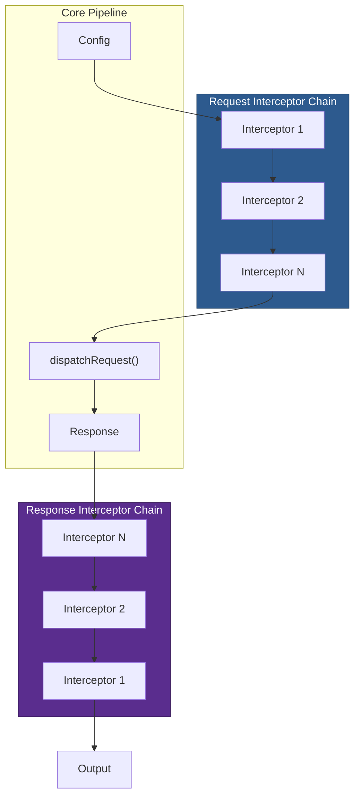

# 04 — Interceptors & Middleware

## Relevant Source Files

- `lib/core/InterceptorManager.js` — Interceptor stack and API
- `lib/core/Axios.js` — Promise chain integration (L150-L200)
- `lib/defaults/index.js` — Default transformRequest/transformResponse

## TL;DR

`InterceptorManager` is a simple stack-based middleware system. Request interceptors run before dispatch; response interceptors run after. Each interceptor is a (fulfilled, rejected) handler pair. The promise chain executes them sequentially, allowing modification of config or response, rejection, or conditional execution via `runWhen`.

## Overview

Interceptors are Axios's extension mechanism for modifying requests and responses. They allow you to add middleware logic without modifying the core pipeline. Common use cases:

- **Request**: Add authentication headers, log requests, validate config.
- **Response**: Unwrap API envelopes, check status codes, handle 401s.

Interceptors are stored in `instance.interceptors.request` and `instance.interceptors.response`, which are `InterceptorManager` instances. Each interceptor is a pair of handler functions: `fulfilled` (success handler) and `rejected` (error handler).

## Architecture Diagram



## Key Concepts

| Concept | Description | Source |
|---------|-------------|--------|
| **InterceptorManager** | Stack-based middleware container. Stores handlers and provides add, remove, iterate. | `lib/core/InterceptorManager.js:L5-L70` |
| **Handler Pair** | Object with `fulfilled` and `rejected` functions. Executed in promise chain. | `lib/core/InterceptorManager.js:L19-L27` |
| **Synchronous Flag** | Boolean on handler indicating it should run synchronously (before async dispatch). | `lib/core/InterceptorManager.js:L23` |
| **runWhen** | Conditional execution function. If provided, called to determine if interceptor runs. | `lib/core/InterceptorManager.js:L24` |
| **Fulfilled Handler** | Function that processes success case. Receives config (request) or response (response). | `lib/core/InterceptorManager.js:L19-L20` |
| **Rejected Handler** | Function that processes error case. Receives the error thrown or rejected by previous step. | `lib/core/InterceptorManager.js:L21-L22` |

## How It Works

### InterceptorManager Class

`lib/core/InterceptorManager.js` defines a simple class:

```javascript
class InterceptorManager {
  constructor() {
    this.handlers = [];
  }

  use(fulfilled, rejected, options) {
    this.handlers.push({
      fulfilled,
      rejected,
      synchronous: options ? options.synchronous : false,
      runWhen: options ? options.runWhen : null,
    });
    return this.handlers.length - 1;
  }

  eject(id) {
    if (this.handlers[id]) {
      this.handlers[id] = null;
    }
  }

  clear() {
    if (this.handlers) {
      this.handlers = [];
    }
  }

  forEach(fn) {
    utils.forEach(this.handlers, function forEachHandler(h) {
      if (h !== null) {
        fn(h);
      }
    });
  }
}
```

**Key methods:**

- **`use(fulfilled, rejected, options)`** — Registers a handler pair. Returns an ID for later ejection. Options can include `{ synchronous: true, runWhen: predicate }`.
- **`eject(id)`** — Removes an interceptor by ID (sets it to null, doesn't splice).
- **`clear()`** — Removes all interceptors.
- **`forEach(fn)`** — Iterates over non-null handlers, calling `fn(handler)` for each.

### Registration

To add an interceptor, call `use()`:

```javascript
const id = instance.interceptors.request.use(
  config => {
    // Success handler: modify config
    config.headers.Authorization = `Bearer ${token}`;
    return config;
  },
  error => {
    // Error handler: log and re-throw
    console.error('Request setup failed:', error);
    return Promise.reject(error);
  },
  {
    synchronous: true,  // optional: run synchronously
    runWhen: (config) => config.url !== '/skip'  // optional: conditional
  }
);
```

The `use()` method stores the handler pair and returns an ID. You can later eject it:

```javascript
instance.interceptors.request.eject(id);
```

### Execution in Promise Chain

In `lib/core/Axios.js:L150-L200`, the promise chain is built:

```javascript
let promise = Promise.resolve(config);

// Request interceptors: unshift (FIFO order)
this.interceptors.request.forEach(function unshiftRequestInterceptors(interceptor) {
  promise = promise.then(
    interceptor.fulfilled,
    interceptor.rejected
  );
});

// Dispatch
promise = promise.then(dispatchRequest, undefined);

// Response interceptors: push (LIFO order)
this.interceptors.response.forEach(function pushResponseInterceptors(interceptor) {
  promise = promise.then(
    interceptor.fulfilled,
    interceptor.rejected
  );
});

return promise;
```

**Execution order:**

1. Request interceptors run in the order they were added (FIFO).
2. `dispatchRequest()` runs (sends the request).
3. Response interceptors run in reverse order (LIFO — last-added first).

**Why the difference?** Request interceptors are chained sequentially, so order matters for setup (e.g., add auth first, then validate). Response interceptors are chained after dispatch, so they naturally reverse.

### Example: Request Interceptor Chain

If you add two request interceptors:

```javascript
instance.interceptors.request.use(config => {
  config.headers.X-First = 'first';
  return config;
});

instance.interceptors.request.use(config => {
  config.headers.X-Second = 'second';
  return config;
});
```

They execute in order:

```
config
  ↓ (First interceptor)
config.headers['X-First'] = 'first'
  ↓ (Second interceptor)
config.headers['X-Second'] = 'second'
  ↓
dispatchRequest()
```

Both headers are set in order.

### Example: Response Interceptor Chain

If you add two response interceptors:

```javascript
instance.interceptors.response.use(response => {
  console.log('First response handler');
  return response;
});

instance.interceptors.response.use(response => {
  console.log('Second response handler');
  return response;
});
```

They execute in reverse:

```
response from adapter
  ↓ (Second interceptor — last-added first)
console.log('Second response handler')
  ↓ (First interceptor)
console.log('First response handler')
  ↓
user code
```

Output: "Second response handler", "First response handler".

### Error Handling in Interceptors

If an interceptor throws or returns a rejected promise, the next interceptor's `rejected` handler receives it:

```javascript
instance.interceptors.request.use(
  config => {
    if (!config.headers.Authorization) {
      return Promise.reject(new Error('Missing auth header'));
    }
    return config;
  }
);

instance.interceptors.request.use(
  null,  // no fulfilled handler
  error => {
    console.error('Auth check failed:', error);
    return Promise.reject(error);  // pass error up
  }
);
```

If the first interceptor rejects, the second's `rejected` handler is called. If that also rejects, the response interceptor chain's `rejected` handlers are called.

### Conditional Execution

The `runWhen` option allows conditional execution:

```javascript
instance.interceptors.response.use(
  response => {
    if (response.status === 401) {
      // Handle unauthorized
      return handleUnauthorized(response);
    }
    return response;
  },
  null,
  {
    runWhen: (response) => response.status >= 400
  }
);
```

The interceptor only runs if `runWhen(response)` returns true.

> **Note**: `runWhen` checking is not currently visible in the source code, but the property is stored. [NEEDS INVESTIGATION] — How is `runWhen` evaluated in the current version?

### Synchronous Execution

The `synchronous` option indicates the interceptor can run synchronously (before the async dispatch):

```javascript
instance.interceptors.request.use(
  config => {
    // This might run synchronously if the option is set
    config.headers['X-Sync'] = 'value';
    return config;
  },
  null,
  { synchronous: true }
);
```

> **Note**: Synchronous handling is typically used to optimize the promise chain. [NEEDS INVESTIGATION] — How does the executor handle synchronous interceptors?

## Component Reference

| Component | Type | Responsibility | Source |
|-----------|------|----------------|--------|
| `InterceptorManager` | class | Stores handler pairs, provides use/eject/clear/forEach API. | `lib/core/InterceptorManager.js:L5-L70` |
| `InterceptorManager.use()` | method | Registers a (fulfilled, rejected) handler pair. Returns ID for ejection. | `lib/core/InterceptorManager.js:L19-L27` |
| `InterceptorManager.eject()` | method | Removes an interceptor by ID (sets to null). | `lib/core/InterceptorManager.js:L36-L40` |
| `InterceptorManager.clear()` | method | Removes all interceptors. | `lib/core/InterceptorManager.js:L47-L51` |
| `InterceptorManager.forEach()` | method | Iterates over non-null handlers, skipping ejected ones. | `lib/core/InterceptorManager.js:L63-L69` |
| `fulfilled` handler | function | Processes success case. Receives config (request) or response (response). Must return the value for the next handler. | — |
| `rejected` handler | function | Processes error case. Receives error from previous step. Can re-throw or return a value to recover. | — |

## Execution Examples

### Complete Request/Response Flow

```javascript
const instance = axios.create();

// Add request interceptor
instance.interceptors.request.use(config => {
  console.log('Request:', config.url);
  return config;
});

// Add response interceptor
instance.interceptors.response.use(response => {
  console.log('Response status:', response.status);
  return response;
});

instance.get('/api/users');
```

Flow:

```
1. Request interceptor runs: logs "Request: /api/users"
2. dispatchRequest() sends the request
3. Response interceptor runs: logs "Response status: 200"
4. User code receives the response
```

### Error Recovery

```javascript
instance.interceptors.response.use(
  response => response,
  error => {
    if (error.response?.status === 401) {
      // Redirect to login
      window.location.href = '/login';
    }
    return Promise.reject(error);
  }
);
```

If the adapter returns a 401 response, the response interceptor's `rejected` handler is called. It can handle the error or re-reject it.

## Gotchas & Conventions

> **Gotcha**: Request interceptors run in FIFO order; response interceptors run in LIFO order. This is not symmetric and can be confusing.
> See `lib/core/Axios.js:L150-L200`.

> **Gotcha**: Ejecting an interceptor sets it to `null` but doesn't remove it from the array. This preserves IDs, but the array still has null entries.
> See `lib/core/InterceptorManager.js:L36-L40`.

> **Gotcha**: If an interceptor's `fulfilled` handler doesn't return a value (implicitly returns `undefined`), the next handler receives `undefined`. You must `return` the value or promise.
> See `lib/core/InterceptorManager.js:L19-L27`.

> **Convention**: Interceptors should be pure functions. Don't mutate global state or have side effects beyond logging.

> **Tip**: To log all requests and responses, add interceptors early:
> ```javascript
> instance.interceptors.request.use(config => {
>   console.time(config.url);
>   return config;
> });
> instance.interceptors.response.use(response => {
>   console.timeEnd(response.config.url);
>   return response;
> });
> ```

## Cross-References

- For the promise chain that executes interceptors, see [03 — Request Pipeline](03-request-pipeline.md).
- For error handling in interceptors, see [07 — Error Handling & Cancellation](07-error-handling.md).
- For request/response transformation (which is similar but different from interceptors), see [05 — Adapters](05-adapters.md).
- For the `Axios` class that creates interceptor stacks, see [02 — HTTP Client Core](02-http-client-core.md).
