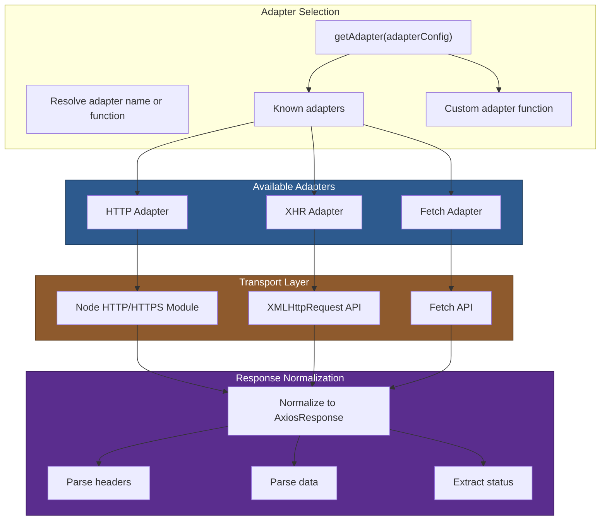

# 05 — Adapters

## Relevant Source Files

- `lib/adapters/adapters.js` — Adapter resolution logic
- `lib/adapters/http.js` — Node.js HTTP/HTTPS adapter
- `lib/adapters/xhr.js` — Browser XMLHttpRequest adapter
- `lib/adapters/fetch.js` — Fetch API adapter
- `lib/core/dispatchRequest.js` — Adapter invocation (L46)
- `lib/core/AxiosError.js` — Error wrapping

## TL;DR

Adapters are environment-specific transport functions that implement `(config) => Promise<response>`. Axios provides three: HTTP (Node.js), XHR (browser), and Fetch API. The `getAdapter()` function selects the first suitable adapter from a list, throwing an error if none are available. Each adapter normalizes its transport's behavior into Axios's response schema.

## Overview

Adapters are the abstraction that allows Axios to work in both browsers and Node.js without conditional imports. An adapter is a function that:

1. Takes a request config.
2. Makes the actual HTTP request using platform-specific APIs (XHR, HTTP, or Fetch).
3. Normalizes the response to Axios's response schema.
4. Returns a Promise that resolves with the response or rejects with an error.

The adapter pattern decouples Axios's pipeline from the transport layer, making it easy to add custom transports or mock them for testing.

## Architecture Diagram



## Key Concepts

| Concept | Description | Source |
|---------|-------------|--------|
| **Adapter Function** | `(config) => Promise<response>` function that makes HTTP requests. | `lib/adapters/http.js`, `lib/adapters/xhr.js`, `lib/adapters/fetch.js` |
| **Adapter Resolution** | `getAdapter()` selects an adapter from a list of names or functions. | `lib/adapters/adapters.js:L63-L113` |
| **Known Adapters** | Built-in adapters: `http` (Node.js), `xhr` (browser), `fetch` (fetch API). | `lib/adapters/adapters.js:L16-L22` |
| **Custom Adapter** | User-provided adapter function passed via `config.adapter`. | `lib/adapters/adapters.js:L63-L113` |
| **Response Schema** | Normalized response object with status, statusText, headers, data, config. | `lib/adapters/http.js`, `lib/adapters/xhr.js` |
| **Cancellation Integration** | Adapters check cancellation signals (AbortSignal) to prevent unnecessary work. | [NEEDS INVESTIGATION] |
| **Error Wrapping** | Adapters wrap HTTP errors in objects with request, response, config context. | `lib/adapters/http.js`, `lib/adapters/xhr.js` |

## How It Works

### Adapter Selection: getAdapter()

`lib/adapters/adapters.js:L63-L113` defines the `getAdapter()` function:

```javascript
function getAdapter(adapters, config) {
  adapters = utils.isArray(adapters) ? adapters : [adapters];

  const { length } = adapters;
  let nameOrAdapter;
  let adapter;

  const rejectedReasons = {};

  for (let i = 0; i < length; i++) {
    nameOrAdapter = adapters[i];
    let id;

    adapter = nameOrAdapter;

    if (!isResolvedHandle(nameOrAdapter)) {
      adapter = knownAdapters[(id = String(nameOrAdapter)).toLowerCase()];

      if (adapter === undefined) {
        throw new AxiosError(`Unknown adapter '${id}'`);
      }
    }

    if (adapter && (utils.isFunction(adapter) || (adapter = adapter.get(config)))) {
      break;
    }

    rejectedReasons[id || '#' + i] = adapter;
  }

  if (!adapter) {
    const reasons = Object.entries(rejectedReasons).map(
      ([id, state]) =>
        `adapter ${id} ` +
        (state === false ? 'is not supported by the environment' : 'is not available in the build')
    );

    let s = length
      ? reasons.length > 1
        ? 'since :\n' + reasons.map(renderReason).join('\n')
        : ' ' + renderReason(reasons[0])
      : 'as no adapter specified';

    throw new AxiosError(
      `There is no suitable adapter to dispatch the request ` + s,
      'ERR_NOT_SUPPORT'
    );
  }

  return adapter;
}
```

**Algorithm:**

1. Normalize `adapters` to an array (if string or function, wrap it).
2. For each adapter in the list:
   - If it's already a function, use it.
   - If it's a string, look it up in `knownAdapters` (case-insensitive).
   - If it's an object with a `get()` method, call `get(config)` to resolve it.
3. Return the first suitable adapter.
4. If none are suitable, throw an error listing why each failed.

**Default adapter list** (from `lib/defaults/index.js:L39`):

```javascript
adapter: ['xhr', 'http', 'fetch']
```

This means: try XHR first (browser), then HTTP (Node.js), then Fetch API (fallback).

### Known Adapters

In `lib/adapters/adapters.js:L16-L22`:

```javascript
const knownAdapters = {
  http: httpAdapter,
  xhr: xhrAdapter,
  fetch: {
    get: fetchAdapter.getFetch,
  },
};
```

Each adapter is either:

- A function: `httpAdapter`, `xhrAdapter`.
- An object with a `get(config)` method: `fetch.get()` which conditionally loads the fetch implementation.

### HTTP Adapter (Node.js)

`lib/adapters/http.js` handles Node.js HTTP/HTTPS requests. It:

1. Selects http or https module based on URL protocol.
2. Creates a request using the appropriate module.
3. Writes request data (body).
4. Handles response events (data chunks, end).
5. Normalizes the response.
6. Handles errors (connection errors, timeouts, etc.).

Key responsibilities:

- **Streaming**: Handle request/response bodies as streams.
- **Redirects**: Follow redirects (via `follow-redirects` dependency).
- **Auth**: Support `auth` config for Basic auth.
- **Proxies**: Support HTTP proxies (via `proxy-from-env`).
- **Compression**: Handle gzip/deflate encoding.

> **Note**: The HTTP adapter is complex and handles many Node.js-specific features. See the source file for details.

### XHR Adapter (Browser)

`lib/adapters/xhr.js` handles browser XMLHttpRequest requests. It:

1. Creates an XMLHttpRequest object.
2. Sets up event listeners (load, error, abort, timeout).
3. Writes request data.
4. Normalizes the response from XHR.
5. Handles browser-specific errors.

Key responsibilities:

- **CORS**: Respect same-origin policy.
- **Credentials**: Support `withCredentials` for cross-origin cookies.
- **Progress**: Expose upload/download progress events.
- **Timeout**: Support `timeout` config.
- **Cancellation**: Respect `AbortSignal` (via `signal` config).

### Fetch Adapter

`lib/adapters/fetch.js` uses the modern Fetch API:

1. Calls `fetch(url, init)` with the config.
2. Converts request/response to Axios's schema.
3. Handles response body reading.
4. Supports cancellation via `AbortSignal`.

The Fetch adapter is simpler than HTTP/XHR but less feature-complete. [NEEDS INVESTIGATION] — What features are missing or limited in the Fetch adapter?

### Response Normalization

All adapters normalize their response to Axios's schema:

```javascript
{
  status: 200,
  statusText: 'OK',
  headers: { 'content-type': 'application/json', ... },
  data: { ... },  // Already parsed by transformData
  config: { ... },
  request: { ... }  // The underlying request object
}
```

### Custom Adapters

You can provide a custom adapter:

```javascript
const customAdapter = (config) => {
  return new Promise((resolve, reject) => {
    // Make the request however you want
    const response = {
      status: 200,
      statusText: 'OK',
      headers: {},
      data: { mock: 'data' },
      config,
      request: {}
    };
    resolve(response);
  });
};

const instance = axios.create({ adapter: customAdapter });
```

Or provide a list of adapters to try:

```javascript
const instance = axios.create({
  adapter: [customAdapter, 'fetch', 'http']
});
```

## Component Reference

| Component | Type | Responsibility | Source |
|-----------|------|----------------|--------|
| `getAdapter()` | function | Selects the first suitable adapter from a list. Throws if none available. | `lib/adapters/adapters.js:L63-L113` |
| `knownAdapters` | object | Maps adapter names ('http', 'xhr', 'fetch') to adapter functions. | `lib/adapters/adapters.js:L16-L22` |
| `httpAdapter` | function | Node.js HTTP/HTTPS adapter. Makes requests using http/https modules. | `lib/adapters/http.js` |
| `xhrAdapter` | function | Browser XMLHttpRequest adapter. Makes requests using XHR API. | `lib/adapters/xhr.js` |
| `fetchAdapter` | object | Fetch API adapter with `getFetch()` method to conditionally load implementation. | `lib/adapters/fetch.js` |
| `isResolvedHandle()` | function | Checks if value is a resolved adapter (function, null, or false). | `lib/adapters/adapters.js:L50-L51` |
| `renderReason()` | function | Formats error reason for adapter failure message. | `lib/adapters/adapters.js:L42` |

## Adapter Contract

Every adapter must implement this contract:

```javascript
adapter(config) -> Promise<response>
```

**Input:** `config` object with:
- `url` — Request URL
- `method` — HTTP method (get, post, etc.)
- `headers` — Headers object
- `data` — Request body (already transformed)
- `timeout` — Request timeout in ms
- `signal` — AbortSignal for cancellation
- `withCredentials` — Include credentials (browser only)
- And many more...

**Output:** Promise that resolves with response object:
- `status` — HTTP status code
- `statusText` — Status text (e.g., 'OK', 'Not Found')
- `headers` — Response headers object
- `data` — Response body (already transformed by dispatchRequest)
- `config` — The request config
- `request` — The underlying request object (XHR, http.ClientRequest, etc.)

**Error handling:** If the request fails, the adapter should reject with an error object:

```javascript
{
  message: 'Network error',
  code: 'ECONNABORTED',
  config,
  request,
  response: { status, statusText, headers, data }  // if available
}
```

The error is automatically wrapped in `AxiosError` by `dispatchRequest()`.

## Gotchas & Conventions

> **Gotcha**: The adapter list order matters. The first available adapter is used. Default order is `['xhr', 'http', 'fetch']`, which tries browser XHR first, then Node.js HTTP, then Fetch API.
> See `lib/defaults/index.js:L39`.

> **Gotcha**: Custom adapters are functions, not strings. To use a custom adapter, pass the function directly: `{ adapter: myCustomAdapter }`, not `{ adapter: 'custom' }`.
> See `lib/adapters/adapters.js:L63-L113`.

> **Gotcha**: The Fetch adapter may not support all features of the HTTP/XHR adapters (progress events, streaming, etc.). [NEEDS INVESTIGATION] — What features are missing?

> **Convention**: All adapters follow the same contract. They receive the config object and return a Promise resolving with a response object with `status`, `headers`, `data`, etc.

> **Tip**: To debug which adapter is being used, log in your interceptor:
> ```javascript
> instance.interceptors.request.use(config => {
>   const adapter = require('axios/lib/adapters/adapters');
>   const selected = adapter.getAdapter(config.adapter || ['xhr', 'http', 'fetch']);
>   console.log('Using adapter:', selected.name);
>   return config;
> });
> ```

## Cross-References

- For adapter invocation, see [03 — Request Pipeline](03-request-pipeline.md) (dispatchRequest).
- For response transformation (happens after adapter returns), see [05 — Adapters](05-adapters.md).
- For error handling in adapters, see [07 — Error Handling & Cancellation](07-error-handling.md).
- For config options that adapters use, see [06 — Configuration & Config Merging](06-config-merging.md).
