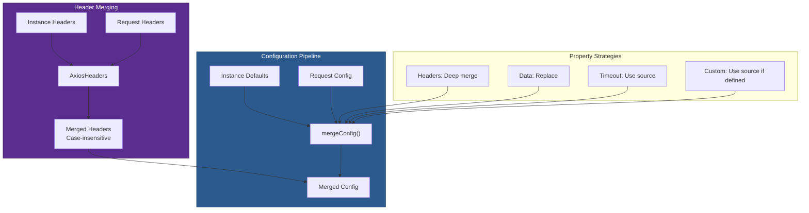

# 06 — Configuration & Config Merging

## Relevant Source Files

- `lib/core/mergeConfig.js` — Config merging logic
- `lib/core/AxiosHeaders.js` — Case-insensitive header management
- `lib/defaults/index.js` — Default configuration
- `lib/defaults/transitional.js` — Backward compatibility flags
- `lib/helpers/validator.js` — Config validation

## TL;DR

Axios uses `mergeConfig(config1, config2)` to combine instance defaults with request-specific config. The merge is property-aware: headers are deep-merged (case-insensitive), data and params are replaced, timeout uses the source value. `AxiosHeaders` provides case-insensitive header lookups, normalizing HTTP header semantics.

## Overview

Configuration in Axios flows through multiple stages:

1. **Default Config** (from `axios.create()`) — Instance-level defaults.
2. **Request Config** — User-provided per-request config.
3. **Merged Config** — Result of combining 1 and 2.

The merge is not a simple object spread; it's property-aware. Headers are deep-merged with case-insensitive keys. Some properties completely override defaults, others inherit from them. This allows instances to set defaults like `baseURL` and `headers` while allowing requests to override them selectively.

## Architecture Diagram



## Key Concepts

| Concept | Description | Source |
|---------|-------------|--------|
| **Config Object** | Plain JavaScript object with request options: url, method, headers, data, timeout, etc. | `lib/defaults/index.js` |
| **mergeConfig()** | Function that combines two config objects using property-specific merge strategies. | `lib/core/mergeConfig.js:L17-L95` |
| **AxiosHeaders** | Class that provides case-insensitive header access and normalization. | `lib/core/AxiosHeaders.js` |
| **Merge Strategy** | Per-property function determining how to combine values from two configs. | `lib/core/mergeConfig.js` |
| **Deep Merge** | Recursive merge for nested objects (headers, transitional). | `lib/core/mergeConfig.js:L22-L31` |
| **Case-Insensitive Headers** | HTTP headers are case-insensitive; `Content-Type` and `content-type` are equivalent. | `lib/core/AxiosHeaders.js` |
| **Transitional Options** | Backward compatibility flags controlling deprecated behaviors. | `lib/defaults/transitional.js` |

## How It Works

### mergeConfig() Algorithm

`lib/core/mergeConfig.js:L17-L95` defines the merge logic:

```javascript
export default function mergeConfig(config1, config2) {
  config2 = config2 || {};
  const config = {};

  function getMergedValue(target, source, prop, caseless) {
    if (utils.isPlainObject(target) && utils.isPlainObject(source)) {
      return utils.merge.call({ caseless }, target, source);
    } else if (utils.isPlainObject(source)) {
      return utils.merge({}, source);
    } else if (utils.isArray(source)) {
      return source.slice();
    }
    return source;
  }

  function mergeDeepProperties(a, b, prop, caseless) {
    if (!utils.isUndefined(b)) {
      return getMergedValue(a, b, prop, caseless);
    } else if (!utils.isUndefined(a)) {
      return getMergedValue(undefined, a, prop, caseless);
    }
  }

  function valueFromConfig2(a, b) {
    if (!utils.isUndefined(b)) {
      return getMergedValue(undefined, b);
    }
  }

  function defaultToConfig2(a, b) {
    if (!utils.isUndefined(b)) {
      return getMergedValue(undefined, b);
    } else {
      return getMergedValue(undefined, a);
    }
  }

  // Define which properties use which strategy
  const keys = ['url', 'method', 'data'];
  const mergedData = {};

  // Use valueFromConfig2 for these (config2 overrides)
  utils.forEach(['method', 'timeout', 'withCredentials'], function forEachPropertyOfConfig2(prop) {
    if (!utils.isUndefined(config2[prop])) {
      config[prop] = config2[prop];
    }
  });

  // Use defaultToConfig2 for these (config2 preferred, fallback to config1)
  utils.forEach(
    ['headers', 'auth', 'proxy', 'params'],
    function forEachPropertyOfConfig12(prop) {
      config[prop] = defaultToConfig2(config1[prop], config2[prop]);
    }
  );

  // For other properties, use valueFromConfig2
  // ... additional strategy handling

  return config;
}
```

**Key strategies:**

1. **`valueFromConfig2` strategy:** Use config2's value if defined, ignore config1.
   - Properties: `method`, `timeout`, `withCredentials`, `url`, `data`.

2. **`defaultToConfig2` strategy:** Prefer config2, fallback to config1.
   - Properties: `headers`, `auth`, `proxy`, `params`.
   - This allows deep merging for headers.

3. **`mergeDeepProperties` strategy:** Deep merge nested objects.
   - Used for objects that should be combined, not replaced.

### Example: Config Merging

Instance defaults:

```javascript
{
  baseURL: 'https://api.example.com',
  timeout: 5000,
  headers: {
    'X-Custom': 'default-value',
    'Accept': 'application/json'
  }
}
```

Request config:

```javascript
{
  url: '/users',
  timeout: 10000,
  headers: {
    'X-Request-ID': '123'
  }
}
```

After `mergeConfig(defaults, request)`:

```javascript
{
  baseURL: 'https://api.example.com',  // from defaults
  url: '/users',                       // from request (overrides)
  timeout: 10000,                      // from request (overrides)
  headers: {                           // deep merged
    'X-Custom': 'default-value',       // from defaults
    'Accept': 'application/json',      // from defaults
    'X-Request-ID': '123'              // from request (added)
  }
}
```

Headers are merged because both are plain objects. Other properties use the strategy functions.

### AxiosHeaders Class

`lib/core/AxiosHeaders.js` provides case-insensitive header management:

```javascript
class AxiosHeaders {
  constructor(headers) {
    this[internals] = {};
    headers && AxiosHeaders.from(headers, this);
  }

  // Set a header
  set(header, val, caseless) {
    const key = normalizeHeader(header);
    this[internals][caseless ? key.toLowerCase() : key] = val;
  }

  // Get a header (case-insensitive)
  get(header, caseless) {
    const key = normalizeHeader(header);
    return this[internals][caseless ? key.toLowerCase() : key];
  }

  // ... many more methods
}
```

**Key features:**

- **Case-insensitive access:** `headers.get('Content-Type')` and `headers.get('content-type')` are equivalent.
- **Normalization:** Header names are normalized (trimmed, lowercased for comparison).
- **Static `from()` method:** Converts a plain object to an `AxiosHeaders` instance.
- **Deep merging:** Headers from two sources are combined.

### Default Configuration

`lib/defaults/index.js` defines Axios's default configuration:

```javascript
const defaults = {
  transitional: transitionalDefaults,

  adapter: ['xhr', 'http', 'fetch'],

  transformRequest: [ /* array of functions */ ],
  transformResponse: [ /* array of functions */ ],

  timeout: 0,  // No timeout by default

  xsrfCookieName: 'XSRF-TOKEN',
  xsrfHeaderName: 'X-XSRF-TOKEN',

  maxContentLength: -1,
  maxBodyLength: -1,

  validateStatus: function (status) {
    return status >= 200 && status < 300;
  },

  headers: {
    common: { /* common headers across all methods */ },
    delete: { /* DELETE-specific headers */ },
    get: { /* GET-specific headers */ },
    head: { /* HEAD-specific headers */ },
    post: { /* POST-specific headers */ },
    put: { /* PUT-specific headers */ },
    patch: { /* PATCH-specific headers */ }
  },

  // ... many more properties
};
```

This is the base configuration that all instances inherit from.

### Transitional Options

`lib/defaults/transitional.js` defines backward compatibility flags:

```javascript
const transitionalDefaults = {
  silentJSONParsing: true,
  forcedJSONParsing: true,
  clarifyTimeoutError: false,
  legacyInterceptorReqResOrdering: undefined
};
```

These flags control deprecated behaviors:

- **`silentJSONParsing`:** Silently parse JSON even if Content-Type doesn't suggest JSON.
- **`forcedJSONParsing`:** Force parse as JSON if MIME type is JSON.
- **`clarifyTimeoutError`:** Provide more descriptive timeout error messages.
- **`legacyInterceptorReqResOrdering`:** Use old interceptor execution order (deprecated).

## Component Reference

| Component | Type | Responsibility | Source |
|-----------|------|----------------|--------|
| `mergeConfig()` | function | Combines two config objects using property-specific strategies. | `lib/core/mergeConfig.js:L17-L95` |
| `getMergedValue()` | nested fn | Implements deep merge for nested objects and arrays. | `lib/core/mergeConfig.js:L22-L31` |
| `AxiosHeaders` | class | Case-insensitive header management and normalization. | `lib/core/AxiosHeaders.js` |
| `AxiosHeaders.from()` | static method | Converts plain object to AxiosHeaders instance. | `lib/core/AxiosHeaders.js` |
| `normalizeHeader()` | function | Normalizes header name (trim, lowercase). | `lib/core/AxiosHeaders.js:L8-L10` |
| `defaults` | object | Base configuration inherited by all instances. | `lib/defaults/index.js:L36-L130+` |
| `transitionalDefaults` | object | Backward compatibility flags. | `lib/defaults/transitional.js` |

## Config Precedence

Config properties are resolved in this order:

1. **Request-specific config** (highest priority) — User passes per-request.
2. **Instance config** — Set via `axios.create()`.
3. **Default config** (lowest priority) — Built-in defaults.

Properties determined by strategy:

```
Property            Strategy
========            ========
url                 request only
method              request or instance
data                request only
headers             deep merge (instance + request)
baseURL             instance default or request
timeout             request or instance
withCredentials     request or instance
auth                request or instance (deep merge)
params              request or instance (deep merge)
transformRequest    instance or request (array concat)
transformResponse   instance or request (array concat)
```

## Config Example

Complete flow from creation to execution:

```javascript
// 1. Create instance with defaults
const instance = axios.create({
  baseURL: 'https://api.example.com',
  timeout: 5000,
  headers: {
    'X-API-Key': 'secret'
  }
});

// 2. Make a request with overrides
instance.get('/users', {
  timeout: 10000,  // override timeout
  headers: {
    'X-Request-ID': '123'  // add header
  }
});

// 3. Merged config sent to adapter
{
  baseURL: 'https://api.example.com',  // from instance
  url: '/users',                       // from get() shortcut
  method: 'get',                       // from get() shortcut
  timeout: 10000,                      // from request (overridden)
  headers: {                           // merged
    'X-API-Key': 'secret',             // from instance
    'X-Request-ID': '123'              // from request
  }
}
```

## Gotchas & Conventions

> **Gotcha**: Headers are case-insensitive. `Content-Type` and `content-type` are the same header. This is handled by `AxiosHeaders`, but plain objects lose this semantic.
> See `lib/core/AxiosHeaders.js`.

> **Gotcha**: The `headers` property uses deep merging, but `data` does not. Providing `data` in an instance config and then in a request config completely replaces it; it's not merged.
> See `lib/core/mergeConfig.js`.

> **Gotcha**: Method-specific headers (GET, POST, etc.) are set in `defaults.headers[method]`. These are merged with common headers, which can cause confusion.
> See `lib/defaults/index.js`.

> **Convention**: Config objects are never mutated. `mergeConfig()` always returns a new object.

> **Tip**: To set instance-wide headers, use `instance.defaults.headers.common`:
> ```javascript
> instance.defaults.headers.common['X-API-Key'] = 'secret';
> ```

## Cross-References

- For how merged config is used in the pipeline, see [03 — Request Pipeline](03-request-pipeline.md).
- For how config is validated, see [02 — HTTP Client Core](02-http-client-core.md).
- For adapter-specific config options, see [05 — Adapters](05-adapters.md).
- For transformation functions in config, see [03 — Request Pipeline](03-request-pipeline.md) (transformRequest/transformResponse).
