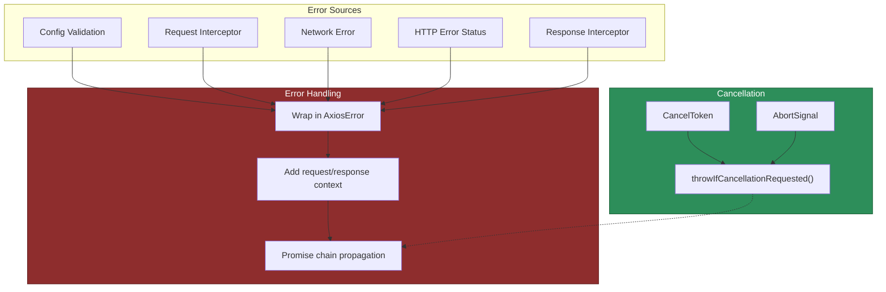

# 07 — Error Handling & Cancellation

## Relevant Source Files

- `lib/core/AxiosError.js` — Custom error class
- `lib/cancel/CancelToken.js` — Promise-based cancellation
- `lib/cancel/CanceledError.js` — Cancellation error
- `lib/cancel/isCancel.js` — Cancellation detection
- `lib/core/dispatchRequest.js` — Cancellation checks
- `lib/helpers/settle.js` — Response settlement logic

## TL;DR

`AxiosError` wraps all errors with request, response, and config context for debugging. Two cancellation mechanisms exist: (1) `CancelToken` (promise-based, deprecated), (2) `AbortSignal` (modern, preferred). Both integrate into `dispatchRequest()` to prevent sending or complete canceled requests. Errors in the pipeline are caught, wrapped, and propagated through response interceptors.

## Overview

Error handling in Axios serves two purposes:

1. **Uniform error format:** All errors (network, HTTP status, cancellation) are wrapped in `AxiosError` with context.
2. **Cancellation control:** Requests can be aborted before sending or after receiving response.

Errors can occur at multiple points:
- **Request validation** — Invalid config.
- **Request interceptor** — User code rejects config.
- **Network layer** — Connection timeout, DNS failure, etc.
- **HTTP response** — Server returns error status (e.g., 404, 500).
- **Response interceptor** — User code rejects response.
- **Cancellation** — User calls cancel function before response.

All errors flow through the promise chain and are available to `.catch()` handlers and error interceptors.

## Architecture Diagram



## Key Concepts

| Concept | Description | Source |
|---------|-------------|--------|
| **AxiosError** | Custom error class wrapping request, response, config, and error message. | `lib/core/AxiosError.js:L5-L60` |
| **Error Context** | Request, response, and config objects attached to error for debugging. | `lib/core/AxiosError.js` |
| **CancelToken** | Promise-based cancellation mechanism. Executor function receives cancel callback. | `lib/cancel/CancelToken.js:L12-L120` |
| **AbortSignal** | Modern Web Standard for cancellation. Passed via `config.signal`. | `lib/core/dispatchRequest.js:L22` |
| **CanceledError** | Error thrown when cancellation is requested. Subclass of `AxiosError`. | `lib/cancel/CanceledError.js` |
| **throwIfCancellationRequested** | Check function that throws if cancellation was triggered. Called in dispatchRequest. | `lib/core/dispatchRequest.js:L17-L25` |
| **isCancel()** | Helper to detect if an error is a cancellation. | `lib/cancel/isCancel.js` |

## How It Works

### AxiosError Class

`lib/core/AxiosError.js` defines the custom error:

```javascript
class AxiosError extends Error {
  static from(error, code, config, request, response, customProps) {
    const axiosError = new AxiosError(error.message, code || error.code, config, request, response);
    axiosError.cause = error;
    axiosError.name = error.name;

    if (error.status != null && axiosError.status == null) {
      axiosError.status = error.status;
    }

    customProps && Object.assign(axiosError, customProps);
    return axiosError;
  }

  constructor(message, code, config, request, response) {
    super(message);

    this.name = 'AxiosError';
    this.isAxiosError = true;
    code && (this.code = code);
    config && (this.config = config);
    request && (this.request = request);
    if (response) {
      this.response = response;
      this.status = response.status;
    }
  }
}
```

**Key properties:**

- **`message`** — Error message.
- **`code`** — Error code (e.g., 'ECONNABORTED', 'ENOTFOUND').
- **`config`** — Request config object.
- **`request`** — The underlying request object (XHR, http.ClientRequest, etc.).
- **`response`** — Response object (if available).
- **`status`** — HTTP status code (from response if available).
- **`isAxiosError`** — Boolean flag for type checking.

### Error Wrapping in Adapters

Adapters catch transport errors and wrap them in error objects:

```javascript
// In XHR adapter
try {
  const response = {
    status: xhr.status,
    statusText: xhr.statusText,
    headers: parseHeaders(xhr.getAllResponseHeaders()),
    data: responseData,
    config,
    request: xhr
  };
  resolve(response);
} catch (error) {
  reject(new AxiosError(error.message, null, config, xhr, null));
}

// In HTTP adapter (similar pattern)
```

The error object includes request and config context, which is later wrapped in `AxiosError` by `dispatchRequest()`.

### Error Settling in dispatchRequest()

`lib/core/dispatchRequest.js:L34-L77` handles adapter responses and errors:

```javascript
return adapter(config).then(
  function onAdapterResolution(response) {
    throwIfCancellationRequested(config);

    response.data = transformData.call(config, config.transformResponse, response);
    response.headers = AxiosHeaders.from(response.headers);

    return response;
  },
  function onAdapterRejection(reason) {
    if (!isCancel(reason)) {
      throwIfCancellationRequested(config);

      if (reason && reason.response) {
        reason.response.data = transformData.call(config, config.transformResponse, reason.response);
        reason.response.headers = AxiosHeaders.from(reason.response.headers);
      }
    }

    return Promise.reject(reason);
  }
);
```

**Error flow:**

1. If the adapter throws, the `rejected` handler is called.
2. If it's a cancellation error, propagate as-is.
3. Otherwise, transform response data if available.
4. Re-throw the error (propagate up promise chain).

### Validation Errors

In `lib/core/Axios.js:L78-L150`, config is validated:

```javascript
if (transitional !== undefined) {
  validator.assertOptions(transitional, { ... }, false);
}

// If validation fails, AxiosError is thrown with code 'ERR_INVALID_CONFIG'
```

Validation errors are thrown early, before any adapters or interceptors run.

### HTTP Status Errors

By default, axios resolves the promise for all status codes (2xx, 3xx, 4xx, 5xx). The `validateStatus` function determines if a status should be treated as an error:

```javascript
// Default validateStatus (from lib/defaults/index.js)
validateStatus: function (status) {
  return status >= 200 && status < 300;
}
```

If `validateStatus(status)` returns false, the response is rejected as an error. The error object includes the response, allowing response interceptors to handle it.

## Cancellation Mechanisms

### CancelToken (Deprecated)

`lib/cancel/CancelToken.js` implements promise-based cancellation:

```javascript
class CancelToken {
  constructor(executor) {
    if (typeof executor !== 'function') {
      throw new TypeError('executor must be a function.');
    }

    let resolvePromise;

    this.promise = new Promise(function promiseExecutor(resolve) {
      resolvePromise = resolve;
    });

    const token = this;

    executor(function cancel(message, config, request) {
      if (token.reason) {
        return;  // Already canceled
      }

      token.reason = new CanceledError(message, config, request);
      resolvePromise(token.reason);
    });
  }

  throwIfRequested() {
    if (this.reason) {
      throw this.reason;
    }
  }

  // ... subscribe, unsubscribe methods
}
```

**Usage:**

```javascript
const source = axios.CancelToken.source();

axios.get('/api/data', {
  cancelToken: source.token
}).catch(error => {
  if (axios.isCancel(error)) {
    console.log('Request canceled', error.message);
  }
});

// Cancel the request
source.cancel('Request canceled by user');
```

**Key points:**

- The executor receives a `cancel()` callback.
- Calling `cancel()` resolves the token's promise with a `CanceledError`.
- `throwIfRequested()` throws if cancellation was requested.
- Multiple requests can share the same token (cancel all at once).

### AbortSignal (Modern)

Modern JavaScript has the `AbortSignal` API, supported by Axios:

```javascript
const controller = new AbortController();

axios.get('/api/data', {
  signal: controller.signal
}).catch(error => {
  if (error.name === 'AbortError') {
    console.log('Request aborted');
  }
});

// Abort the request
controller.abort();
```

In `lib/core/dispatchRequest.js:L17-L25`:

```javascript
function throwIfCancellationRequested(config) {
  if (config.cancelToken) {
    config.cancelToken.throwIfRequested();
  }

  if (config.signal && config.signal.aborted) {
    throw new CanceledError(null, config);
  }
}
```

The adapter checks `config.signal.aborted` before sending and handles `AbortError` thrown by the adapter.

## Error Handling Examples

### Catching Errors

```javascript
instance.get('/api/users')
  .then(response => {
    console.log('Success:', response.data);
  })
  .catch(error => {
    if (error.response) {
      // Server responded with error status
      console.log('Status:', error.response.status);
      console.log('Data:', error.response.data);
    } else if (error.request) {
      // Request was made but no response
      console.log('Request made but no response');
    } else {
      // Error in request setup
      console.log('Error:', error.message);
    }
  });
```

### Error Interceptor

```javascript
instance.interceptors.response.use(
  response => response,
  error => {
    if (error.response?.status === 401) {
      // Unauthorized — redirect to login
      window.location.href = '/login';
    } else if (error.response?.status === 500) {
      // Server error — log and retry
      console.error('Server error:', error);
    }
    return Promise.reject(error);
  }
);
```

### Retry Logic

```javascript
const maxRetries = 3;
let retryCount = 0;

instance.interceptors.response.use(
  response => response,
  async error => {
    if (error.response?.status === 429 && retryCount < maxRetries) {
      retryCount++;
      // Wait and retry
      await new Promise(resolve => setTimeout(resolve, 1000 * retryCount));
      return instance.request(error.config);
    }
    return Promise.reject(error);
  }
);
```

## Component Reference

| Component | Type | Responsibility | Source |
|-----------|------|----------------|--------|
| `AxiosError` | class | Custom error wrapping request, response, config, and error context. | `lib/core/AxiosError.js:L5-L60` |
| `AxiosError.from()` | static method | Create AxiosError from another error, preserving context. | `lib/core/AxiosError.js:L6-L18` |
| `CancelToken` | class | Promise-based cancellation. Executor receives cancel callback. | `lib/cancel/CancelToken.js:L12-L120` |
| `CancelToken.source()` | static method | Create a new CancelToken with source.token and source.cancel. | `lib/cancel/CancelToken.js` |
| `CanceledError` | class | Error thrown when cancellation is requested. Subclass of AxiosError. | `lib/cancel/CanceledError.js` |
| `isCancel()` | function | Detect if an error is a CanceledError. | `lib/cancel/isCancel.js` |
| `throwIfCancellationRequested()` | function | Check and throw CanceledError if cancellation was triggered. | `lib/core/dispatchRequest.js:L17-L25` |

## Gotchas & Conventions

> **Gotcha**: CancelToken is deprecated in favor of AbortSignal. Both work, but AbortSignal is the modern standard.
> See `lib/cancel/CancelToken.js` (marked as deprecated in comments).

> **Gotcha**: Canceling a token after the response is received still rejects the promise. This is intentional but can be surprising.
> See `lib/core/dispatchRequest.js:L50`.

> **Gotcha**: `error.response` is only set if the server responded with an error status. Network errors have no `error.response`.
> See error handling examples above.

> **Convention**: Always handle both `error.response` (HTTP error) and `error.request` (network error) cases in `.catch()` handlers.

> **Tip**: Use `axios.isAxiosError()` to check if an error is from Axios:
> ```javascript
> if (axios.isAxiosError(error)) {
>   console.log('Axios error:', error.message);
> } else {
>   console.log('Other error:', error);
> }
> ```

## Cross-References

- For error handling in the request pipeline, see [03 — Request Pipeline](03-request-pipeline.md).
- For how adapters throw errors, see [05 — Adapters](05-adapters.md).
- For validation of config, see [02 — HTTP Client Core](02-http-client-core.md).
- For response interceptors that handle errors, see [04 — Interceptors & Middleware](04-interceptors.md).
