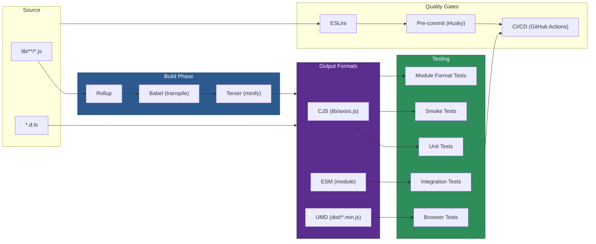

# 08 — Build & Development

## Relevant Source Files

- `package.json` — Scripts and dependencies
- `rollup.config.js` — Build configuration
- `tsconfig.json` — TypeScript configuration
- `vitest.config.js` — Test runner configuration
- `.eslintrc.*` — Linting configuration
- `gulpfile.js` — Task automation

## TL;DR

Axios uses Rollup to bundle code into CJS, ESM, and UMD formats. Babel transpiles modern JavaScript for older environments. npm scripts automate building, testing (Vitest), and linting (ESLint). TypeScript definitions are generated and published alongside JavaScript. Development workflow includes local testing, pre-commit hooks (Husky), and automated releases.

## Overview

The Axios build system is designed to:

1. **Support multiple module formats:** CJS (Node.js), ESM (modern browsers/Node.js), UMD (browser globals).
2. **Transpile for broad compatibility:** Babel targets modern and older JavaScript versions.
3. **Optimize bundle size:** Tree-shaking, minification via Terser.
4. **Enable robust testing:** Unit tests, integration tests, browser tests, module format tests, smoke tests.
5. **Maintain code quality:** Linting, pre-commit hooks, automated releases.

The build pipeline is orchestrated by npm scripts, with Rollup as the bundler and Gulp for task automation.

## Architecture Diagram



## Key Concepts

| Concept | Description | Source |
|---------|-------------|--------|
| **Rollup** | Module bundler for JavaScript. Bundles multiple files into single output. | `rollup.config.js` |
| **Babel** | JavaScript transpiler. Converts modern syntax to older-compatible versions. | `rollup.config.js` (babel plugin) |
| **Terser** | JavaScript minifier. Reduces bundle size. | `rollup.config.js` (terser plugin) |
| **npm scripts** | Automation commands defined in `package.json`. Orchestrate build, test, lint, publish. | `package.json:410-428` |
| **Vitest** | Test runner. Executes unit and integration tests. | `vitest.config.js` |
| **ESLint** | Code linter. Checks for style and error issues. | `.eslintrc.*`, `package.json:426` |
| **Husky** | Git hooks manager. Runs linting and tests before commits. | `.husky/pre-commit`, `package.json` |
| **TypeScript Definitions** | `.d.ts` files providing type information. Bundled with package. | `index.d.ts`, `index.d.cts` |

## How It Works

### Build Configuration: rollup.config.js

The `rollup.config.js` file defines how to bundle Axios:

```javascript
// Simplified structure
export default [
  {
    input: 'lib/axios.js',
    output: {
      file: 'index.js',
      format: 'cjs',
      exports: 'default'
    },
    external: ['follow-redirects', 'form-data', 'proxy-from-env'],
    plugins: [
      resolve(),           // Resolve node_modules
      babel({...}),        // Transpile with Babel
      cjs(),               // CommonJS support
      json(),              // Import JSON
      {
        name: 'banner',
        banner: { code: '/* ... license ... */' }
      }
    ]
  },
  {
    input: 'lib/axios.js',
    output: {
      file: 'dist/axios.min.js',
      format: 'umd',
      name: 'axios'
    },
    plugins: [
      ...,
      terser()  // Minify for UMD
    ]
  }
  // ... more output configurations
];
```

**Key points:**

- **Entry point:** `lib/axios.js`.
- **External dependencies:** Don't bundle `follow-redirects`, `form-data`, `proxy-from-env`. They're loaded at runtime.
- **Multiple outputs:** CJS for Node.js, ESM for modern bundlers, UMD for browser scripts.
- **Plugins:**
  - `@rollup/plugin-node-resolve` — Find packages in node_modules.
  - `@rollup/plugin-babel` — Transpile with Babel.
  - `@rollup/plugin-commonjs` — Handle CommonJS modules.
  - `@rollup/plugin-json` — Import JSON files.
  - `@rollup/plugin-terser` — Minify UMD output.

### npm Scripts: build and test

Key scripts from `package.json:410-428`:

```json
"scripts": {
  "build": "gulp clear && cross-env NODE_ENV=production rollup -c -m",
  "test": "npm run test:vitest",
  "test:vitest": "vitest run",
  "test:vitest:unit": "vitest run --project unit",
  "test:vitest:browser": "vitest run --project browser",
  "test:vitest:browser:headless": "vitest run --project browser-headless",
  "test:vitest:watch": "vitest",
  "test:smoke:cjs:vitest": "npm --prefix tests/smoke/cjs run test:smoke:cjs:mocha",
  "test:smoke:esm:vitest": "npm --prefix tests/smoke/esm run test:smoke:esm:vitest",
  "test:module:cjs": "npm --prefix tests/module/cjs run test:module:cjs",
  "test:module:esm": "npm --prefix tests/module/esm run test:module:esm",
  "start": "node ./sandbox/server.js",
  "examples": "node ./examples/server.js",
  "lint": "eslint lib/**/*.js",
  "fix": "eslint --fix lib/**/*.js",
  "prepare": "husky"
}
```

**Workflow:**

1. **`npm run build`**
   - Clear dist directory via Gulp.
   - Run Rollup in production mode with source maps (`-m`).
   - Output CJS, ESM, UMD builds to `index.js`, `dist/`.

2. **`npm test`**
   - Run all test suites via Vitest.
   - Unit tests test individual functions.
   - Integration tests test features end-to-end.
   - Browser tests run in browser environment (Playwright).
   - Smoke tests validate real-world usage scenarios.
   - Module tests validate CJS/ESM/TS module loading.

3. **`npm run lint`**
   - Run ESLint on `lib/**/*.js`.
   - Report style and error issues.

4. **`npm run fix`**
   - Auto-fix linting issues (format, spacing, etc.).

### Testing: Vitest Configuration

`vitest.config.js` defines test projects:

```javascript
export default defineConfig({
  test: {
    globals: true,
    environment: 'node'
  },
  projects: [
    {
      name: 'unit',
      test: { environment: 'node' },
      include: ['tests/unit/**/*.test.js']
    },
    {
      name: 'browser',
      test: { environment: 'browser', browser: { provider: 'playwright' } },
      include: ['tests/browser/**/*.browser.test.js']
    },
    {
      name: 'browser-headless',
      test: { environment: 'browser', browser: { provider: 'playwright', launch: { headless: true } } }
    }
  ]
});
```

**Test organization:**

- **Unit tests** (`tests/unit/`) — Test individual functions and classes in isolation.
- **Browser tests** (`tests/browser/`) — Test in real browser environment via Playwright.
- **Smoke tests** (`tests/smoke/`) — Validate real-world scenarios (auth, forms, uploads, etc.).
- **Module tests** (`tests/module/`) — Validate CJS/ESM/TypeScript module loading.

### TypeScript Definitions

TypeScript type definitions are provided in:

- **`index.d.ts`** — ESM/dual export definitions.
- **`index.d.cts`** — CommonJS export definitions.

These are generated manually or via TypeScript, and bundled with the published package. They enable IDE autocompletion and type checking in TypeScript projects.

### Code Quality: ESLint and Husky

**ESLint** (via `.eslintrc.js`):

- Enforces code style (indentation, spacing, naming).
- Catches common errors (unused variables, etc.).
- Configured with `@eslint/js` and `globals`.

**Husky** (via `.husky/pre-commit`):

- Runs before every commit.
- Runs `lint-staged` on changed files.
- Prevents commits with linting errors.

### Version Management

Version bumping is automated:

```json
"version": "npm run build && git add package.json",
"preversion": "gulp version"
```

The `npm version` command:

1. Runs `preversion` (updates version in files).
2. Bumps the version in `package.json`.
3. Runs the `version` script (rebuild and stage).
4. Creates a git tag.
5. Commits the changes.

## Development Workflow

### Local Development

```bash
# Install dependencies
npm install

# Run tests in watch mode
npm run test:vitest:watch

# Run specific test suite
npm run test:vitest:unit

# Lint code
npm run lint

# Fix linting issues
npm run fix

# Build distribution
npm run build

# Start sandbox server
npm start

# Run examples
npm run examples
```

### Commit Workflow

```bash
# Write code, make changes
# ... edit lib/core/Axios.js, tests/unit/core/Axios.test.js, etc.

# Commit (Husky runs linting and tests)
git commit -m "feat: add new feature"
# → Pre-commit hook runs ESLint
# → If lint fails, commit is blocked
# → Fix issues and retry

# If commit succeeds, changes are staged
# → CI/CD runs full test suite
# → If tests pass, code is ready for release
```

### Release Workflow

```bash
# Bump version (major, minor, patch)
npm version patch  # or minor, major

# This triggers:
# 1. preversion hook (update version in files)
# 2. rebuild distribution
# 3. Create git tag and commit

# Push to GitHub
git push origin main --tags

# GitHub Actions publishes to npm
# → CI/CD runs full tests
# → If tests pass, publishes to npm registry
```

## Component Reference

| Component | Type | Responsibility | Source |
|-----------|------|----------------|--------|
| `rollup.config.js` | config | Bundling configuration. Defines input, outputs, plugins, transpilation. | `rollup.config.js` |
| `vitest.config.js` | config | Test runner configuration. Defines test projects, environments, files. | `vitest.config.js` |
| `.eslintrc.js` | config | Linting configuration. Defines style rules and error checks. | `.eslintrc.js` |
| `tsconfig.json` | config | TypeScript configuration. Defines compiler options and source files. | `tsconfig.json` |
| `gulpfile.js` | script | Task automation. Clears dist, versions, builds. | `gulpfile.js` |
| `package.json` | config | npm package config. Defines scripts, dependencies, metadata. | `package.json` |
| `.husky/pre-commit` | hook | Git hook. Runs linting and tests before commits. | `.husky/pre-commit` |
| `index.d.ts` / `index.d.cts` | types | TypeScript definitions for ESM and CJS. | `index.d.ts`, `index.d.cts` |

## Build Outputs

After running `npm run build`, the following files are created:

```
index.js                    # CommonJS main entry
dist/
├── axios.js              # UMD (unminified)
├── axios.min.js          # UMD (minified)
├── axios.min.js.map      # UMD source map
├── es6/
│   └── axios.js          # ESM format
└── ...
```

Each format is suitable for different environments:

- **CJS (`index.js`)** — Node.js (`require('axios')`).
- **ESM (`dist/es6/axios.js`)** — Modern bundlers (`import axios from 'axios'`).
- **UMD (`dist/axios.min.js`)** — Browser globals (`<script src="axios.min.js">` then `window.axios`).

## Gotchas & Conventions

> **Gotcha**: The build process clears the `dist/` directory first. Any manual edits there are lost. Always edit source files in `lib/`.
> See `package.json:411`.

> **Gotcha**: External dependencies (`follow-redirects`, `form-data`, `proxy-from-env`) are not bundled. They must be installed separately. This keeps the bundle small but requires dependency management.
> See `rollup.config.js`.

> **Gotcha**: Tests run in both Node.js and browser environments. Some tests may pass in one but fail in the other due to environment differences (XHR vs. HTTP module).
> See `vitest.config.js`.

> **Convention**: Commit messages follow Conventional Commits format (`feat:`, `fix:`, `chore:`, etc.) for automated changelog generation.

> **Tip**: To skip pre-commit hooks (not recommended), use `git commit --no-verify`. This bypasses linting and tests.

## Cross-References

- For architecture overview, see [01 — Architecture Overview](01-overview.md).
- For testing strategy details, see [09 — Testing Infrastructure](09-testing.md).
- For development and debugging tips, see [02 — HTTP Client Core](02-http-client-core.md) (Gotchas section).
