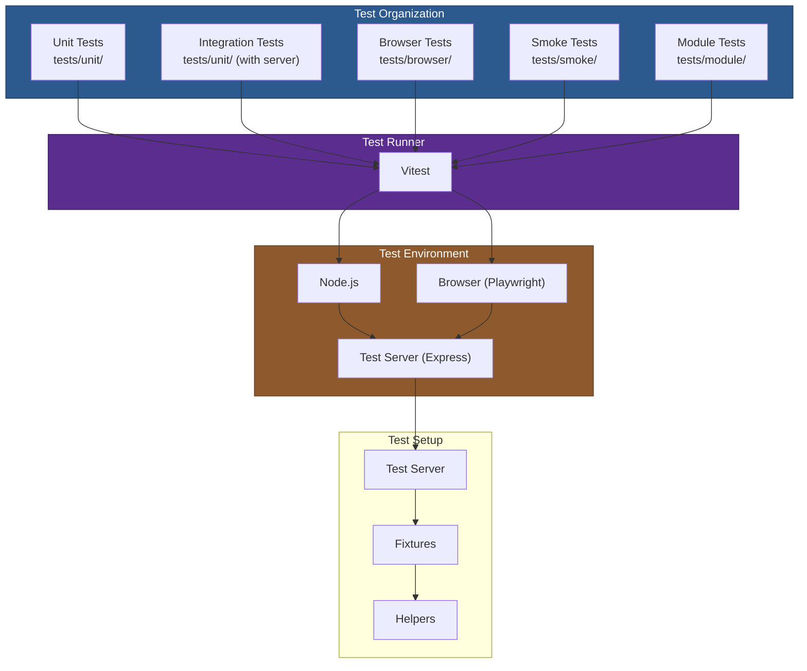

# 09 — Testing Infrastructure

## Relevant Source Files

- `vitest.config.js` — Test runner configuration
- `tests/` — Modern test suite (Vitest)
- `test/` — Legacy test suite
- `tests/setup/` — Test server and setup
- `tests/smoke/` — Real-world scenario tests
- `tests/module/` — Module format tests
- `package.json:410-428` — Test scripts

## TL;DR

Axios uses Vitest for modern testing with unit, integration, browser, smoke, and module format tests. Unit tests validate individual functions; integration tests validate features end-to-end; browser tests run in Playwright; smoke tests validate real-world scenarios; module tests ensure CJS/ESM/TypeScript compatibility. Tests are organized by feature and environment, with a test server (Express-based) providing backend responses.

## Overview

Testing in Axios is comprehensive and multi-layered:

1. **Unit Tests** — Test individual functions and classes in isolation (Node.js).
2. **Integration Tests** — Test features end-to-end (Node.js + HTTP server).
3. **Browser Tests** — Test in real browser environment via Playwright.
4. **Smoke Tests** — Validate real-world scenarios (auth, forms, uploads, http2, timeouts, etc.).
5. **Module Tests** — Validate module loading in CJS, ESM, TypeScript.

Each test type serves a different purpose: unit tests catch regressions in core logic, integration tests catch architectural issues, browser tests catch environment-specific bugs, smoke tests catch breaking changes, and module tests ensure broad compatibility.

## Architecture Diagram



## Key Concepts

| Concept | Description | Source |
|---------|-------------|--------|
| **Unit Test** | Isolated test of a function or class. No HTTP calls. | `tests/unit/**/*.test.js` |
| **Integration Test** | Test of a feature end-to-end with HTTP server. | `tests/unit/**/*adapter*.test.js` (with server) |
| **Browser Test** | Test running in real browser (Playwright). | `tests/browser/**/*.browser.test.js` |
| **Smoke Test** | Real-world scenario test (auth, uploads, timeouts, etc.). | `tests/smoke/cjs/*.smoke.test.cjs`, `tests/smoke/esm/*.smoke.test.js` |
| **Module Test** | Validates module loading in different formats (CJS, ESM, TS). | `tests/module/*/tests/` |
| **Test Server** | Express server providing mock HTTP responses for tests. | `tests/setup/server.js` |
| **Test Fixture** | Sample data or mock server response used in tests. | `tests/browser/fixture.json`, `test/manual/fixture.json` |
| **Vitest** | Modern test runner (Vite + Vitest). Fast, supports ESM, browser. | `vitest.config.js` |

## How It Works

### Test Organization

Tests are organized by type and location:

```
tests/
├── unit/                      # Unit tests (Node.js)
│   ├── adapters/
│   │   ├── adapters.test.js  # Adapter selection logic
│   │   ├── fetch.test.js     # Fetch adapter
│   │   ├── http.test.js      # HTTP adapter
│   │   └── errorDetails.test.js
│   ├── core/
│   │   ├── AxiosError.test.js
│   │   ├── mergeConfig.test.js
│   │   └── transformData.test.js
│   ├── helpers/              # Utility function tests
│   ├── utils/                # Utility function tests
│   └── axios.test.js         # Main export test
├── browser/                   # Browser-specific tests (Playwright)
│   ├── adapters/
│   ├── core/
│   ├── helpers/
│   └── ...browser.test.js    # .browser.test.js suffix
├── smoke/                     # Real-world scenario tests
│   ├── cjs/
│   │   └── tests/
│   │       ├── auth.smoke.test.cjs
│   │       ├── basic.smoke.test.cjs
│   │       ├── cancel.smoke.test.cjs
│   │       ├── headers.smoke.test.cjs
│   │       └── ...
│   └── esm/
│       └── tests/
│           ├── auth.smoke.test.js
│           └── ...
├── module/                    # Module format compatibility tests
│   ├── cjs/
│   │   └── tests/
│   │       ├── fixture-cleanup.module.test.cjs
│   │       └── typings.module.test.cjs
│   └── esm/
│       └── tests/
│           ├── fixture-cleanup.module.test.js
│           └── typings.module.test.js
└── setup/
    ├── server.js             # Express test server
    └── browser.setup.js      # Browser test setup
```

### Unit Tests: Example

From `tests/unit/axios.test.js`:

```javascript
import axios from '../../index.js';
import { describe, it, expect } from 'vitest';

describe('axios', () => {
  it('should exist', () => {
    expect(axios).toBeDefined();
  });

  it('should have methods', () => {
    expect(typeof axios.get).toBe('function');
    expect(typeof axios.post).toBe('function');
    expect(typeof axios.request).toBe('function');
  });

  it('should create instance', () => {
    const instance = axios.create();
    expect(instance).toBeDefined();
    expect(typeof instance.get).toBe('function');
  });

  it('should merge config', () => {
    const instance = axios.create({
      baseURL: 'https://example.com'
    });

    // instance.get() should use baseURL
    expect(instance.defaults.baseURL).toBe('https://example.com');
  });
});
```

**Key patterns:**

- `describe()` groups related tests.
- `it()` defines individual test cases.
- `expect()` asserts expected behavior.

### Integration Tests: Example

From `tests/unit/adapters/http.test.js`:

```javascript
import axios from '../../index.js';
import { createServer } from 'node:http';
import { describe, it, expect, beforeAll, afterAll } from 'vitest';

describe('HTTP adapter', () => {
  let server;

  beforeAll((done) => {
    // Start test server
    server = createServer((req, res) => {
      res.writeHead(200, { 'Content-Type': 'application/json' });
      res.end(JSON.stringify({ data: 'test' }));
    });
    server.listen(3000, done);
  });

  afterAll(() => {
    server.close();
  });

  it('should make HTTP request', async () => {
    const response = await axios.get('http://localhost:3000/api/data');
    expect(response.status).toBe(200);
    expect(response.data).toEqual({ data: 'test' });
  });

  it('should handle errors', async () => {
    // Start server that returns 404
    // ...
    try {
      await axios.get('http://localhost:3000/not-found');
      expect.fail('Should have thrown');
    } catch (error) {
      expect(error.response.status).toBe(404);
    }
  });
});
```

**Key patterns:**

- `beforeAll()` / `afterAll()` setup/teardown.
- Start a test server for HTTP testing.
- Test both success and error cases.
- Assert response status, data, headers.

### Browser Tests: Example

From `tests/browser/adapter.browser.test.js`:

```javascript
import axios from '../../index.js';
import { describe, it, expect } from 'vitest';

describe('XHR adapter (browser)', () => {
  it('should make XHR request', async () => {
    const response = await axios.get('/api/data');
    expect(response.status).toBe(200);
    expect(response.data).toBeDefined();
  });

  it('should handle CORS', async () => {
    try {
      await axios.get('https://cross-origin-domain.com/api');
    } catch (error) {
      // CORS errors are browser-specific
      expect(error.message).toContain('CORS');
    }
  });

  it('should support progress events', (done) => {
    const config = {
      url: '/api/upload',
      method: 'post',
      onDownloadProgress: (progressEvent) => {
        if (progressEvent.loaded > 0) {
          done();
        }
      }
    };
    axios.request(config).catch(() => {});
  });
});
```

**Key patterns:**

- Tests run in Playwright (Chrome, Firefox, Safari).
- Tests XHR adapter features (CORS, progress events).
- Some tests only make sense in browser (progress, XHR errors).

### Smoke Tests: Real-World Scenarios

From `tests/smoke/cjs/tests/auth.smoke.test.cjs`:

```javascript
const axios = require('axios');

describe('Auth smoke test', () => {
  it('should support Basic auth', async () => {
    const response = await axios.get('http://localhost:3000/auth', {
      auth: {
        username: 'user',
        password: 'pass'
      }
    });
    expect(response.status).toBe(200);
  });

  it('should support custom Authorization header', async () => {
    const response = await axios.get('http://localhost:3000/api', {
      headers: {
        'Authorization': 'Bearer token123'
      }
    });
    expect(response.status).toBe(200);
  });
});
```

Smoke tests validate:

- Auth (Basic, Bearer tokens).
- Form data (urlencoded, multipart).
- File uploads.
- Redirects.
- Timeouts.
- HTTP/2.
- Cancellation.
- Custom instances.
- Interceptors.
- Rate limiting.

### Module Format Tests: Example

From `tests/module/cjs/tests/typings.module.test.cjs`:

```javascript
const axios = require('axios');

describe('CJS module test', () => {
  it('should load axios from CJS', () => {
    expect(typeof axios).toBe('function');
    expect(typeof axios.get).toBe('function');
  });

  it('should have TypeScript definitions', () => {
    // Check that *.d.cts files are present and valid
    // (Node.js can resolve them for IDE autocompletion)
  });

  it('should work with require', () => {
    const instance = axios.create({ baseURL: 'http://localhost' });
    expect(instance).toBeDefined();
  });
});
```

Module tests validate:

- CJS module loading (require).
- ESM module loading (import).
- TypeScript type checking.
- No circular dependencies.
- Correct exports.

### Test Server Setup

From `tests/setup/server.js`:

```javascript
import express from 'express';
import { createServer } from 'node:http';

const app = express();

// Setup routes
app.get('/api/data', (req, res) => {
  res.json({ data: 'test' });
});

app.post('/api/post', (req, res) => {
  res.json({ received: req.body });
});

app.get('/api/404', (req, res) => {
  res.status(404).json({ message: 'Not found' });
});

// ... many more routes

const server = createServer(app);
export default server;
```

The test server provides:

- Endpoints for GET, POST, PUT, PATCH, DELETE.
- Error responses (404, 500, etc.).
- Custom headers.
- Form data handling.
- File uploads.
- Redirects.
- Timeouts.
- Stream responses.

## Component Reference

| Component | Type | Responsibility | Source |
|-----------|------|----------------|--------|
| `vitest.config.js` | config | Test runner config. Defines projects, environments, globals. | `vitest.config.js` |
| `tests/unit/` | dir | Unit tests for individual functions and classes. | `tests/unit/**/*.test.js` |
| `tests/browser/` | dir | Browser-specific tests (XHR, CORS, progress events). | `tests/browser/**/*.browser.test.js` |
| `tests/smoke/` | dir | Real-world scenario tests (auth, uploads, timeouts, etc.). | `tests/smoke/**/*.smoke.test.js/cjs` |
| `tests/module/` | dir | Module format compatibility tests (CJS, ESM, TypeScript). | `tests/module/**/tests/*.module.test.js/cjs` |
| `tests/setup/server.js` | file | Express test server providing mock HTTP responses. | `tests/setup/server.js` |
| `tests/setup/browser.setup.js` | file | Browser test setup (start server, setup globals). | `tests/setup/browser.setup.js` |
| Test helpers | file | Utility functions for testing (retry logic, fixtures). | `test/helpers/`, `tests/unit/**/__helpers`.js |

## Test Commands

```bash
# Run all tests
npm test

# Run unit tests only
npm run test:vitest:unit

# Run browser tests only
npm run test:vitest:browser

# Run browser tests headless
npm run test:vitest:browser:headless

# Watch mode (re-run on file change)
npm run test:vitest:watch

# Smoke tests
npm run test:smoke:cjs:vitest
npm run test:smoke:esm:vitest

# Module format tests
npm run test:module:cjs
npm run test:module:esm

# Run specific test file
npx vitest tests/unit/axios.test.js
```

## Gotchas & Conventions

> **Gotcha**: Browser tests require Playwright to be installed. They run in a real browser (Chrome by default), which is slower than Node.js tests but more realistic.
> See `vitest.config.js` (browser project config).

> **Gotcha**: Smoke tests are in separate npm packages (`tests/smoke/cjs`, `tests/smoke/esm`) to test real installation scenarios. They can't share dependencies with the main package.
> See `tests/smoke/cjs/package.json`.

> **Gotcha**: Module tests validate that `package.json:exports` points to the correct files and that TypeScript definitions are valid. If the build is broken, module tests fail before smoke tests run.
> See `tests/module/**/tests/`.

> **Convention**: Test files end with `.test.js` or `.test.cjs` (unit/integration), `.browser.test.js` (browser), `.smoke.test.js` (smoke), or `.module.test.js` (module).

> **Convention**: Tests are organized by feature/component (adapters, core, helpers, utils), mirroring the source structure.

> **Tip**: To run tests in parallel, use `npx vitest run --reporter=verbose`. Vitest runs tests in parallel by default but you can control concurrency with `--threads=4`.

## Cross-References

- For build configuration, see [08 — Build & Development](08-build-development.md).
- For test runner setup (Vitest), see `vitest.config.js` in the repo.
- For error handling and cancellation tests, see [07 — Error Handling & Cancellation](07-error-handling.md).
- For adapter-specific tests, see [05 — Adapters](05-adapters.md).
