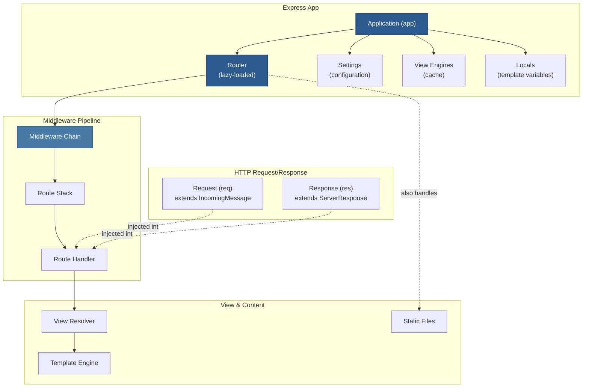

# Express.js Codebase Wiki

A comprehensive DeepWiki-style onboarding guide to the Express.js web framework.

**Version**: 5.2.1 | **Language**: JavaScript | **Framework**: HTTP/Web | **Repository**: [expressjs/express](https://github.com/expressjs/express)

---

## Table of Contents

### Core Documentation

1. **[01 — Overview & Architecture](01-overview.md)** — High-level system design, module graph, and key dependencies. Start here to understand how Express.js fits together.

2. **[02 — Application Core](02-application-core.md)** — The `Application` prototype and initialization system. Covers app setup, settings, locals, and lifecycle management.

3. **[03 — Routing System](03-routing-system.md)** — Route matching, route objects, and the `app.route()` / `app.METHOD()` API. How HTTP methods are dispatched to handlers.

4. **[04 — Middleware Pipeline](04-middleware-pipeline.md)** — The `app.use()` system, middleware chain execution, and error-handling middleware. The backbone of request processing.

5. **[05 — Request & Response Objects](05-request-response.md)** — Extensions to Node's `IncomingMessage` and `ServerResponse`. All request and response methods/properties available to route handlers.

6. **[06 — View System & Rendering](06-view-engine.md)** — View resolution, template engine registration, and the `res.render()` flow. Covers view caching and engine integration.

7. **[07 — Static Files & Content Handling](07-static-middleware.md)** — Built-in middleware for static files, body parsing (JSON/URL-encoded), and content type negotiation.

8. **[08 — Build, Testing & Development](08-build-and-testing.md)** — Project structure, test organization, CI/CD setup, and developer tooling. How to build and test Express itself.

---

## Quick Navigation

### By Topic

- **Getting Started**: [01 — Overview](01-overview.md) → [02 — Application Core](02-application-core.md)
- **Building APIs**: [03 — Routing](03-routing-system.md) → [04 — Middleware](04-middleware-pipeline.md) → [05 — Request/Response](05-request-response.md)
- **Web Pages & Views**: [06 — View System](06-view-engine.md) → [07 — Static Files](07-static-middleware.md)
- **Extending Express**: [04 — Middleware (Extension Points)](04-middleware-pipeline.md) → [02 — Application (Settings)](02-application-core.md)
- **Debugging & Testing**: [08 — Build/Testing](08-build-and-testing.md)

### By Component

| Component | Location | Responsibility |
|-----------|----------|-----------------|
| `Application` (app) | [02](02-application-core.md) | Core app object, settings, initialization |
| `Router` (app.router) | [03](03-routing-system.md) | Route dispatch, method matching |
| `Route` | [03](03-routing-system.md) | Per-path middleware stacks |
| `Request` (req) | [05](05-request-response.md) | HTTP request parsing, helpers |
| `Response` (res) | [05](05-request-response.md) | HTTP response generation, helpers |
| `View` | [06](06-view-engine.md) | Template file resolution & engine loading |
| Middleware | [04](04-middleware-pipeline.md) | Request/response pipeline |
| Static Files | [07](07-static-middleware.md) | `express.static()` and built-in handlers |

---

## Key Concepts at a Glance

| Concept | What It Does | Page |
|---------|------------|------|
| **Application** | The main Express app object created by `express()`. Holds settings, routes, and middleware. | [02](02-application-core.md) |
| **Middleware** | Functions that process requests in a chain. Can modify req/res, call next(), or end the response. | [04](04-middleware-pipeline.md) |
| **Route** | A path-specific middleware stack. Created via `app.get()`, `app.post()`, etc., or `app.route()`. | [03](03-routing-system.md) |
| **Router** | The internal router instance that handles route dispatch. Usually accessed indirectly via `app.router`. | [03](03-routing-system.md) |
| **Request (req)** | The incoming HTTP request object. Extended with Express methods like `req.accepts()`, `req.query`, etc. | [05](05-request-response.md) |
| **Response (res)** | The HTTP response object. Extended with Express methods like `res.send()`, `res.json()`, `res.render()`, etc. | [05](05-request-response.md) |
| **View** | A template file resolver and engine loader. Used by `res.render()` to find and render views. | [06](06-view-engine.md) |
| **Handler** | A middleware function passed to routes. Signature: `(req, res, next) => void` or `(err, req, res, next) => void` for error handlers. | [04](04-middleware-pipeline.md) |

---

## Architecture Diagram



---

## Development Team & Code Ownership

| Area | Primary Contributor | Key Files |
|------|---------------------|-----------|
| Core Library | Sam Tucker-Davis | `lib/application.js`, `lib/express.js`, `lib/request.js`, `lib/response.js`, `lib/view.js` |
| Examples | Sam Tucker-Davis | `examples/` (80+ files, reference patterns) |
| Tests | Sam Tucker-Davis | `test/` (100+ test files, comprehensive coverage) |

---

## How to Use This Wiki

1. **New to Express?** Start with [01 — Overview](01-overview.md) to understand the big picture.
2. **Building a feature?** Jump to the relevant topic page (e.g., [04 — Middleware](04-middleware-pipeline.md) to add middleware).
3. **Debugging an issue?** Use the component index above to find where the code lives.
4. **Understanding a flow?** Each page includes sequence diagrams showing request/response lifecycles.

---

## File Structure

The Express codebase is organized as follows:

```
express/
├── lib/                          # Core framework code
│   ├── express.js               # Factory function & exports
│   ├── application.js           # App prototype & lifecycle
│   ├── request.js               # Request extensions
│   ├── response.js              # Response extensions
│   ├── view.js                  # View resolver
│   └── utils.js                 # Internal utilities
├── index.js                      # Entry point (re-exports lib/express.js)
├── examples/                     # Reference implementations (~90 files)
├── test/                         # Test suite (100+ test files)
├── package.json                  # Dependencies & scripts
└── Readme.md                     # Official project README
```

---

## Dependencies Overview

Express has **24 production dependencies**, carefully selected for minimal footprint:

| Category | Modules | Purpose |
|----------|---------|---------|
| **Routing** | `router` | HTTP route matching and dispatch |
| **Parsing** | `body-parser`, `qs`, `querystring` | Request body and query string parsing |
| **Headers** | `content-type`, `content-disposition`, `type-is`, `accepts` | Content negotiation |
| **HTTP Utilities** | `http-errors`, `statuses`, `etag`, `fresh`, `vary`, `on-finished` | HTTP semantics and caching |
| **Cookies** | `cookie`, `cookie-signature` | HTTP cookie handling |
| **Files** | `send`, `serve-static`, `mime-types`, `encodeurl` | Static file serving |
| **Networking** | `proxy-addr`, `parseurl` | Proxy and URL parsing |
| **Dev Utilities** | `debug`, `depd`, `merge-descriptors`, `escape-html`, `once` | Logging and deprecation |

---

## Common Developer Tasks

### I want to...

- **Add a new route** → See [03 — Routing](03-routing-system.md)
- **Add middleware** → See [04 — Middleware](04-middleware-pipeline.md)
- **Extend req/res** → See [05 — Request/Response](05-request-response.md)
- **Register a template engine** → See [06 — View System](06-view-engine.md)
- **Serve static files** → See [07 — Static Files](07-static-middleware.md)
- **Understand app initialization** → See [02 — Application Core](02-application-core.md)
- **Run tests** → See [08 — Build/Testing](08-build-and-testing.md)

---

## Quality & Completeness Notes

- All pages cite source files with exact line numbers
- Mermaid diagrams illustrate key architectural patterns
- Tables organize structured information (components, dependencies, configuration)
- Example code from real test cases and examples
- Cross-references link related concepts across pages

---

**Last Updated**: March 2026 | **Express Version**: 5.2.1
