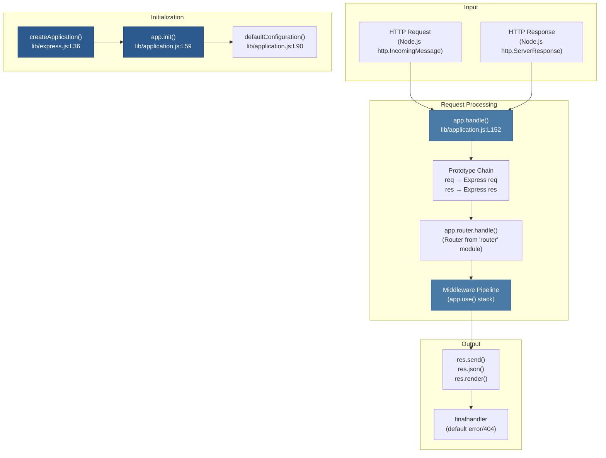

# 1 — Overview & Architecture

## Relevant Source Files

- `lib/express.js` — Factory and exports
- `lib/application.js` — Core app prototype
- `lib/request.js` — Request extensions
- `lib/response.js` — Response extensions
- `lib/view.js` — View system
- `lib/utils.js` — Utilities
- `index.js` — Entry point

## TL;DR

Express.js is a minimal, composable HTTP server framework for Node.js built on top of Node's native `http` module. It provides three main abstractions: an `Application` object for configuration and lifecycle, a middleware pipeline for request processing, and extended `Request`/`Response` objects with high-level convenience methods. Everything is lazy-loaded and opt-in.

## Overview

Express.js is a **web application framework** designed to be fast, unopinionated, and minimalist. At its core, it's a thin layer of abstractions over Node.js's native HTTP capabilities, allowing developers to:

1. Define routes and map HTTP methods to handler functions
2. Chain middleware for cross-cutting concerns (logging, parsing, auth, etc.)
3. Render templates and send responses with high-level helpers
4. Serve static files and handle content negotiation

Unlike heavier frameworks, Express avoids prescriptive patterns and leaves architectural decisions to the developer.

### Architecture Philosophy

Express follows a **layered, composable design**:

- **Lazy initialization**: The router and view engine are created only when first accessed (`lib/application.js:L69-L82`)
- **Mixin inheritance**: Core functionality is added to the app via descriptor objects rather than deep class hierarchies (`lib/express.js:L41-L52`)
- **Delegation to dependencies**: Routing, body parsing, static file serving, and content negotiation are delegated to focused, single-purpose modules (`router`, `body-parser`, `serve-static`, etc.)
- **Extensibility via middleware**: The entire request pipeline can be extended without modifying Express internals

### Request Lifecycle

When an HTTP request arrives:

1. **Routing**: The request is matched against registered routes by the `Router` (see [Page 3 — Routing](03-routing-system.md))
2. **Middleware Pipeline**: Matching middleware chain is executed in order (see [Page 4 — Middleware](04-middleware-pipeline.md))
3. **Handler Execution**: Route handler is invoked with extended `Request` and `Response` objects (see [Page 5 — Request/Response](05-request-response.md))
4. **Response Generation**: Handler calls methods like `res.send()`, `res.json()`, `res.render()`, etc.
5. **Final Handler**: If no handler sends a response, `finalhandler` provides a default 404 or error response

## Architecture Diagram

## Key Concepts

| Concept | Definition | Where It Lives |
|---------|-----------|-----------------|
| **Application (app)** | The core Express app object created by `express()`. Holds settings, engines, locals, and the router. | `lib/express.js:L36-L56`, `lib/application.js:L40` |
| **Factory Function** | `createApplication()` creates a function that acts as middleware (it's callable and has methods mixed in). | `lib/express.js:L36` |
| **Router** | Internally managed by the app via lazy getter. Routes HTTP requests to handlers. Imported from external `router` module. | `lib/application.js:L69-L82` |
| **Middleware** | Functions that process requests in a chain. Signature: `(req, res, next) => void`. Can modify req/res or call `next()` to continue. | [Page 4](04-middleware-pipeline.md) |
| **Route** | A path-specific middleware stack for particular HTTP methods. Created by `app.get()`, `app.post()`, etc. | [Page 3](03-routing-system.md) |
| **Handler** | A middleware function assigned to a route or globally via `app.use()`. | [Page 4](04-middleware-pipeline.md) |
| **Request (req)** | Express extends Node's `IncomingMessage` with methods like `req.accepts()`, `req.query`, `req.body` (if body-parser loaded). | `lib/request.js`, [Page 5](05-request-response.md) |
| **Response (res)** | Express extends Node's `ServerResponse` with methods like `res.send()`, `res.json()`, `res.render()`. | `lib/response.js`, [Page 5](05-request-response.md) |
| **Settings** | App configuration stored in `app.settings` object. Set/get via `app.set(key, val)` and `app.get(key)`. | `lib/application.js:L64` |
| **Locals** | Template variables stored in `app.locals` and `res.locals`. Available to all view renders. | `lib/application.js:L125`, [Page 6](06-view-engine.md) |
| **View** | A template file resolver and engine loader. Finds the template file and calls the registered engine. | `lib/view.js`, [Page 6](06-view-engine.md) |

## Component Reference

| Component | Kind | Responsibility | Source |
|-----------|------|-----------------|--------|
| `createApplication()` | factory | Creates an Express app object by mixing in EventEmitter and application prototype methods | `lib/express.js:L36-L56` |
| `app.init()` | method | Initializes app state: cache, engines, settings, lazy router getter, and default config | `lib/application.js:L59-L83` |
| `app.defaultConfiguration()` | method | Sets default settings (env, etag mode, query parser, trust proxy, view engine, etc.) | `lib/application.js:L90-L141` |
| `app.handle()` | method | Main request dispatcher. Sets up prototype chain, calls router.handle() | `lib/application.js:L152-L178` |
| `app.use()` | method | Registers global middleware. Flattens arrays, detects mounted sub-apps | `lib/application.js:L190-L244` |
| `app.route()` | method | Returns a Route object for path-specific middleware chaining | `lib/application.js:L256-L258` |
| `app.engine()` | method | Registers a view template engine by file extension | `lib/application.js:L294+` |
| `req` (prototype) | object | Extended IncomingMessage with `.get()`, `.accepts()`, `.query`, `.params`, `.ip`, etc. | `lib/request.js` |
| `res` (prototype) | object | Extended ServerResponse with `.send()`, `.json()`, `.render()`, `.redirect()`, `.status()`, etc. | `lib/response.js` |
| `View` | class | Template file resolver. Looks up files by name, loads engine, stores path | `lib/view.js:L52-L95` |

## How It Works

### App Creation & Initialization

When a developer calls `express()`:

1. `createApplication()` (`lib/express.js:L36`) creates a function that closes over the app object
2. `EventEmitter.prototype` is mixed into the function (`lib/express.js:L41`), making the app an event emitter
3. Application prototype methods are mixed in (`lib/express.js:L42`), adding `.use()`, `.route()`, `.listen()`, etc.
4. Custom request/response prototypes are created and attached as `app.request` and `app.response` (`lib/express.js:L45-L52`)
5. `app.init()` is called to initialize internal state: settings, cache, engines, and lazy router getter (`lib/express.js:L54`)
6. Default configuration is applied: environment, etag mode, view engine, view directory, etc. (`lib/application.js:L90-L141`)

### Request Handling Pipeline

When an HTTP request arrives:

1. Node.js calls the app function directly (because the app itself is a function): `app(req, res, next)` → `app.handle(req, res, next)` (`lib/express.js:L37-L38`)
2. `app.handle()` sets the "X-Powered-By" header if enabled (`lib/application.js:L160-L162`)
3. Prototype chain is altered: both `req` and `res` are re-prototyped to Express versions, gaining Express methods (`lib/application.js:L169-L170`)
4. Response locals are initialized if missing (`lib/application.js:L173-L175`)
5. The router's `handle()` method is called, which dispatches to matching routes and middleware (`lib/application.js:L177`)
6. If no handler sends a response, `finalhandler` is called to send a 500 or 404 (`lib/application.js:L154-L157`)

### Middleware & Route Execution

The router maintains two separate stacks:

1. **Global middleware** (registered via `app.use()`) — executed for all routes
2. **Route-specific handlers** (registered via `app.get()`, `app.post()`, etc.) — executed only for matching paths/methods

Each middleware/handler is a function with signature `(req, res, next) => void`. The middleware chain is managed by the `router` module (external dependency), but Express provides the glue:

- `app.use(path?, fn|array)` flattens nested arrays and delegates to `router.use()` (`lib/application.js:L190-L244`)
- `app.get()`, `app.post()`, etc. are HTTP method shortcuts that delegate to `router[method]()` (automatically generated from `METHODS` in `lib/utils.js:L29`)

If a middleware calls `next(err)` with an error, the error is passed through the chain. Any middleware with 4 parameters `(err, req, res, next)` is treated as error middleware (see [Page 4](04-middleware-pipeline.md)).

## Configuration & Settings

Express maintains app-wide configuration via `app.settings`:

| Setting | Default | Purpose | Set via | Source |
|---------|---------|---------|---------|--------|
| `env` | NODE_ENV or 'development' | Current environment (dev/prod affects view caching) | `process.env.NODE_ENV` | `lib/application.js:L91-L96` |
| `etag` | `'weak'` | ETag generation strategy: false, 'weak', 'strong', or custom function | `app.set('etag', val)` | `lib/application.js:L95` |
| `x-powered-by` | `true` (enabled) | Whether to set X-Powered-By header | `app.enable()`/`disable()` | `lib/application.js:L94` |
| `view` | `View` class | Template engine resolver class | `app.set('view', CustomView)` | `lib/application.js:L134` |
| `views` | `'./views'` (cwd) | Directory where view templates are stored | `app.set('views', path)` | `lib/application.js:L135` |
| `view cache` | `true` in production | Whether to cache compiled view functions | `app.enable()`/`disable()` | `lib/application.js:L139` |
| `query parser` | `'simple'` | How to parse URL query strings. Options: 'simple', 'extended', custom function, `false` | `app.set('query parser', val)` | `lib/application.js:L97` |
| `trust proxy` | `false` | Whether to trust X-Forwarded-* headers. Options: boolean, IP/CIDR list, function | `app.set('trust proxy', val)` | `lib/application.js:L99` |
| `subdomain offset` | `2` | Number of dots stripped from hostname when accessing `req.subdomains` | `app.set('subdomain offset', val)` | `lib/application.js:L98` |
| `jsonp callback name` | `'callback'` | Query parameter name for JSONP responses | `app.set('jsonp callback name', val)` | `lib/application.js:L136` |

## Cross-References

- For routing details, see [Page 3 — Routing System](03-routing-system.md)
- For middleware system details, see [Page 4 — Middleware Pipeline](04-middleware-pipeline.md)
- For request/response methods, see [Page 5 — Request & Response](05-request-response.md)
- For view engine system, see [Page 6 — View System](06-view-engine.md)
- For application configuration details, see [Page 2 — Application Core](02-application-core.md)
