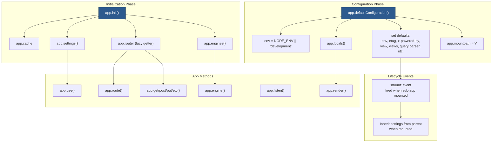

# 2 — Application Core

## Relevant Source Files

- `lib/application.js` — Application prototype and methods
- `lib/express.js:L36-L56` — App factory
- `lib/utils.js` — Utility functions for settings compilation
- `examples/hello-world/index.js` — Minimal app setup

## TL;DR

The Application object is the heart of Express. It's created by the factory function `express()`, initialized with lazy loaders and default settings, and provides methods to register routes, middleware, view engines, and configuration. Most app state is stored in `app.settings`, `app.engines`, and `app.locals`.

## Overview

The Application prototype (`lib/application.js`) defines all app-level methods and configuration. When `express()` is called, a new function is created and the application prototype is mixed into it, making the function itself the app object. This clever design allows Express apps to act as middleware—you can mount one app inside another via `app.use()`.

The app object manages:

1. **Settings** — Configuration via `app.set()` and `app.get()`
2. **Engines** — Registered template engines by file extension
3. **Router** — Lazily created router for dispatching requests
4. **Locals** — Template variables available to all views
5. **Request/Response prototypes** — Custom extensions to Node's http objects

All initialization happens in two phases:

- **Phase 1**: `app.init()` sets up internal state and installs a lazy getter for the router
- **Phase 2**: `app.defaultConfiguration()` applies environment-specific defaults and event listeners

## Architecture Diagram



## Key Concepts

| Concept | Description | Source |
|---------|-------------|--------|
| **Settings Object** | Key-value store of app configuration. Access via `app.get(key)` and `app.set(key, value)`. Environment-based defaults applied at init. | `lib/application.js:L64`, `L90-L141` |
| **Engines Cache** | Object mapping file extensions to template engine functions (e.g., `{ '.ejs': ejaRenderFn }`). Populated by `app.engine()`. | `lib/application.js:L63` |
| **Locals Object** | Variables available to all template renders. `app.locals` is app-level; `res.locals` is request-level. | `lib/application.js:L125` |
| **Lazy Router Getter** | Router is created on first access via `app.router` getter, not at init time. Improves startup performance. | `lib/application.js:L69-L82` |
| **Mount Path** | Path where an app is mounted if used as middleware. Top-level apps default to '/'. Sub-apps set this when mounted. | `lib/application.js:L128` |
| **Trust Proxy** | Controls whether to trust X-Forwarded-* headers (for IP, protocol, host when behind reverse proxy). | `lib/application.js:L99`, `L111-L115` |
| **Sub-app Mounting** | When an Express app is registered via `app.use(path, subapp)`, it receives mount events and inherits parent settings. | `lib/application.js:L221-L240` |
| **Prototype Inheritance** | When sub-app is mounted, its request/response prototypes inherit from parent's via `Object.setPrototypeOf()`. | `lib/application.js:L118-L121`, `L233-L234` |

## Component Reference

| Component | Type | Responsibility | Source |
|-----------|------|-----------------|--------|
| `app.init()` | method | Initializes app state: cache, engines, settings. Sets up lazy router getter. | `lib/application.js:L59-L83` |
| `app.defaultConfiguration()` | method | Applies environment-specific defaults: env, etag, view engine, etc. Registers mount event listener. | `lib/application.js:L90-L141` |
| `app.handle()` | method | Main request dispatcher. Alters req/res prototypes, initializes locals, calls router.handle(). | `lib/application.js:L152-L178` |
| `app.use()` | method | Registers global or path-prefixed middleware. Flattens arrays. Detects and mounts sub-apps. | `lib/application.js:L190-L244` |
| `app.route()` | method | Returns a Route object for the given path, allowing chained method handlers. | `lib/application.js:L256-L258` |
| `app.engine()` | method | Registers a view template engine by file extension. Stores in `app.engines{}` cache. | `lib/application.js:L294-L315` |
| `app.param()` | method | Registers a middleware callback for named route parameters. | [NEEDS INVESTIGATION] |
| `app.render()` | method | Renders a view template with given data. Creates View instance, compiles, returns result. | [NEEDS INVESTIGATION] |
| `app.listen()` | method | Starts HTTP server on given port. Wraps `http.createServer()` and calls `.listen()`. | [NEEDS INVESTIGATION] |
| `app.set()` | method | Sets a setting value in `app.settings`. | [NEEDS INVESTIGATION] |
| `app.get()` | method | Gets a setting value or HTTP method handler. Overloaded. | [NEEDS INVESTIGATION] |
| `app.enable()` | method | Sets a boolean setting to true. | [NEEDS INVESTIGATION] |
| `app.disable()` | method | Sets a boolean setting to false. | [NEEDS INVESTIGATION] |
| `app.enabled()` | method | Checks if a boolean setting is true. | [NEEDS INVESTIGATION] |
| `app.disabled()` | method | Checks if a boolean setting is false. | [NEEDS INVESTIGATION] |

## How It Works

### Phase 1: Initialization via app.init()

When `express()` is called, `app.init()` runs immediately (`lib/express.js:L54`):

```javascript
app.init = function init() {
  var router = null;

  this.cache = Object.create(null);        // Empty cache for views
  this.engines = Object.create(null);      // Empty cache for template engines
  this.settings = Object.create(null);     // Empty settings object

  this.defaultConfiguration();             // Apply defaults

  // Lazy getter for router
  Object.defineProperty(this, 'router', {
    configurable: true,
    enumerable: true,
    get: function getrouter() {
      if (router === null) {
        router = new Router({
          caseSensitive: this.enabled('case sensitive routing'),
          strict: this.enabled('strict routing')
        });
      }
      return router;
    }
  });
};
```

Key points:

- **Cache, engines, settings** are initialized as empty objects using `Object.create(null)` to avoid prototype pollution
- **Router is lazy-loaded** — the getter returns a cached `Router` instance on first access, improving startup performance
- **Router options** respect app settings for `case sensitive routing` and `strict routing`

### Phase 2: Configuration via app.defaultConfiguration()

Immediately after init, `defaultConfiguration()` runs (`lib/application.js:L90-L141`):

```javascript
app.defaultConfiguration = function defaultConfiguration() {
  var env = process.env.NODE_ENV || 'development';

  // Apply default settings
  this.enable('x-powered-by');                              // X-Powered-By: Express header
  this.set('etag', 'weak');                                 // Use weak ETags
  this.set('env', env);                                     // Store environment
  this.set('query parser', 'simple');                       // Simple query parser (not qs)
  this.set('subdomain offset', 2);                          // Strip 2 dots from hostname
  this.set('trust proxy', false);                           // Don't trust proxy headers by default

  // Trust proxy backwards compatibility
  Object.defineProperty(this.settings, trustProxyDefaultSymbol, {
    configurable: true,
    value: true
  });

  // Attach mount event listener for sub-app inheritance
  this.on('mount', function onmount(parent) {
    if (this.settings[trustProxyDefaultSymbol] === true && typeof parent.settings['trust proxy fn'] === 'function') {
      delete this.settings['trust proxy'];
      delete this.settings['trust proxy fn'];
    }

    // Inherit prototypes from parent app
    Object.setPrototypeOf(this.request, parent.request);
    Object.setPrototypeOf(this.response, parent.response);
    Object.setPrototypeOf(this.engines, parent.engines);
    Object.setPrototypeOf(this.settings, parent.settings);
  });

  // Setup locals and path
  this.locals = Object.create(null);
  this.mountpath = '/';
  this.locals.settings = this.settings;

  // View engine defaults
  this.set('view', View);                                   // Use built-in View resolver
  this.set('views', resolve('views'));                      // Look in ./views/ directory
  this.set('jsonp callback name', 'callback');              // Default JSONP parameter name

  // Production settings
  if (env === 'production') {
    this.enable('view cache');                              // Cache compiled views
  }
};
```

Key behaviors:

- **Environment detection** from `NODE_ENV` environment variable
- **JSONP support** via callback parameter (configurable name)
- **View caching** enabled automatically in production for performance
- **Prototype inheritance chain** — sub-apps mounted via `app.use()` inherit parents' request/response prototypes and settings
- **Event listener** for mount events allows configuration inheritance when used as middleware

### App Methods: Registering Routes & Middleware

**`app.use(path?, fn|array)`** — Registers middleware (`lib/application.js:L190-L244`):

```javascript
app.use = function use(fn) {
  var offset = 0;
  var path = '/';

  // Determine if first arg is a path or middleware
  if (typeof fn !== 'function') {
    var arg = fn;
    while (Array.isArray(arg) && arg.length !== 0) {
      arg = arg[0];
    }
    if (typeof arg !== 'function') {
      offset = 1;
      path = fn;  // First arg is the path
    }
  }

  // Flatten any nested arrays of middleware
  var fns = flatten.call(slice.call(arguments, offset), Infinity);

  if (fns.length === 0) {
    throw new TypeError('app.use() requires a middleware function');
  }

  var router = this.router;

  fns.forEach(function (fn) {
    // If fn is an Express app (has .handle and .set methods), mount it as sub-app
    if (!fn || !fn.handle || !fn.set) {
      return router.use(path, fn);
    }

    debug('.use app under %s', path);
    fn.mountpath = path;
    fn.parent = this;

    // Wrap the sub-app to restore original prototypes after it handles the request
    router.use(path, function mounted_app(req, res, next) {
      var orig = req.app;
      fn.handle(req, res, function (err) {
        Object.setPrototypeOf(req, orig.request);
        Object.setPrototypeOf(res, orig.response);
        next(err);
      });
    });

    // Fire mount event on the sub-app
    fn.emit('mount', this);
  }, this);

  return this;
};
```

Key features:

- **Flexible path parameter**: `app.use(fn)` vs `app.use('/path', fn)` both supported
- **Array flattening**: Can pass arrays or nested arrays of middleware
- **Sub-app detection**: If `fn` has `.handle()` and `.set()` methods, it's treated as a mounted Express app
- **Prototype wrapping**: When sub-app handles a request, prototypes are temporarily altered, then restored
- **Mount events**: When a sub-app is mounted, it emits a 'mount' event allowing it to inherit parent settings

**`app.route(path)`** — Returns a Route object (`lib/application.js:L256-L258`):

```javascript
app.route = function route(path) {
  return this.router.route(path);
};
```

This delegates to the `Router.route()` method, which returns a `Route` object from the external `router` module. The Route object allows chaining of method-specific handlers:

```javascript
app.route('/user/:id')
  .get((req, res) => res.send('Get user'))
  .post((req, res) => res.send('Create user'))
  .delete((req, res) => res.send('Delete user'));
```

**`app.engine(ext, fn)`** — Registers a template engine (`lib/application.js:L294-L315`):

```javascript
app.engine = function engine(ext, fn) {
  if (typeof fn !== 'function') {
    throw new Error('callback function required');
  }

  var extension = ext[0] !== '.' ? '.' + ext : ext;

  // Store the engine function in the cache
  this.engines[extension] = fn;
  return this;
};
```

This is how developers register custom template engines. The function must have signature `(path, options, callback)`. See [Page 6 — View System](06-view-engine.md) for how this is used during rendering.

## Configuration & Environment

### Default Settings by Environment

| Setting | Development | Production | How to Override |
|---------|-------------|-----------|-----------------|
| `env` | 'development' | 'production' | `process.env.NODE_ENV` |
| `view cache` | disabled | **enabled** | `app.disable('view cache')` |
| `x-powered-by` | enabled | enabled | `app.disable('x-powered-by')` |
| `etag` | 'weak' | 'weak' | `app.set('etag', 'strong')` or `false` |
| `trust proxy` | false | false | `app.set('trust proxy', true)` |
| `query parser` | 'simple' | 'simple' | `app.set('query parser', 'extended')` |

### Settings Resolution

Settings are resolved via `app.get()` with automatic compilation:

- **ETag compilation**: Raw settings like `'weak'` are compiled to functions via `compileETag()` (`lib/utils.js:L130-L152`)
- **Query parser compilation**: `'simple'` and `'extended'` string values are compiled to parsing functions (`lib/utils.js:L176+`)
- **Trust proxy compilation**: Boolean/CIDR/function values are compiled to IP matchers via `compileTrust()` (`lib/utils.js:L208+`)

Example:

```javascript
app.set('etag', 'weak');           // Set as string
var etagFn = app.get('etag');      // Get returns compiled function
```

## Extension Points

### Mounting Sub-Apps

An Express app can be mounted as middleware inside another app:

```javascript
const main = express();
const api = express();

api.get('/users', (req, res) => res.json([...]));

main.use('/api', api);  // Mount api under /api path
```

When `api` is mounted:

1. Its `mountpath` is set to `/api`
2. Its `parent` is set to `main`
3. It emits a 'mount' event with `main` as the argument
4. It inherits `main`'s request/response prototypes and settings via prototype chain

This allows sub-apps to override settings while inheriting from parent.

### Registering Custom Template Engines

```javascript
const app = express();

app.engine('jsx', async (path, options, callback) => {
  try {
    const compiled = await compileJSX(path, options);
    callback(null, compiled);
  } catch (err) {
    callback(err);
  }
});

app.set('view engine', 'jsx');
```

The engine function is invoked by the View system with `(path, locals, callback)`. See [Page 6](06-view-engine.md).

## Gotchas & Conventions

> ⚠️ **Gotcha**: The router is lazy-loaded, so accessing `app.router` before any routes are registered may be unexpected. If you need to inspect routes, ensure at least one route is registered first.
> Source: `lib/application.js:L69-L82`

> ⚠️ **Gotcha**: Sub-apps mounted via `app.use()` inherit the parent's request/response prototypes. If you extend `req` or `res` on the parent, those extensions are automatically available on the sub-app. However, the reverse is not true — extensions on the sub-app don't affect the parent.
> Source: `lib/application.js:L233-L234`

> 📌 **Convention**: Settings should be set before routes are defined, because some route-level middleware may depend on settings. For example, body-parser middleware depends on the 'json' settings.
> Source: `lib/application.js:L90`

> 💡 **Tip**: Use `app.locals` for variables that should be available to all template renders. Use `res.locals` for request-specific variables.
> Source: `lib/application.js:L125`

> 💡 **Tip**: In production, always set `NODE_ENV=production` to enable view caching, which significantly improves template rendering performance.
> Source: `lib/application.js:L138-L140`

## Cross-References

- For routing system details, see [Page 3 — Routing System](03-routing-system.md)
- For middleware pipeline, see [Page 4 — Middleware Pipeline](04-middleware-pipeline.md)
- For view engine system, see [Page 6 — View System](06-view-engine.md)
- For request/response objects, see [Page 5 — Request & Response](05-request-response.md)
- For architecture overview, see [Page 1 — Overview](01-overview.md)
