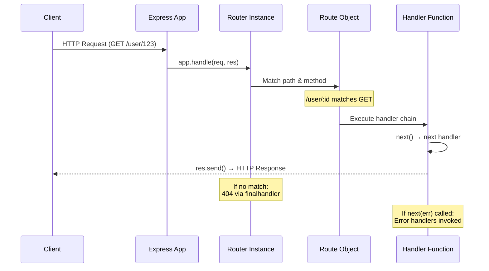

# 3 — Routing System

## Relevant Source Files

- `lib/express.js:L70-L71` — Route and Router exports
- `lib/application.js:L256-L258` — `app.route()` method
- `lib/application.js:L190-L244` — `app.use()` method for router delegation
- External module `router` (v2.2.0) — Core routing engine
- `test/Router.js` — Comprehensive routing tests
- `examples/resource/index.js`, `examples/route-map/index.js` — Routing examples

## TL;DR

Express delegates routing to the external `router` module, but wraps it with convenience methods like `app.get()`, `app.post()`, etc. Routes are path-to-handler mappings that can be created via `app.METHOD(path, handler...)` or `app.route(path).METHOD(handler...)`. The router matches requests by path pattern and HTTP method, then executes the matching handlers in sequence.

## Overview

The routing system is one of Express's core responsibilities. When an HTTP request arrives at the app, it needs to be matched against registered routes and dispatched to the appropriate handlers. Express uses the external `router` package for this, but provides high-level convenience methods.

There are two main ways to define routes:

1. **Direct method shortcuts**: `app.get(path, handler1, handler2, ...)`
2. **Route objects**: `app.route(path).get(handler1).post(handler2).put(handler3)`

Both approaches ultimately delegate to the underlying `Router` instance (`lib/express.js:L70-L71`), which is managed internally by the app (`lib/application.js:L69-L82`).

### Key Design Principles

- **Lazy router creation**: The router isn't instantiated until the first route is accessed
- **Path pattern matching**: Supports strings, regexes, and wildcards (e.g., `/user/:id`, `/files/*`, `/api/:version(\\d+)/users`)
- **Method-specific routing**: Each HTTP method (GET, POST, PUT, DELETE, etc.) can have different handlers for the same path
- **Handler chaining**: Multiple handlers can be registered for the same route; they execute in order
- **Error handling**: Error-handling middleware is triggered when a handler calls `next(err)`

## Architecture Diagram



## Key Concepts

| Concept | Description | Source |
|---------|-------------|--------|
| **Route** | A path-specific middleware stack. Supports specific HTTP methods. Created via `app.route(path)` or `app.METHOD(path, ...)`. | External `router` module (v2.2.0) |
| **Router** | The central dispatcher that matches requests to routes. Created lazily by app. Manages both global middleware and method-specific routes. | `lib/application.js:L69-L82` |
| **Path Pattern** | A route path can be: string (`'/user'`), regex (`/^\/user$/`), or pattern with parameters (`'/user/:id'`). | External `router` module |
| **Route Handler** | A middleware function executed when a route matches. Signature: `(req, res, next) => void`. Can be sync or async. | [Page 4 — Middleware](04-middleware-pipeline.md) |
| **Handler Chain** | Multiple handlers can be registered for a single route. They execute sequentially. If a handler doesn't call `next()`, the chain stops. | External `router` module |
| **Route Parameters** | Named segments in the path like `:id` in `/user/:id`. Available as `req.params.id`. | External `router` module |
| **Query Parameters** | URL query string parameters like `?search=foo`. Available as `req.query` after body-parser middleware. | [Page 5 — Request](05-request-response.md) |
| **Method Routing** | Each HTTP method (GET, POST, etc.) can have different handlers for the same path. Enabled by the Router's method separation. | External `router` module |
| **404 Routing** | When no route matches, the router returns control to `finalhandler`, which sends a 404 response. | [Page 4 — Middleware](04-middleware-pipeline.md) |
| **Case Sensitivity** | Whether routes are case-sensitive (`/User` ≠ `/user`). Controlled by `app.set('case sensitive routing', val)`. | `lib/application.js:L75` |
| **Strict Routing** | Whether trailing slashes matter (`/user/` ≠ `/user`). Controlled by `app.set('strict routing', val)`. | `lib/application.js:L76` |

## Component Reference

| Component | Type | Responsibility | Source |
|-----------|------|-----------------|--------|
| `Router` | class | Core routing engine from external module. Matches requests to handlers. Manages middleware stacks per route. | External `router` (v2.2.0) |
| `Route` | class | Per-path middleware stack. Holds method-specific handlers (GET, POST, etc.). | External `router` (v2.2.0) |
| `app.route(path)` | method | Returns a Route object for chaining method handlers. | `lib/application.js:L256-L258` |
| `app.get(path, handler...)` | method | Shortcut for registering GET route handlers. Auto-generated from METHODS list. | [Generated from lib/utils.js:L29] |
| `app.post(path, handler...)` | method | Shortcut for registering POST route handlers. | [Generated from lib/utils.js:L29] |
| `app.put(path, handler...)` | method | Shortcut for registering PUT route handlers. | [Generated from lib/utils.js:L29] |
| `app.delete(path, handler...)` | method | Shortcut for registering DELETE route handlers. | [Generated from lib/utils.js:L29] |
| `app.patch(path, handler...)` | method | Shortcut for registering PATCH route handlers. | [Generated from lib/utils.js:L29] |
| `app.options(path, handler...)` | method | Shortcut for registering OPTIONS route handlers. | [Generated from lib/utils.js:L29] |
| `app.head(path, handler...)` | method | Shortcut for registering HEAD route handlers. | [Generated from lib/utils.js:L29] |
| `app.all(path, handler...)` | method | Registers handler for all HTTP methods on a path. | [Generated from lib/utils.js:L29] |
| `router.handle(req, res, done)` | method | Main entry point. Matches request to routes and executes handlers. | External `router` module |

## How It Works

### Creating Routes

#### Method 1: Direct Shortcuts

```javascript
app.get('/user/:id', (req, res) => {
  res.send(`User ${req.params.id}`);
});

app.post('/user', (req, res) => {
  res.send('User created');
});
```

HTTP method shortcuts (`app.get()`, `app.post()`, etc.) are dynamically created from the list of valid HTTP methods (`lib/utils.js:L29`):

```javascript
exports.methods = METHODS.map((method) => method.toLowerCase());
// METHODS from Node.js http module: ['GET', 'POST', 'PUT', 'DELETE', 'PATCH', 'OPTIONS', 'HEAD', ...]
```

These shortcuts delegate to the router's corresponding method:

```javascript
app.get(path, handler1, handler2, ...)
  → app.router.get(path, handler1, handler2, ...)  // External router module
```

The router internally creates a Route object for the path and registers the handlers.

#### Method 2: Route Objects

```javascript
app.route('/user/:id')
  .get((req, res) => res.send('Get user'))
  .post((req, res) => res.send('Update user'))
  .delete((req, res) => res.send('Delete user'));
```

The `app.route()` method returns a Route object (`lib/application.js:L256-L258`):

```javascript
app.route = function route(path) {
  return this.router.route(path);
};
```

The Route object supports method chaining and returns itself from each method call, allowing fluent syntax.

### Path Patterns

Express routes support several path pattern types:

```javascript
// Literal string
app.get('/user', handler);

// Path parameter (named segment)
app.get('/user/:id', handler);
app.get('/user/:id/post/:postId', handler);

// Optional parameters (via regex)
app.get(/^\/user\/(\d+)$/, handler);

// Wildcard (catch-all)
app.get('/files/*', handler);

// Regular expression
app.get(/^\/admin/, handler);
```

Route parameters are extracted and made available as `req.params`:

```javascript
app.get('/user/:id', (req, res) => {
  console.log(req.params.id);  // Extracted from URL
});
```

### Request Dispatch Flow

When an HTTP request arrives:

1. **Router matching** (`lib/application.js:L177`): `app.router.handle(req, res, done)` is called
2. **Path & method matching**: The Router scans registered routes to find matches
3. **Handler execution**: For each matching route, handlers are executed in order
4. **Handler chain**: Each handler can:
   - Call `next()` to continue to the next handler
   - Call `next(err)` to skip to error handlers (see [Page 4](04-middleware-pipeline.md))
   - Call `res.send()`, `res.json()`, etc. to end the response
   - Do nothing (handler doesn't complete the response; chain continues)
5. **Fallback**: If no handler sends a response and the chain completes, `finalhandler` sends a 404 or error response

Example flow:

```javascript
app.get('/user/:id',
  (req, res, next) => {
    console.log('Middleware 1');
    next();  // Continue to next handler
  },
  (req, res, next) => {
    console.log('Middleware 2');
    res.send(`User ${req.params.id}`);  // Respond; chain stops
  }
);
```

### Method Routing

The same path can have different handlers for different HTTP methods:

```javascript
app.get('/resource', (req, res) => res.send('Get resource'));
app.post('/resource', (req, res) => res.send('Create resource'));
app.put('/resource/:id', (req, res) => res.send('Update resource'));
app.delete('/resource/:id', (req, res) => res.send('Delete resource'));
```

Each method is tracked separately by the Router. A request to `GET /resource` matches only the GET handler, not the POST handler.

### Route Parameter Extraction

Route parameters in the path are extracted and available as `req.params`:

```javascript
app.get('/user/:id/post/:postId', (req, res) => {
  console.log(req.params.id);      // From URL
  console.log(req.params.postId);  // From URL
  res.send('OK');
});

// Request: GET /user/42/post/100
// req.params = { id: '42', postId: '100' }
```

Parameters can also be validated with optional regex patterns:

```javascript
app.get('/user/:id(\\d+)', handler);  // Only match if :id is digits
```

### Middleware vs Routes

Routes registered via `app.get()`, `app.post()`, etc. are only executed if:
1. The HTTP method matches
2. The path matches

Middleware registered via `app.use()` is executed for **all** requests (or all requests under a path prefix):

```javascript
app.use((req, res, next) => {
  console.log('This runs for every request');
  next();
});

app.get('/specific', (req, res) => {
  console.log('This only runs for GET /specific');
  res.send('OK');
});
```

See [Page 4 — Middleware](04-middleware-pipeline.md) for more on middleware.

## Configuration & Settings

### Route Configuration

Routing behavior is controlled by app settings:

| Setting | Default | Purpose |
|---------|---------|---------|
| `case sensitive routing` | `false` | If true, `/User` ≠ `/user`. If false, they match. |
| `strict routing` | `false` | If true, `/user/` ≠ `/user`. If false, they match. |

Set these before registering routes:

```javascript
const app = express();
app.set('case sensitive routing', true);   // /User ≠ /user
app.set('strict routing', true);            // /user/ ≠ /user

app.get('/User', (req, res) => res.send('Uppercase'));
app.get('/user', (req, res) => res.send('Lowercase'));
```

The router respects these settings when instantiated (`lib/application.js:L74-L77`):

```javascript
router = new Router({
  caseSensitive: this.enabled('case sensitive routing'),
  strict: this.enabled('strict routing')
});
```

## Extension Points

### Route Middleware Chaining

Multiple middleware functions can be attached to a route:

```javascript
function validateUser(req, res, next) {
  if (!req.params.id) {
    return res.status(400).send('Missing user ID');
  }
  next();
}

function fetchUser(req, res, next) {
  // Fetch user from database
  req.user = { id: req.params.id, name: 'John' };
  next();
}

function sendUser(req, res) {
  res.json(req.user);
}

app.get('/user/:id', validateUser, fetchUser, sendUser);
```

Or using route objects:

```javascript
const route = app.route('/user/:id');

route.get(validateUser, fetchUser, sendUser);
route.post(validateUser, createUser);
route.put(validateUser, updateUser);
route.delete(validateUser, deleteUser);
```

### Parameterized Route Handlers

Express provides `app.param()` for middleware that runs before route handlers when a parameter is present:

```javascript
app.param('id', (req, res, next, id) => {
  console.log('Loading user', id);
  // Fetch user from DB
  req.user = { id, name: 'John' };
  next();
});

app.get('/user/:id', (req, res) => {
  res.json(req.user);  // User already loaded
});
```

The param handler (`app.param()`) is invoked before the route handler whenever the parameter is present in the URL.

## Error Handling in Routes

If a route handler calls `next(err)`, Express skips normal handlers and jumps to error handlers (middleware with 4 parameters):

```javascript
app.get('/user/:id', (req, res, next) => {
  try {
    const user = loadUser(req.params.id);
    res.json(user);
  } catch (err) {
    next(err);  // Pass error to error handlers
  }
});

// Error handler (must have 4 parameters)
app.use((err, req, res, next) => {
  res.status(500).send('Server error: ' + err.message);
});
```

See [Page 4 — Middleware Pipeline](04-middleware-pipeline.md) for full error handling details.

## Gotchas & Conventions

> ⚠️ **Gotcha**: The order of route registration matters. Express matches routes in the order they were registered. If you have overlapping paths, more specific routes should be registered before general ones.
> Source: External `router` module behavior

> ⚠️ **Gotcha**: If a route handler doesn't call `next()` and doesn't send a response (e.g., it's missing `res.send()`), the response will hang. Always ensure each handler either calls `next()` or sends a response.
> Source: Standard middleware pattern

> 📌 **Convention**: Use `app.route(path)` for routes with multiple methods to avoid repetition:
> ```javascript
> app.route('/user/:id')
>   .get(getHandler)
>   .post(postHandler)
>   .put(putHandler);
> ```

> 💡 **Tip**: Use `app.all()` for middleware that should run for all HTTP methods on a path:
> ```javascript
> app.all('/admin*', checkAuth);  // Protect all /admin paths
> ```

> 💡 **Tip**: Route parameters are always strings. If you need numbers, parse them explicitly:
> ```javascript
> app.get('/user/:id', (req, res) => {
>   const id = parseInt(req.params.id, 10);  // Parse string to number
>   res.json({ id });
> });
> ```

## Cross-References

- For middleware system details, see [Page 4 — Middleware Pipeline](04-middleware-pipeline.md)
- For request parameters and methods, see [Page 5 — Request & Response](05-request-response.md)
- For app configuration, see [Page 2 — Application Core](02-application-core.md)
- For architecture overview, see [Page 1 — Overview](01-overview.md)

---

## Test Coverage

The test suite has comprehensive routing coverage:

- `test/Router.js` — Core Router tests (463+ lines)
- `test/Route.js` — Route object tests
- `test/app.route.js` — `app.route()` API tests
- `test/app.router.js` — Router integration tests (1210+ lines)
- `test/app.get.js`, `test/app.post.js`, etc. — Individual HTTP method tests
- `test/app.param.js` — Parameter handler tests
- `test/req.path.js`, `test/req.params.js` — Request parameter tests

These tests verify path matching, parameter extraction, method routing, and error handling.
