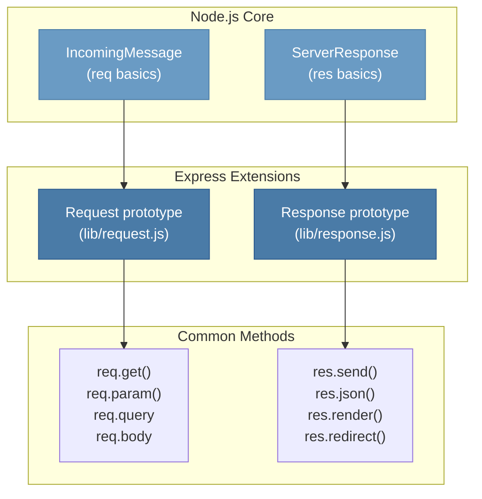

# 5 — Request & Response Objects

## Relevant Source Files

- `lib/request.js` — Request prototype extensions (900+ lines)
- `lib/response.js` — Response prototype extensions (1100+ lines)
- `lib/express.js:L45-L52` — Custom prototypes attachment
- `examples/params/index.js`, `examples/content-negotiation/index.js` — Usage examples
- `test/req.*.js`, `test/res.*.js` — Comprehensive method tests (50+ test files)

## TL;DR

Express extends Node.js's native `IncomingMessage` (request) and `ServerResponse` (response) objects with convenience methods. Request methods help parse incoming data (headers, parameters, body, content negotiation). Response methods simplify sending responses (send, json, render, redirect, etc.). Both are attached to the app during `app.handle()` via prototype manipulation.

## Overview

One of Express's most valuable contributions is the extensive convenience API built on top of Node's raw HTTP objects. While a developer can use raw Node methods like `res.writeHead()` and `res.end()`, Express provides higher-level methods that handle common patterns automatically.

The `req` and `res` objects are enhanced versions of Node's `IncomingMessage` and `ServerResponse`:

```javascript
var req = Object.create(http.IncomingMessage.prototype);   // lib/request.js:L30
var res = Object.create(http.ServerResponse.prototype);    // lib/response.js:L42
```

When a request arrives, the app alters the prototype chain of the request/response objects to these enhanced versions, making all Express methods available:

```javascript
Object.setPrototypeOf(req, this.request);   // lib/application.js:L169
Object.setPrototypeOf(res, this.response);  // lib/application.js:L170
```

This design allows developers to use raw Node methods when needed (they're still on the prototype chain) while gaining high-level Express helpers.

## Architecture Diagram



## Key Concepts

| Concept | Description | Source |
|---------|-------------|--------|
| **Request (req)** | Express-enhanced Node.js IncomingMessage. Provides methods for parsing headers, query, params, body, content negotiation. | `lib/request.js` |
| **Response (res)** | Express-enhanced Node.js ServerResponse. Provides methods for sending responses in various formats. | `lib/response.js` |
| **Prototype Chain** | req and res are created by extending Node prototypes. Allows use of both Node and Express methods. | `lib/request.js:L30`, `lib/response.js:L42` |
| **Headers** | HTTP headers in requests (accessed via `req.get()`) and responses (set via `res.set()`). | `lib/request.js:L63-L83`, `lib/response.js` |
| **Query String** | URL query parameters like `?search=foo&page=2`. Available as `req.query` (requires body-parser or query parser middleware). | `lib/request.js:L172+` |
| **Route Parameters** | Named segments in routes like `:id` in `/user/:id`. Available as `req.params`. | `lib/request.js` |
| **Body** | Request body content. Available as `req.body` (requires body-parser middleware). | External `body-parser` module |
| **Content Negotiation** | Determining best response format based on Accept headers. Methods: `req.accepts()`, `res.format()`. | `lib/request.js`, `lib/response.js` |
| **Locals** | Response-specific variables available to templates. Set via `res.locals` or app/request level. | [Page 6 — View System](06-view-engine.md) |
| **Status Code** | HTTP response status code (200, 404, 500, etc.). Set via `res.status(code)`. | `lib/response.js:L64-L76` |
| **Content Type** | MIME type of response body. Set via `res.type()` or `res.set('Content-Type', ...)`. | `lib/response.js` |

## Component Reference

### Request Methods

| Method | Signature | Purpose | Source |
|--------|-----------|---------|--------|
| `req.get(name)` | `(name: string) → string \| undefined` | Get request header value | `lib/request.js:L63-L83` |
| `req.accepts(types)` | `(types: string \| string[]) → string \| false` | Check if client accepts content type | `lib/request.js` |
| `req.acceptsCharsets()` | `(charsets: string[]) → string \| false` | Check if client accepts charset | `lib/request.js` |
| `req.acceptsEncodings()` | `(encodings: string[]) → string \| false` | Check if client accepts encoding | `lib/request.js` |
| `req.acceptsLanguages()` | `(languages: string[]) → string \| false` | Check if client accepts language | `lib/request.js` |
| `req.is(type)` | `(type: string) → string \| false` | Check if request Content-Type matches | `lib/request.js` |
| `req.path` | property | Requested path (without query string) | `lib/request.js` |
| `req.hostname` | property | Hostname from Host header | `lib/request.js` |
| `req.host` | property | Hostname and port | `lib/request.js` |
| `req.ip` | property | Client IP address (respects trust proxy) | `lib/request.js` |
| `req.ips` | property | Array of IPs if forwarded through proxies | `lib/request.js` |
| `req.query` | property | Parsed query string parameters | [Via router/body-parser] |
| `req.params` | property | Named route parameters | `lib/request.js` |
| `req.body` | property | Parsed request body (requires body-parser) | External `body-parser` |
| `req.cookies` | property | Parsed cookies (requires cookie-parser) | External `cookie-parser` |
| `req.signedCookies` | property | Verified signed cookies | External `cookie-parser` |
| `req.protocol` | property | 'http' or 'https' (respects trust proxy) | `lib/request.js` |
| `req.secure` | property | Boolean: is connection HTTPS? | `lib/request.js` |
| `req.fresh` | property | Boolean: is response still fresh (from etag/last-modified)? | `lib/request.js` |
| `req.stale` | property | Opposite of fresh | `lib/request.js` |
| `req.xhr` | property | Boolean: is X-Requested-With XMLHttpRequest? | `lib/request.js` |
| `req.baseUrl` | property | Base URL of the app | `lib/request.js` |
| `req.originalUrl` | property | Original request URL (Node.js native) | Node.js http |
| `req.url` | property | Current request URL (may be modified by middleware) | Node.js http |
| `req.method` | property | HTTP method (GET, POST, etc.) | Node.js http |
| `req.headers` | property | Raw headers object | Node.js http |
| `req.route` | property | Matched Route object | `lib/request.js` |
| `req.app` | property | Reference to Express app | `lib/request.js` |
| `req.res` | property | Reference to response object | Set in `app.handle()` |

### Response Methods

| Method | Signature | Purpose | Source |
|--------|-----------|---------|--------|
| `res.status(code)` | `(code: number) → this` | Set HTTP status code | `lib/response.js:L64-L76` |
| `res.sendStatus(code)` | `(code: number) → void` | Set status and send standard message | `lib/response.js` |
| `res.send(body)` | `(body: string \| object \| buffer) → void` | Send response with automatic Content-Type | `lib/response.js` |
| `res.json(obj)` | `(obj: any) → void` | Send JSON response | `lib/response.js` |
| `res.jsonp(obj)` | `(obj: any) → void` | Send JSONP response (wrapper callback) | `lib/response.js` |
| `res.render(view, locals, callback)` | `(view, options?, callback?) → void` | Render template and send | `lib/response.js` |
| `res.redirect(status?, url)` | `(url: string) → void` or `(status, url) → void` | Send redirect response | `lib/response.js` |
| `res.location(url)` | `(url: string) → this` | Set Location header | `lib/response.js` |
| `res.set(field, value)` | `(field: string, value: string) → this` | Set response header | Node.js native |
| `res.get(field)` | `(field: string) → string \| undefined` | Get response header | Node.js native |
| `res.header(field, value)` | alias for `set()` | Alias for `res.set()` | Node.js native |
| `res.append(field, value)` | `(field: string, value: string) → this` | Append to response header | `lib/response.js` |
| `res.type(type)` | `(type: string) → this` | Set Content-Type header | `lib/response.js` |
| `res.format(obj)` | `(obj: {[key]: handler}) → void` | Send response based on Accept header | `lib/response.js` |
| `res.cookie(name, value, options)` | `(name, value, options?) → this` | Set response cookie | `lib/response.js` |
| `res.clearCookie(name, options)` | `(name, options?) → this` | Clear a cookie | `lib/response.js` |
| `res.download(path, filename?, callback)` | `(path, name?, cb?) → void` | Serve file as download | `lib/response.js` |
| `res.sendFile(path, options?, callback)` | `(path, options?, cb?) → void` | Send file | `lib/response.js` |
| `res.links(links)` | `(links: object) → this` | Set Link header | `lib/response.js:L97-L103` |
| `res.locals` | property object | Response-local variables for templates | Set in `app.handle()` |
| `res.end(data?, encoding?)` | `(data?, encoding?) → void` | End response (Node.js native) | Node.js http |
| `res.write(chunk, encoding?)` | `(chunk, encoding?) → boolean` | Write chunk to response (Node.js native) | Node.js http |
| `res.writeHead(statusCode, headers)` | `(code, headers?) → this` | Write status and headers (Node.js native) | Node.js http |
| `res.app` | property | Reference to Express app | Set in `lib/express.js` |
| `res.req` | property | Reference to request object | Set in `app.handle()` |

## How It Works

### Request Object Initialization

When a request arrives, Express creates a req object extending Node's IncomingMessage:

```javascript
var req = Object.create(http.IncomingMessage.prototype);  // lib/request.js:L30
```

Then in `app.handle()`, the prototype chain is altered to the Express request object (`lib/application.js:L169`):

```javascript
Object.setPrototypeOf(req, this.request);
```

This gives the request object all Node.js methods (the prototype chain is preserved) plus all Express methods defined in `lib/request.js`.

#### Request Properties

Some properties are lazy-loaded getters:

```javascript
// req.query - Parsed query string
Object.defineProperty(req, 'query', {
  get: function query() {
    // Parse query string using configured query parser
  }
});

// req.params - Route parameters
Object.defineProperty(req, 'params', {
  get: function params() {
    // Extract from matched route
  }
});

// req.ip - Client IP
Object.defineProperty(req, 'ip', {
  get: function ip() {
    // Extract from request or X-Forwarded-For
  }
});
```

### Response Object Initialization

Similarly, the response object extends Node's ServerResponse:

```javascript
var res = Object.create(http.ServerResponse.prototype);   // lib/response.js:L42
```

In `app.handle()`, the prototype chain is altered:

```javascript
Object.setPrototypeOf(res, this.response);
```

All response methods defined in `lib/response.js` become available.

### Content Negotiation

Express uses the `accepts` library for content negotiation:

```javascript
// req.accepts(types) - Check if client accepts type
req.accepts('json');      // → 'json' if client Accept includes application/json
req.accepts(['json', 'html']);  // → 'json' if preferred by Accept header

// res.format(obj) - Send response based on Accept header
res.format({
  json: () => res.json({...}),
  html: () => res.send('<html>...</html>'),
  text: () => res.send('Plain text')
});
```

### Response Sending

`res.send()` is a versatile method that handles multiple scenarios (`lib/response.js`):

```javascript
res.send('Hello');           // Sends string, sets Content-Type to text/html
res.send({ a: 1 });         // Sends JSON, sets Content-Type to application/json
res.send(Buffer.from(...));  // Sends buffer as-is
```

`res.json()` always sends JSON regardless of input:

```javascript
res.json({ a: 1 });         // Always JSON
res.json('text');           // Sends "\"text\"" (JSON string)
```

`res.render()` looks up a template, renders it, and sends the result (`lib/response.js`):

```javascript
res.render('user', { user: data }, (err, html) => {
  if (err) return next(err);
  res.send(html);
});
```

See [Page 6 — View System](06-view-engine.md) for how templates are resolved and rendered.

### Cookie Handling

Cookies are set via `res.cookie()` and can be signed:

```javascript
res.cookie('sessionId', 'abc123', {
  httpOnly: true,
  secure: true,
  maxAge: 24 * 60 * 60 * 1000  // 24 hours
});

res.cookie('token', 'xyz', {
  signed: true  // Uses app's cookie secret (must be configured)
});
```

To read cookies, the `cookie-parser` middleware must be installed:

```javascript
app.use(require('cookie-parser')());

app.get('/', (req, res) => {
  console.log(req.cookies.sessionId);  // Unsigned cookies
  console.log(req.signedCookies.token);  // Signed cookies (verified)
});
```

### Redirects

Redirects are simple:

```javascript
res.redirect('/home');                    // 302 Found
res.redirect(301, '/home');               // 301 Moved Permanently
res.redirect('http://example.com');       // External redirect
res.redirect('back');                     // Back to referer
res.redirect('../page');                  // Relative to current path
```

## Configuration & Environment

### Request/Response Configuration

Configuration is done via app settings (see [Page 2 — Application Core](02-application-core.md)):

| Setting | Effect | Example |
|---------|--------|---------|
| `trust proxy` | How to trust X-Forwarded-* headers for `req.ip`, `req.protocol` | `app.set('trust proxy', true)` |
| `query parser` | How to parse URL query strings | `app.set('query parser', 'extended')` |
| `subdomain offset` | How many dots to strip from hostname for `req.subdomains` | `app.set('subdomain offset', 2)` |
| `jsonp callback name` | Query parameter name for JSONP responses | `app.set('jsonp callback name', 'cb')` |

### Content Types

Express automatically determines Content-Type based on data:

```javascript
res.send('hello');        // text/html; charset=utf-8
res.send({a: 1});         // application/json; charset=utf-8
res.send(Buffer.from(...)//  application/octet-stream
```

Or set it explicitly:

```javascript
res.type('json');         // application/json
res.type('text/plain');   // text/plain
res.type('html');         // text/html
res.set('Content-Type', 'application/pdf');
```

## Extension Points

### Custom Request Methods

Developers can add custom methods to all requests:

```javascript
// Add custom getter to request prototype
Object.defineProperty(express.request, 'user', {
  get: function() {
    return this.session?.user;
  }
});

// Or monkey-patch
express.request.isAdmin = function() {
  return this.user?.role === 'admin';
};

// Now available on all requests
app.get('/', (req, res) => {
  if (req.isAdmin()) {
    res.send('Admin panel');
  }
});
```

### Custom Response Methods

Similarly for responses:

```javascript
express.response.sendError = function(status, message) {
  this.status(status).json({ error: message });
};

app.use((err, req, res, next) => {
  res.sendError(err.status || 500, err.message);
});
```

### Content Negotiation Middleware

Custom negotiation:

```javascript
app.use((req, res, next) => {
  res.format({
    json: () => res.json({...}),
    csv: () => res.send(convertToCSV(...)),
    xml: () => res.send(convertToXML(...))
  });
});
```

## Gotchas & Conventions

> ⚠️ **Gotcha**: `req.query` and `req.body` are only available if the query parser and body-parser middleware are enabled. By default, they're undefined.
> Source: `lib/application.js`, `test/req.query.js`

> ⚠️ **Gotcha**: `req.params` contains the matched route parameters (`:id`), not query parameters. For query parameters, use `req.query`.
> Source: `lib/request.js`

> ⚠️ **Gotcha**: `res.send()` sets the Content-Length header and calls `res.end()`. Don't call `res.send()` twice or `res.send()` followed by `res.end()`.
> Source: `lib/response.js`

> ⚠️ **Gotcha**: `res.redirect()` defaults to 302 (Found), not 301 (Moved Permanently). Use `res.redirect(301, url)` for permanent redirects.
> Source: `lib/response.js`

> 📌 **Convention**: Always use `res.status().json()` or `res.json()` for JSON APIs, not `res.send()` with an object, to ensure proper Content-Type.
> Source: Best practices

> 💡 **Tip**: Use `res.format()` for content negotiation instead of checking Accept headers manually:
> ```javascript
> res.format({
>   json: () => res.json(data),
>   html: () => res.render('page', { data })
> });
> ```

> 💡 **Tip**: Cookies require a secret to be set for signed cookies. Configure it via middleware:
> ```javascript
> app.use(require('cookie-parser')('my-secret'));
> ```

## Common Patterns

### Accessing Route Parameters

```javascript
app.get('/user/:id', (req, res) => {
  const id = req.params.id;           // From route
  const format = req.query.format;    // From query string
  res.json({ id, format });
});

// GET /user/123?format=json
// req.params = { id: '123' }
// req.query = { format: 'json' }
```

### Content Negotiation

```javascript
app.get('/data', (req, res) => {
  const data = { items: [...] };

  if (req.accepts('json')) {
    res.json(data);
  } else if (req.accepts('html')) {
    res.render('data', { data });
  } else {
    res.status(406).send('Not Acceptable');
  }
});
```

### Error Responses

```javascript
app.get('/user/:id', (req, res, next) => {
  const user = loadUser(req.params.id);
  if (!user) {
    return res.status(404).json({ error: 'User not found' });
  }
  res.json(user);
});
```

## Cross-References

- For view rendering, see [Page 6 — View System](06-view-engine.md)
- For middleware using req/res, see [Page 4 — Middleware Pipeline](04-middleware-pipeline.md)
- For routing and req.params, see [Page 3 — Routing System](03-routing-system.md)
- For body parsing, see [Page 7 — Static Files & Content Handling](07-static-middleware.md)
- For app configuration affecting req/res, see [Page 2 — Application Core](02-application-core.md)

---

## Test Coverage

Extensive tests for request and response methods:

- `test/req.*.js` — 20+ test files for request properties and methods
- `test/res.*.js` — 20+ test files for response methods
- `test/req.path.js`, `test/req.params.js`, `test/req.query.js` — Parameter/query tests
- `test/res.send.js`, `test/res.json.js`, `test/res.render.js` — Response sending
- `test/res.redirect.js`, `test/res.cookie.js` — Redirect and cookie tests
