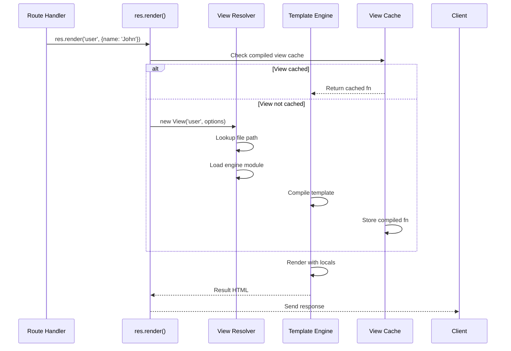

# 6 — View System & Rendering

## Relevant Source Files

- `lib/view.js` — View resolver and template loader (250+ lines)
- `lib/response.js` — `res.render()` method
- `lib/application.js:L90-L141` — View-related settings
- `lib/application.js:L294-L315` — `app.engine()` registration
- `examples/ejs/index.js`, `examples/view-locals/index.js` — View examples
- `test/app.engine.js`, `test/app.render.js`, `test/res.render.js` — View tests

## TL;DR

The view system allows Express apps to render HTML from template files using pluggable template engines. Developers register engines via `app.engine(ext, fn)`, set the view directory via `app.set('views', path)`, and render with `res.render(viewName, locals)`. The View class resolves file paths, loads template engines, caches compiled views, and invokes the engine to render.

## Overview

While Express is often used for APIs returning JSON, it also excels at rendering HTML pages using template engines. The view system provides:

1. **Engine Registration** — Map file extensions to template engine functions
2. **Path Resolution** — Find template files by name in the views directory
3. **Rendering** — Invoke the engine to compile and render templates
4. **Caching** — Cache compiled templates for performance (especially in production)
5. **Locals** — Pass variables to templates at app and request level

The system is flexible and supports any template engine that follows Express conventions: `(path, locals, callback) → void`.

## Architecture Diagram



## Key Concepts

| Concept | Description | Source |
|---------|-------------|--------|
| **View** | A template file resolver. Takes a view name (e.g., 'user'), finds the file, loads the engine, and stores the path. | `lib/view.js:L52-L95` |
| **Template Engine** | A function that compiles and renders a template. Signature: `(path, locals, callback) → void`. | `lib/application.js:L294-L315` |
| **View Directory** | Where template files are stored. Set via `app.set('views', path)`. Defaults to `./views`. | `lib/application.js:L135` |
| **Locals** | Variables available to templates. Merged from app.locals, res.locals, and method parameters. | `lib/application.js:L125`, [Page 5](05-request-response.md) |
| **View Cache** | Stores compiled template functions to avoid re-compiling on every request. Enabled in production automatically. | `lib/application.js:L62`, `L139` |
| **Engine Cache** | Stores loaded template engine functions by file extension. Prevents re-requiring the same module. | `lib/application.js:L63`, `lib/view.js:L75-L88` |
| **Default Engine** | The template engine to use if view file has no extension. Set via `app.set('view engine', ext)`. | [NEEDS INVESTIGATION] |
| **Engine Function** | The actual compilation/render function. Retrieved from the engine module via `.__express` export. | `lib/view.js:L81` |

## Component Reference

| Component | Type | Responsibility | Source |
|-----------|------|-----------------|--------|
| `View` | class | Template file resolver. Finds file, loads engine, stores path for rendering. | `lib/view.js:L52-L95` |
| `View.prototype.lookup()` | method | Searches for template file in views directory and parent directories. | `lib/view.js:L108-L168` |
| `View.prototype.render()` | method | Invokes the template engine to render the view with locals. | `lib/view.js:L173-L195` |
| `res.render()` | method | High-level render method. Creates View, handles caching, sends response. | `lib/response.js` |
| `app.engine()` | method | Registers a template engine for a file extension. | `lib/application.js:L294-L315` |
| `app.render()` | method | Low-level render method without sending response. | [NEEDS INVESTIGATION] |
| `app.set('view', ViewClass)` | setting | Custom View resolver class (advanced). | `lib/application.js:L134` |
| `app.set('views', path)` | setting | Directory where view templates are stored. | `lib/application.js:L135` |
| `app.set('view cache', bool)` | setting | Whether to cache compiled view functions. | `lib/application.js:L139` |
| `app.set('view engine', ext)` | setting | Default template engine when view has no extension. | [NEEDS INVESTIGATION] |

## How It Works

### View Resolution

When `res.render('user', locals)` is called, a View object is created to find the template file:

```javascript
// lib/view.js:L52-L95
function View(name, options) {
  var opts = options || {};

  this.defaultEngine = opts.defaultEngine;      // e.g., 'ejs'
  this.ext = extname(name);                     // e.g., '.ejs'
  this.name = name;                             // e.g., 'user'
  this.root = opts.root;                        // e.g., './views'

  if (!this.ext && !this.defaultEngine) {
    throw new Error('No default engine was specified and no extension was provided.');
  }

  var fileName = name;

  // Add extension if not provided
  if (!this.ext) {
    this.ext = this.defaultEngine[0] !== '.'
      ? '.' + this.defaultEngine
      : this.defaultEngine;

    fileName += this.ext;
  }

  // Load or retrieve engine from cache
  if (!opts.engines[this.ext]) {
    var mod = this.ext.slice(1);           // e.g., 'ejs'
    debug('require "%s"', mod);

    // Require the engine module and get its __express export
    var fn = require(mod).__express;

    if (typeof fn !== 'function') {
      throw new Error('Module "' + mod + '" does not provide a view engine.');
    }

    opts.engines[this.ext] = fn;
  }

  // Store the engine function
  this.engine = opts.engines[this.ext];

  // Find the file path
  this.path = this.lookup(fileName);
}
```

Key points:

- **Extension handling** — If the view name doesn't have an extension, the default engine is used
- **Engine loading** — Engines are required dynamically and cached to avoid repeated requires
- **Engine export** — The engine module must export a function as `.__express`
- **Path lookup** — The `lookup()` method finds the actual file path

### Path Lookup

The `lookup()` method searches for the template file (`lib/view.js:L108-L168`):

```javascript
View.prototype.lookup = function(name) {
  var dirs = Array.isArray(this.root) ? this.root : [this.root];
  var ext = this.ext;
  var fileName;

  // Search directories
  for (var i = 0; i < dirs.length; i++) {
    var dir = dirs[i];

    // Try exact match
    fileName = resolve(dir, name);
    if (fileExists(fileName)) {
      return fileName;
    }

    // If no extension, try adding the extension
    if (!extname(name)) {
      fileName = resolve(dir, name + ext);
      if (fileExists(fileName)) {
        return fileName;
      }
    }
  }

  throw new Error('Failed to lookup view "' + name + '"');
};
```

Search order:

1. Look for exact file name (with extension if provided)
2. If no extension was provided, look for name + default extension
3. Search in multiple directories if configured
4. Throw error if not found

### Engine Registration

Developers register template engines via `app.engine()` (`lib/application.js:L294-L315`):

```javascript
app.engine = function engine(ext, fn) {
  if (typeof fn !== 'function') {
    throw new Error('callback function required');
  }

  var extension = ext[0] !== '.' ? '.' + ext : ext;

  // Store the engine function in the cache
  this.engines[extension] = fn;
  return this;
};
```

Example engine registration:

```javascript
const ejs = require('ejs');
app.engine('ejs', ejs.renderFile);    // EJS already provides __express export

const pug = require('pug');
app.engine('pug', (path, options, callback) => {
  pug.renderFile(path, options, callback);
});
```

### Rendering Flow

When `res.render(viewName, locals, callback)` is called:

1. **Create View object** — Resolves the template file and loads the engine
2. **Merge locals** — Combines app.locals, res.locals, and method parameters
3. **Check cache** — If view caching is enabled and view is cached, use cached compiled function
4. **Render** — Invoke the engine to render the template
5. **Send response** — Send the rendered HTML with appropriate headers

Simplified flow:

```javascript
res.render = function(view, options, callback) {
  // Merge options
  var opts = options || {};
  var locals = Object.create(null);

  // Merge app-level locals
  if (this.app.locals) {
    Object.assign(locals, this.app.locals);
  }

  // Merge response-level locals
  if (this.locals) {
    Object.assign(locals, this.locals);
  }

  // Merge method parameters
  Object.assign(locals, opts);

  // Create View object
  var view = new (this.app.get('view'))(view, {
    defaultEngine: this.app.get('view engine'),
    engines: this.app.engines,
    root: this.app.get('views')
  });

  // Render the view
  view.render(locals, (err, html) => {
    if (err) {
      return callback ? callback(err) : next(err);
    }

    // Send response
    this.send(html);
  });
};
```

### View Caching

In production, compiled view functions are cached:

```javascript
app.set('env', 'production');  // NODE_ENV=production
app.set('view cache', true);   // Enabled automatically

// First render: compiles and caches
res.render('user', { name: 'John' });

// Second render: uses cached compiled function
res.render('user', { name: 'Jane' });
```

The cache is stored in `app.cache` (`lib/application.js:L62`):

```javascript
this.cache = Object.create(null);

// Cache key is the view file path
app.cache['/path/to/views/user.ejs'] = compiledFunction;
```

## Configuration & Settings

### View Settings

| Setting | Default | Purpose | Usage |
|---------|---------|---------|-------|
| `view` | `View` class | Custom view resolver class (advanced) | `app.set('view', MyViewClass)` |
| `views` | `'./views'` | Directory where view templates are stored | `app.set('views', __dirname + '/templates')` |
| `view cache` | false (dev), true (prod) | Whether to cache compiled view functions | Auto-enabled in production |
| `view engine` | none | Default engine when view has no extension | `app.set('view engine', 'ejs')` |

### Setup Example

```javascript
const express = require('express');
const path = require('path');

const app = express();

// Configure views
app.set('views', path.join(__dirname, 'templates'));
app.set('view engine', 'ejs');

// In production, caching is automatic
if (app.get('env') === 'production') {
  app.set('view cache', true);
}

// Alternative: use different view directory
app.set('views', [
  path.join(__dirname, 'templates'),
  path.join(__dirname, 'shared')
]);
```

## Extension Points

### Custom View Class

Advanced developers can create custom View resolvers:

```javascript
class CustomView {
  constructor(name, options) {
    this.name = name;
    this.options = options;
  }

  render(locals, callback) {
    // Custom rendering logic
    callback(null, '<custom>');
  }
}

app.set('view', CustomView);
```

### Custom Template Engine

Any template engine that follows the Express convention can be used:

```javascript
const Handlebars = require('handlebars');

app.engine('handlebars', (path, options, callback) => {
  fs.readFile(path, 'utf-8', (err, content) => {
    if (err) return callback(err);

    try {
      const template = Handlebars.compile(content);
      const html = template(options);
      callback(null, html);
    } catch (err) {
      callback(err);
    }
  });
});

app.set('view engine', 'handlebars');
```

### Template Locals

Set variables available to all templates:

```javascript
// App-level locals (available to all renders)
app.locals.title = 'My App';
app.locals.version = '1.0.0';

// Response-level locals (available to current request only)
app.get('/', (req, res) => {
  res.locals.user = { name: 'John' };
  res.locals.isAdmin = true;

  res.render('home');  // Can access app.locals + res.locals
});
```

## Gotchas & Conventions

> ⚠️ **Gotcha**: If you don't specify a file extension in the view name and don't set a default engine, you'll get an error: "No default engine was specified".
> Source: `lib/view.js:L60-L62`

> ⚠️ **Gotcha**: The template engine must export a function as `.__express` or you must wrap it. Not all modules do this by default.
> Source: `lib/view.js:L81`

> ⚠️ **Gotcha**: View caching is disabled by default in development to allow template changes without restart. Enable it manually for testing production behavior.
> Source: `lib/application.js:L139-L140`

> 📌 **Convention**: Store template files in a `views/` directory at the app root.
> Source: `lib/application.js:L135`

> 📌 **Convention**: Use the `view engine` setting to avoid specifying extensions in every render call:
> ```javascript
> app.set('view engine', 'ejs');
> res.render('user');  // Looks for views/user.ejs
> ```

> 💡 **Tip**: Use `app.locals` for variables needed in every view, like site title, version, or company name:
> ```javascript
> app.locals.title = 'My App';
> app.locals.year = new Date().getFullYear();
> ```

> 💡 **Tip**: For request-specific data, use `res.locals`:
> ```javascript
> app.get('/', (req, res) => {
>   res.locals.currentUser = req.user;
>   res.locals.isAdmin = req.user?.role === 'admin';
>   res.render('home');
> });
> ```

## Common Patterns

### Multi-view Directory

```javascript
app.set('views', [
  path.join(__dirname, 'app/views'),
  path.join(__dirname, 'shared/views'),
  path.join(__dirname, 'admin/views')
]);
```

### View with Locals

```javascript
app.get('/user/:id', async (req, res, next) => {
  try {
    const user = await User.findById(req.params.id);
    if (!user) return res.status(404).send('User not found');

    res.locals.user = user;
    res.locals.canEdit = req.user?.id === user.id;

    res.render('user-profile');
  } catch (err) {
    next(err);
  }
});
```

### Custom Engine with Async

```javascript
app.engine('md', async (path, options, callback) => {
  try {
    const markdown = await fs.promises.readFile(path, 'utf-8');
    const html = markdownToHtml(markdown);
    callback(null, html);
  } catch (err) {
    callback(err);
  }
});
```

## Test Coverage

View system tests:

- `test/app.engine.js` — Engine registration tests
- `test/app.render.js` — `app.render()` tests
- `test/res.render.js` — `res.render()` tests
- `test/acceptance/ejs.js` — Full integration test with EJS

## Cross-References

- For response methods including `res.render()`, see [Page 5 — Request & Response](05-request-response.md)
- For app configuration affecting views, see [Page 2 — Application Core](02-application-core.md)
- For locals in responses, see [Page 5 — Request & Response](05-request-response.md)
- For architecture overview, see [Page 1 — Overview](01-overview.md)
