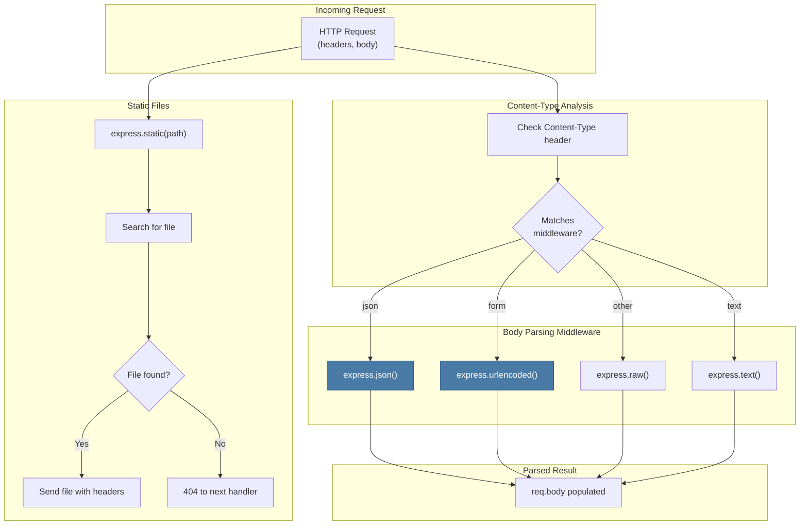

# 7 — Static Files & Content Handling

## Relevant Source Files

- `lib/express.js:L77-L81` — Built-in middleware exports
- `package.json` — Dependencies: `body-parser`, `serve-static`, `send`, `mime-types`
- `examples/static-files/index.js` — Static file serving example
- `examples/downloads/index.js` — File download example
- `test/express.json.js`, `test/express.urlencoded.js`, `test/express.static.js` — Middleware tests

## TL;DR

Express exports convenience methods for common middleware: `express.static()` for serving static files, `express.json()` for parsing JSON bodies, `express.urlencoded()` for parsing form data, `express.raw()` for raw data, and `express.text()` for text bodies. These delegate to external modules (`serve-static`, `body-parser`, etc.) and are used as app-level middleware via `app.use()`.

## Overview

While Express excels at routing and request handling, most web apps need to:

1. **Serve static files** — CSS, JavaScript, images, fonts
2. **Parse request bodies** — JSON, form data, raw data, text
3. **Negotiate content types** — Return different formats based on Accept headers

Express provides built-in middleware for these common tasks. These are thin wrappers around focused external modules:

| Middleware | Delegates To | Purpose |
|-----------|-------------|---------|
| `express.static(root)` | `serve-static` | Serve static files from a directory |
| `express.json(options)` | `body-parser` | Parse application/json request bodies |
| `express.urlencoded(options)` | `body-parser` | Parse application/x-www-form-urlencoded bodies |
| `express.raw(options)` | `body-parser` | Parse raw request bodies (Buffer) |
| `express.text(options)` | `body-parser` | Parse text/plain request bodies |

All are registered via `app.use()` and operate as middleware in the request pipeline.

## Architecture Diagram



## Key Concepts

| Concept | Description | Source |
|---------|-------------|--------|
| **Static Files** | Non-dynamic files like CSS, JavaScript, images that are served as-is. Handled by `express.static()`. | External `serve-static` module |
| **Body Parsing** | Converting raw HTTP request body into a structured format (JSON object, form data, etc.). Handled by body-parser middleware. | External `body-parser` module |
| **Content-Type** | HTTP header specifying the format of the request/response body (e.g., application/json, text/html). | [Page 5 — Request/Response](05-request-response.md) |
| **MIME Type** | Internet media type (e.g., text/html, application/json). Used to determine how to handle/serve files. | `mime-types` module (dependency) |
| **File Serving** | Sending a file from disk with appropriate HTTP headers (Content-Type, Content-Length, caching headers). | `send` module (dependency) |
| **Directory Listing** | Whether to list files in a directory when no index file is present. Disabled by default. | `serve-static` options |
| **Streaming** | Sending file contents in chunks rather than loading entirely into memory. More efficient for large files. | `send` module |
| **Conditional Requests** | Handling If-Modified-Since, ETag headers to avoid re-sending unchanged content. | `send` module |

## Component Reference

| Component | Type | Responsibility | Source |
|-----------|------|-----------------|--------|
| `express.static(root, options)` | middleware factory | Returns middleware that serves static files from a directory | External `serve-static` |
| `express.json(options)` | middleware factory | Returns middleware that parses JSON request bodies | External `body-parser` |
| `express.urlencoded(options)` | middleware factory | Returns middleware that parses URL-encoded form data | External `body-parser` |
| `express.raw(options)` | middleware factory | Returns middleware that parses raw binary request bodies | External `body-parser` |
| `express.text(options)` | middleware factory | Returns middleware that parses text/plain request bodies | External `body-parser` |
| `send(path)` | function | Core file-serving utility. Handles streaming, caching headers, etc. | External `send` module (dependency) |
| `mime-types.lookup(ext)` | function | Maps file extension to MIME type | External `mime-types` module (dependency) |
| `req.body` | property | Parsed request body. Populated by body-parser middleware. | Set by body-parser |

## How It Works

### Static File Serving

`express.static(root, options)` serves files from a directory (`lib/express.js:L79`):

```javascript
exports.static = require('serve-static');
```

Usage:

```javascript
app.use(express.static('public'));     // Serve files from public/ directory
app.use(express.static(__dirname + '/public', {
  maxAge: '1d',                        // Cache for 1 day
  etag: false                          // Disable ETags
}));
```

How it works:

1. **Request arrives** — e.g., `GET /css/style.css`
2. **Path matching** — Removes the base path and looks for the file
3. **File search** — Searches the `public/` directory for `css/style.css`
4. **Found** — Sends the file with appropriate headers (Content-Type, Content-Length, caching)
5. **Not found** — Calls `next()` to pass to next middleware (usually 404 handler)

File lookup:

```javascript
// Request: GET /css/style.css
// Root: public/
// Actual path: public/css/style.css

// If file exists, send it
// If not, call next() to continue to next middleware
```

Caching headers are automatically set based on file metadata:

```javascript
// If client has the file (via ETag or Last-Modified)
// Server responds with 304 Not Modified (no body)

// If client doesn't have it or needs update
// Server responds with 200 + full body
```

### Body Parsing

Body-parser middleware extracts the request body and converts it to structured data:

#### JSON Parsing

```javascript
app.use(express.json());

app.post('/api/users', (req, res) => {
  console.log(req.body);  // Parsed JSON object
  res.json({ created: true });
});

// Request: POST /api/users
// Content-Type: application/json
// Body: {"name": "John", "email": "john@example.com"}
// Result: req.body = { name: 'John', email: 'john@example.com' }
```

#### URL-Encoded Parsing

```javascript
app.use(express.urlencoded({ extended: false }));

app.post('/form', (req, res) => {
  console.log(req.body);  // Parsed form data
  res.send('Form received');
});

// Request: POST /form
// Content-Type: application/x-www-form-urlencoded
// Body: name=John&email=john@example.com
// Result: req.body = { name: 'John', email: 'john@example.com' }
```

#### Raw Data Parsing

```javascript
app.use(express.raw({ type: 'application/octet-stream' }));

app.post('/binary', (req, res) => {
  console.log(req.body);  // Buffer
  res.send('Binary received');
});
```

### Parser Options

Each parser middleware accepts options:

| Option | Type | Purpose | Default |
|--------|------|---------|---------|
| `type` | string/function | Content-Type to match | Specific to parser |
| `limit` | string | Max request body size | '100kb' |
| `strict` | boolean | Only parse objects/arrays (JSON) | true |
| `charset` | string/function | Character encoding | 'utf-8' |

Example:

```javascript
app.use(express.json({
  type: 'application/json',
  limit: '10mb',
  strict: false
}));

app.use(express.urlencoded({
  extended: true,      // Use qs module (supports nested objects)
  limit: '50mb'
}));
```

### File Serving with Custom Handling

```javascript
app.use(express.static('public'));      // Serve static files

// Custom handler for /downloads
app.get('/downloads/:file', (req, res) => {
  const file = path.join(__dirname, 'downloads', req.params.file);

  // Set headers for download
  res.download(file);
});

// Fallback 404
app.use((req, res) => {
  res.status(404).send('Not Found');
});
```

### Content Negotiation with Static Files

```javascript
// Serve different static content based on Accept header
app.use((req, res, next) => {
  if (req.accepts('html')) {
    res.setHeader('Content-Type', 'text/html');
  } else if (req.accepts('json')) {
    res.setHeader('Content-Type', 'application/json');
  }
  next();
});

app.use(express.static('public'));
```

## Configuration & Options

### Static Middleware Options

```javascript
app.use(express.static('public', {
  // Serve index files
  index: ['index.html', 'index.htm'],

  // Set max age for caching (ms or string)
  maxAge: '1d',                 // or 86400000

  // Redirect from directory to directory/
  redirect: true,

  // Treat dotfiles as hidden
  dotfiles: 'ignore',           // or 'allow', 'deny'

  // Enable etag generation
  etag: true,

  // Last-Modified header
  lastModified: true,

  // Enable directory listing
  setHeaders: (res, path) => {
    res.set('X-Custom-Header', 'value');
  },

  // Fallthrough to next middleware if file not found
  fallthrough: true
}));
```

### Body Parser Options

```javascript
// JSON parser
app.use(express.json({
  limit: '100kb',
  type: 'application/json',
  strict: true,
  charset: 'utf-8'
}));

// URL-encoded parser
app.use(express.urlencoded({
  extended: true,          // Use qs module (supports nested)
  limit: '100kb',
  type: 'application/x-www-form-urlencoded'
}));

// Raw parser
app.use(express.raw({
  type: 'application/octet-stream',
  limit: '100mb'
}));

// Text parser
app.use(express.text({
  type: 'text/plain',
  limit: '100kb'
}));
```

## Extension Points

### Custom Body Parser

```javascript
app.use((req, res, next) => {
  if (req.is('application/xml')) {
    let data = '';
    req.setEncoding('utf8');
    req.on('data', chunk => data += chunk);
    req.on('end', () => {
      req.body = parseXML(data);
      next();
    });
  } else {
    next();
  }
});
```

### Conditional Static Serving

```javascript
app.use((req, res, next) => {
  if (req.user?.role === 'admin') {
    express.static('public/admin')(req, res, next);
  } else {
    express.static('public')(req, res, next);
  }
});
```

### Multiple Static Directories

```javascript
app.use(express.static('public'));
app.use(express.static('node_modules'));
app.use(express.static('user-uploads'));
```

Files are searched in order, so if the same file exists in multiple directories, the first match is served.

## Gotchas & Conventions

> ⚠️ **Gotcha**: Body parsers don't automatically handle all content types. If you send a request with an unexpected Content-Type, `req.body` will be undefined.
> Source: Body-parser default types

> ⚠️ **Gotcha**: `express.json()` and `express.urlencoded()` must be called before routes that depend on `req.body`. Place them early in the middleware chain.
> Source: Middleware ordering

> ⚠️ **Gotcha**: By default, `express.urlencoded({ extended: false })` uses Node's built-in querystring parser which doesn't support nested objects. Use `extended: true` if you need nested form data (uses `qs` module).
> Source: Body-parser documentation

> ⚠️ **Gotcha**: Static files are served with caching headers by default. Clear browser cache or disable caching headers during development.
> Source: `serve-static` behavior

> 📌 **Convention**: Place static file middleware early in the middleware stack, before route handlers, for efficiency.
> Source: Best practices

> 💡 **Tip**: Use a subdirectory structure in your public folder to organize assets:
> ```
> public/
>   css/style.css
>   js/app.js
>   images/logo.png
> ```

> 💡 **Tip**: For large file uploads, increase the body size limit:
> ```javascript
> app.use(express.json({ limit: '50mb' }));
> ```

## Common Patterns

### Multi-Directory Static Files

```javascript
// Public assets (for everyone)
app.use(express.static('public'));

// Admin assets (with auth)
app.use('/admin', requireAuth, express.static('admin'));

// User uploads
app.use('/uploads', express.static('user-uploads'));
```

### File Download Handler

```javascript
app.get('/download/:filename', (req, res) => {
  const file = path.join(__dirname, 'downloads', req.params.filename);

  // Check file exists and is safe
  if (!fs.existsSync(file)) {
    return res.status(404).send('File not found');
  }

  // Set headers for download
  res.setHeader('Content-Disposition', `attachment; filename="${path.basename(file)}"`);

  // Stream the file
  res.download(file);
});
```

### Conditional Body Parser

```javascript
// Only parse JSON for API routes
app.use('/api', express.json());

// For other routes, don't parse large bodies
app.use(express.json({ limit: '1kb' }));
```

### Cache Control Headers

```javascript
app.use(express.static('public', {
  maxAge: 1000 * 60 * 60 * 24 * 365  // 1 year for production assets
}));

// Or with environment-specific caching
const maxAge = app.get('env') === 'production' ? '1y' : 0;
app.use(express.static('public', { maxAge }));
```

## Test Coverage

Tests for built-in middleware:

- `test/express.json.js` — JSON parser tests (800+ lines)
- `test/express.urlencoded.js` — URL-encoded parser tests (800+ lines)
- `test/express.raw.js` — Raw parser tests
- `test/express.text.js` — Text parser tests
- `test/express.static.js` — Static file serving tests (900+ lines)
- `test/acceptance/downloads.js` — File download acceptance test

## Cross-References

- For middleware pipeline, see [Page 4 — Middleware Pipeline](04-middleware-pipeline.md)
- For request/response objects, see [Page 5 — Request & Response](05-request-response.md)
- For routing, see [Page 3 — Routing System](03-routing-system.md)
- For app configuration, see [Page 2 — Application Core](02-application-core.md)
- For architecture overview, see [Page 1 — Overview](01-overview.md)
