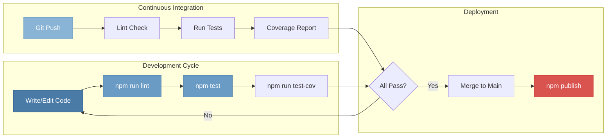

# 8 — Build, Testing & Development

## Relevant Source Files

- `package.json` — Scripts, dependencies, project metadata
- `test/` — Comprehensive test suite (100+ test files)
- `examples/` — Reference implementations (~90 files)
- `.eslintrc.yml`, `.eslintignore` — Linting configuration
- `.github/workflows/` — CI/CD pipelines
- `Readme.md` — Installation and quick start

## TL;DR

Express uses npm scripts for testing and linting. Tests are run via Mocha with excellent coverage tracked by NYC. The test suite is organized by module with acceptance tests for full integration scenarios. ESLint enforces code quality. GitHub Actions CI runs tests on every push. Development setup is minimal: clone, npm install, npm test.

## Overview

The Express.js codebase is designed for maintainability and extensibility:

1. **Testing** — Comprehensive Mocha test suite with 100+ test files covering unit and integration scenarios
2. **Code Quality** — ESLint enforces style; NYC tracks coverage
3. **CI/CD** — GitHub Actions runs tests on every push/PR
4. **Development** — Simple npm scripts for common tasks
5. **Examples** — ~90 reference implementations demonstrating real-world usage

The project is well-organized for both core team contributions and external contributions.

## Architecture Diagram



## Key Concepts

| Concept | Description | Source |
|---------|-------------|--------|
| **Test Suite** | Mocha-based testing framework. Organized by module and feature. | `test/` directory |
| **Unit Tests** | Individual file tests (e.g., `test/app.js`, `test/req.js`) | `test/*.js` |
| **Acceptance Tests** | Full integration tests with examples (e.g., `test/acceptance/ejs.js`) | `test/acceptance/*.js` |
| **Test Coverage** | NYC tracks code coverage. Reports in HTML and text formats. | `package.json` scripts |
| **Linting** | ESLint enforces coding standards and style. | `.eslintrc.yml` |
| **CI/CD** | GitHub Actions workflows for automated testing | `.github/workflows/` |
| **Examples** | Reference implementations of common patterns | `examples/` |
| **Dependencies** | Development tools for testing, linting, and building | `package.json` devDependencies |

## Component Reference

| Component | Type | Responsibility | Source |
|-----------|------|-----------------|--------|
| `test/` | directory | Unit and integration tests (100+ files) | `test/` |
| `test/acceptance/` | directory | Full-app acceptance tests for examples | `test/acceptance/` |
| `examples/` | directory | Reference implementations (~90 files) | `examples/` |
| `package.json` | file | Project metadata, scripts, dependencies | `package.json` |
| `.eslintrc.yml` | file | ESLint configuration | `.eslintrc.yml` |
| `.github/workflows/` | directory | GitHub Actions CI/CD configurations | `.github/workflows/` |
| Mocha | test framework | Test runner and assertion library | devDependency |
| NYC | coverage tool | Code coverage reporter | devDependency |
| ESLint | linter | JavaScript code quality | devDependency |

## How It Works

### Development Workflow

#### 1. Setup

```bash
# Clone the repository
git clone https://github.com/expressjs/express.git
cd express

# Install dependencies
npm install

# Verify setup by running tests
npm test
```

#### 2. Make Changes

Edit source files in `lib/` directory:

```bash
# Edit a file
vim lib/application.js

# Run linter to check style
npm run lint

# Run linter with auto-fix
npm run lint:fix
```

#### 3. Run Tests

```bash
# Run all tests
npm test

# Run with coverage report (HTML)
npm run test-cov

# Run with text coverage report
npm test

# Run tests with TAP reporter
npm run test-tap
```

#### 4. Submit PR

Push changes and create pull request. GitHub Actions will automatically run tests.

### Test Organization

The test suite is organized by module and feature:

```
test/
├── app.js                    # Core app functionality
├── app.engine.js             # View engine tests
├── app.listen.js             # Server listening
├── app.param.js              # Route parameter handlers
├── app.render.js             # app.render() method
├── app.route.js              # app.route() API
├── app.router.js             # Router integration (1210+ lines)
├── app.use.js                # app.use() middleware (430+ lines)
├── Route.js                  # Route class
├── Router.js                 # Router class (463+ lines)
├── req.*.js                  # Request object tests (20+ files)
├── res.*.js                  # Response object tests (20+ files)
├── express.json.js           # JSON parser tests (800+ lines)
├── express.urlencoded.js     # Form parser tests (800+ lines)
├── express.static.js         # Static file tests (900+ lines)
├── middleware.basic.js       # Basic middleware patterns
├── regression.js             # Bug regression tests
└── acceptance/               # Full integration tests (~20 files)
    ├── ejs.js
    ├── auth.js
    ├── mvc.js
    └── ...
```

### Running Specific Tests

```bash
# Run all tests in a file
npx mocha test/app.js

# Run a specific test suite
npx mocha test/app.js --grep "app.listen"

# Run with custom reporter
npx mocha test/app.js --reporter json

# Run with env setup
npx mocha --require test/support/env test/app.js

# Run with leak detection
npx mocha --check-leaks test/app.js
```

### Test Structure

Each test file typically follows this structure:

```javascript
// test/app.js
describe('app', function() {
  describe('.listen()', function() {
    it('should return a server', function(done) {
      const app = express();
      const server = app.listen(0, function() {
        done();
      });

      // Assertions
      assert(server instanceof require('http').Server);
    });

    it('should handle requests', function(done) {
      const app = express();
      app.get('/', (req, res) => res.send('OK'));

      const server = app.listen(0, function() {
        const port = server.address().port;
        // Make request and assert response
        done();
      });
    });
  });
});
```

### Code Coverage

Coverage is tracked with NYC:

```bash
# Generate HTML coverage report
npm run test-cov

# View text summary
npm test

# Check coverage thresholds
nyc report
```

Coverage report output:

```
  Statements   : 85.2% ( 1234/1447 )
  Branches     : 78.4% ( 456/581 )
  Functions    : 82.1% ( 123/150 )
  Lines        : 85.5% ( 1100/1287 )
```

The goal is to maintain high coverage (typically >85%) across all metrics.

## Project Scripts

From `package.json` (`lib/express.js:L272-L279`):

```json
{
  "scripts": {
    "lint": "eslint .",
    "lint:fix": "eslint . --fix",
    "test": "mocha --require test/support/env --reporter spec --check-leaks test/ test/acceptance/",
    "test-ci": "nyc --exclude examples --exclude test --exclude benchmarks --reporter=lcovonly --reporter=text npm test",
    "test-cov": "nyc --exclude examples --exclude test --exclude benchmarks --reporter=html --reporter=text npm test",
    "test-tap": "mocha --require test/support/env --reporter tap --check-leaks test/ test/acceptance/"
  }
}
```

| Script | Purpose | When to Use |
|--------|---------|------------|
| `npm run lint` | Check code style with ESLint | Before committing code |
| `npm run lint:fix` | Auto-fix style issues | For routine formatting |
| `npm test` | Run all tests with spec reporter | During development |
| `npm run test-ci` | Run tests for CI with coverage | In CI/CD pipeline |
| `npm run test-cov` | Generate HTML coverage report | To check coverage visually |
| `npm run test-tap` | Run tests with TAP reporter | For external test aggregation |

## Linting Configuration

ESLint configuration (`.eslintrc.yml`):

```yaml
env:
  node: true
  es2020: true

extends:
  - eslint:recommended

rules:
  # Enforce semicolons
  semi: [error, always]

  # Enforce single quotes
  quotes: [error, single, { avoidEscape: true }]

  # Indentation
  indent: [error, 2]

  # No trailing whitespace
  no-trailing-spaces: error

  # Enforce consistent comma dangle
  comma-dangle: [error, never]
```

Running linter:

```bash
# Check all files
npm run lint

# Check specific file
npx eslint lib/application.js

# Fix issues automatically
npm run lint:fix

# Check and fix
npx eslint . --fix
```

## CI/CD Pipeline

GitHub Actions workflows in `.github/workflows/`:

### Main CI Pipeline (`ci.yml`)

```yaml
name: CI
on:
  push:
    branches: [master]
  pull_request:
    branches: [master]

jobs:
  test:
    runs-on: ubuntu-latest
    strategy:
      matrix:
        node-version: [18.x, 20.x, 21.x]
    steps:
      - uses: actions/checkout@v3
      - uses: actions/setup-node@v3
        with:
          node-version: ${{ matrix.node-version }}
      - run: npm install
      - run: npm run lint
      - run: npm run test-ci
      - uses: codecov/codecov-action@v3
```

This pipeline:

1. Checks out code
2. Sets up Node.js (multiple versions)
3. Installs dependencies
4. Runs linter
5. Runs tests with coverage
6. Reports coverage to codecov.io

### Other Workflows

- **CodeQL Analysis** (`codeql.yml`) — Security scanning
- **OpenSSF Scorecard** (`scorecard.yml`) — Security metrics
- **Dependabot** (`dependabot.yml`) — Automatic dependency updates

## Examples

The `examples/` directory contains ~90 reference implementations:

```
examples/
├── hello-world/          # Minimal "Hello World" app
├── auth/                 # Session-based authentication
├── content-negotiation/  # Content type handling
├── cookies/              # Cookie management
├── downloads/            # File downloads
├── ejs/                  # EJS template engine
├── error/                # Error handling
├── error-pages/          # Custom error pages
├── mvc/                  # MVC pattern example
├── params/               # Route parameters
├── resource/             # RESTful resource routing
├── route-map/            # Route mapping utilities
├── route-middleware/     # Middleware on routes
├── route-separation/     # Separating routes by file
├── static-files/         # Serving static files
├── vhost/                # Virtual host routing
├── view-constructor/     # Custom view class
└── web-service/          # Simple web service
```

Each example is a complete, runnable Express app demonstrating a specific pattern.

Running an example:

```bash
cd examples/hello-world
npm install  # Install dependencies if needed
node index.js

# Visit http://localhost:3000
```

## Testing Best Practices

### Writing Tests

Good test structure:

```javascript
describe('res.json()', function() {
  it('should send JSON response', function(done) {
    const app = express();

    app.get('/', (req, res) => {
      res.json({ a: 1 });
    });

    supertest(app)
      .get('/')
      .expect('Content-Type', /json/)
      .expect({ a: 1 })
      .expect(200, done);
  });

  it('should set Content-Length', function(done) {
    const app = express();

    app.get('/', (req, res) => {
      res.json({ a: 1 });
    });

    supertest(app)
      .get('/')
      .expect('Content-Length')
      .expect(200, done);
  });
});
```

Key practices:

- **Use Mocha describe/it blocks** — Organize tests logically
- **Clear test names** — Describe what is being tested
- **One assertion per test** (ideally) — Makes failures clear
- **Use supertest** — For HTTP testing
- **Use done callback** — For async tests
- **Check multiple aspects** — Content, headers, status code

### Test File Naming

- Unit tests: `test/<module>.js` (e.g., `test/app.js`)
- Acceptance tests: `test/acceptance/<feature>.js`
- Feature tests: `test/<feature>.js`

## Development Tips

### Debugging

Enable debugging output:

```bash
# Debug Express app initialization
DEBUG=express:* node examples/hello-world

# Debug specific module
DEBUG=express:application node examples/hello-world

# Enable all Node.js debug
DEBUG=* node examples/hello-world
```

Modules using debug:

- `express:application` — App and request handling
- `express:router` — Router and route matching
- `express:view` — View resolution
- etc.

### Using Node Debugger

```bash
# Start Node debugger
node --inspect examples/hello-world

# Visit chrome://inspect in Chrome to debug
```

### Memory Profiling

```bash
# Use clinic.js for profiling
npm install -g clinic
clinic doctor -- npm test
```

## Project Statistics

From analysis:

| Metric | Value |
|--------|-------|
| Total Files | 197 |
| Source Files | 6 (lib/) |
| Test Files | 100+ |
| Example Files | ~90 |
| Lines of Code (lib/) | ~3000 |
| Test Lines | ~15000+ |
| Supported Node Versions | 18+ |

## Contributing

The Express project welcomes contributions:

1. **Fork and clone** the repository
2. **Create a branch** for your feature
3. **Write tests** for new functionality
4. **Run `npm test`** to verify
5. **Run `npm run lint:fix`** to format code
6. **Create a pull request** with clear description

The team reviews PRs and provides feedback. All contributions must:

- Pass linting
- Have comprehensive tests
- Maintain backward compatibility
- Include documentation

## Gotchas & Conventions

> ⚠️ **Gotcha**: Tests require `test/support/env.js` to be required before running. This is done automatically by the npm test script.
> Source: `package.json` scripts

> ⚠️ **Gotcha**: Some tests use `--check-leaks` flag which detects global leaks. Tests that intentionally create globals may fail.
> Source: `package.json` scripts

> 📌 **Convention**: Place test files in `test/` directory alongside the code being tested.
> Source: Project structure

> 📌 **Convention**: Use descriptive test names that explain what is being tested and the expected behavior.
> Source: Best practices

> 💡 **Tip**: Use `npm run test-cov` regularly during development to ensure new code has coverage.
> Source: Quality guidelines

> 💡 **Tip**: Run `npm run lint:fix` before committing to auto-fix style issues.
> Source: Development workflow

## Cross-References

- For app structure, see [Page 2 — Application Core](02-application-core.md)
- For architecture overview, see [Page 1 — Overview](01-overview.md)
- For all middleware, see [Page 4 — Middleware Pipeline](04-middleware-pipeline.md)
- For request/response, see [Page 5 — Request & Response](05-request-response.md)

---

## Resources

- **Test Entry Point**: `package.json` scripts
- **Test Framework**: [Mocha](https://mochajs.org/) test runner
- **HTTP Testing**: [Supertest](https://www.npmjs.com/package/supertest) library
- **Coverage**: [NYC](https://github.com/istanbuljs/nyc) code coverage
- **Linting**: [ESLint](https://eslint.org/) JavaScript linter
- **CI/CD**: [GitHub Actions](https://github.com/features/actions) workflows
- **Official Docs**: [expressjs.com](https://expressjs.com/)
