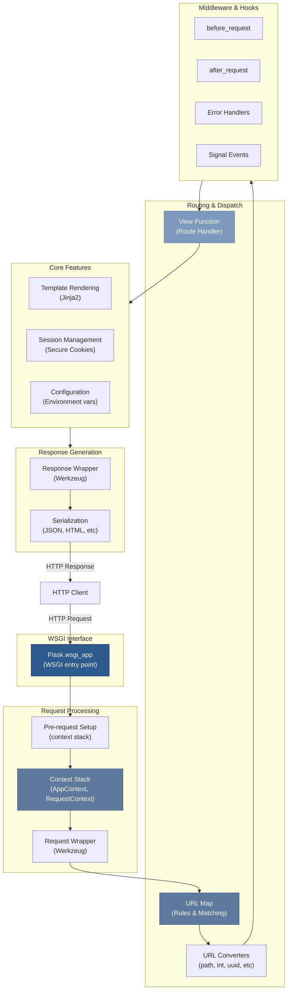

# 01 — Flask Architecture Overview

## Relevant Source Files

- `src/flask/__init__.py` — Public API exports
- `src/flask/app.py` — Flask application class (1625 lines)
- `src/flask/sansio/app.py` — HTTP-agnostic app implementation
- `src/flask/sansio/scaffold.py` — Common scaffolding for Flask and Blueprint
- `src/flask/wrappers.py` — Request and Response wrapper objects
- `src/flask/globals.py` — Thread-local proxy objects
- `src/flask/ctx.py` — Context stack management
- `src/flask/signals.py` — Application event signals

## TL;DR

Flask is a lightweight WSGI (Web Server Gateway Interface) framework that provides the core infrastructure for building web applications. It wraps Werkzeug (routing, request/response handling), Jinja2 (templating), and adds a modular architecture via Blueprints. The `Flask` class is the central object—it manages routing rules, configuration, template rendering, and request/response processing. Everything flows through a request context stack that makes request-specific data available globally via thread-local proxies.

## Overview

Flask is a microframework for building Python web applications. Unlike monolithic frameworks, Flask provides only the essentials: request/response handling, routing, and template rendering. Everything else is optional—databases, forms, authentication, etc. are provided via community extensions.

### Design Philosophy

The framework follows these core principles (from the source code and README):

1. **Minimal by design** — Only essential features in core; users choose their own tools
2. **Convention over configuration** — Sensible defaults, minimal boilerplate
3. **WSGI-based** — Built on the Python web standard, easy to deploy anywhere
4. **Modular** — Blueprints allow organizing large applications into logical components
5. **Development-friendly** — Built-in debugger, auto-reloading, integrated testing tools

### Architecture Layers

Flask is structured in layers, from HTTP protocol up to application logic:

```
┌─────────────────────────────────────┐
│   Application Layer                 │
│   (Blueprints, Views, Handlers)     │
├─────────────────────────────────────┤
│   Context Layer                     │
│   (Request, AppContext, g, session) │
├─────────────────────────────────────┤
│   Routing & Middleware Layer        │
│   (URL Map, Error Handlers, Signals)│
├─────────────────────────────────────┤
│   Request/Response Layer            │
│   (Request, Response, Wrappers)     │
├─────────────────────────────────────┤
│   Core Framework Layer              │
│   (Flask class, lifecycle)          │
├─────────────────────────────────────┤
│   WSGI Layer                        │
│   (wsgi_app, environ → response)    │
├─────────────────────────────────────┤
│   External Dependencies             │
│   (Werkzeug, Jinja2, Click, etc)    │
└─────────────────────────────────────┘
```

## Architecture Diagram



## Key Concepts

| Concept | Description | Source |
|---------|-------------|--------|
| **Flask** | Central application object; implements WSGI interface | `src/flask/app.py:L109-L500` |
| **Blueprint** | Modular application component; groups routes, templates, static files | `src/flask/blueprints.py:L18-L80` |
| **RequestContext** | Holds request-specific data (request, session, g) during HTTP request | `src/flask/ctx.py:L200-L350` |
| **AppContext** | Holds app-wide state during request handling | `src/flask/ctx.py:L100-L150` |
| **wsgi_app()** | WSGI entry point; orchestrates request → context → dispatch → response | `src/flask/app.py:L570-L630` |
| **URL Map** | Werkzeug routing engine; matches URLs to rules and view functions | `src/flask/app.py:L190-L250` |
| **Signal** | Event system for app lifecycle (before_request, after_request, etc.) | `src/flask/signals.py:L1-L30` |
| **Session** | Secure, cryptographically signed HTTP cookie for user data | `src/flask/sessions.py:L1-L100` |
| **Config** | Hierarchical configuration object; merges defaults, env files, code | `src/flask/config.py:L1-L100` |
| **Request/Response** | Werkzeug wrapper objects for HTTP request/response data | `src/flask/wrappers.py:L1-L50` |

## Component Reference

| Component | Type | Responsibility | Source |
|-----------|------|-----------------|--------|
| `Flask` | class | Main application object; WSGI entry point, routing, config | `src/flask/app.py:L109-L1625` |
| `Blueprint` | class | Modular app component; collects routes/static/templates | `src/flask/blueprints.py:L18-L128` |
| `AppContext` | class | Manages app state during request lifecycle | `src/flask/ctx.py:L100-L200` |
| `RequestContext` | class | Manages request state during HTTP request handling | `src/flask/ctx.py:L200-L350` |
| `Request` | class | HTTP request wrapper; extends Werkzeug Request | `src/flask/wrappers.py:L1-L100` |
| `Response` | class | HTTP response wrapper; extends Werkzeug Response | `src/flask/wrappers.py:L100-L257` |
| `_AppCtxGlobals` | class | Namespace for app context variables (g object) | `src/flask/ctx.py:L30-L100` |
| `Config` | class | Configuration management with file and environment support | `src/flask/config.py:L40-L367` |
| `SecureCookieSessionInterface` | class | Implements session storage via signed cookies | `src/flask/sessions.py:L100-L385` |
| `wsgi_app()` | method | WSGI interface; orchestrates the entire request/response cycle | `src/flask/app.py:L570-L630` |
| `dispatch_request()` | method | Routes request to appropriate view function | `src/flask/app.py:L650-L700` |
| `match_request()` | method | Matches incoming request URL to routing rules | `src/flask/app.py:L600-L650` |

## How It Works

### Application Initialization

When you create a Flask application, it initializes core infrastructure:

```python
app = Flask(__name__)
```

The Flask constructor (`src/flask/app.py:L250-L350`) performs these key steps:

1. **Store app name and import path** — Used for resource resolution and debugging
2. **Initialize routing map** — Create empty URL rule collection
3. **Set up configuration** — Load defaults, create Config object
4. **Initialize template environment** — Set up Jinja2 for template rendering
5. **Register built-in error handlers** — Default handlers for 400, 405, 500, etc.
6. **Create request/app context stacks** — Thread-local storage for context objects
7. **Register signal handlers** — Initialize event system

The Flask class inherits from `App` in `src/flask/sansio/app.py`, which contains HTTP-agnostic application logic that could work with ASGI, WSGI, or other protocols.

### Request Lifecycle

Each HTTP request flows through these stages:

#### 1. WSGI Entry Point
The WSGI server calls `Flask.wsgi_app(environ, start_response)` with the HTTP request data:

```
wsgi_app(environ, start_response)  # src/flask/app.py:L570
```

#### 2. Request Context Creation
The framework creates a `RequestContext` object that wraps the HTTP request data and pushes it onto the context stack:

```
RequestContext(self, environ)  # src/flask/ctx.py:L200
RequestContext.push()          # Pushes to thread-local stack
```

This makes `request`, `session`, `g` available as proxies throughout request handling.

#### 3. Pre-Request Hooks
Signal fired: `request_started` → Calls registered `before_request` handlers:

```
before_request.send(self)           # src/flask/signals.py
for handler in before_request_funcs:
    handler()
```

#### 4. URL Matching & Routing
The request URL is matched against the routing map using Werkzeug's URL router:

```
adapter = self.url_map.bind_to_environ(environ)  # src/flask/app.py:L600
rule, args = adapter.match()
```

#### 5. View Function Dispatch
The matched view function is called with URL arguments:

```
dispatch_request()  # src/flask/app.py:L650
view_func = self.view_functions[endpoint]
rv = view_func(**args)
```

#### 6. Response Generation
View function return value is converted to a Response object:

```
finalize_response(rv)  # src/flask/app.py:L700
# If rv is dict → jsonify()
# If rv is str → Response(rv)
# If rv is Response → return as-is
```

#### 7. Post-Request Hooks
Signal fired: `request_finished` → Calls registered `after_request` handlers:

```
after_request.send(self, response=response)
for handler in after_request_funcs:
    response = handler(response)
```

#### 8. Context Cleanup
Request and app contexts are popped from the stack, cleanup functions are called:

```
RequestContext.pop()  # Removes request/session/g
appcontext_tearing_down.send()
```

#### 9. Response Return
WSGI response is serialized and returned to the web server:

```
return response(environ, start_response)
```

### Decorators & Route Registration

Routes are registered using the `@app.route()` decorator:

```python
@app.route('/users/<int:user_id>')
def get_user(user_id):
    return {'id': user_id}
```

This is syntactic sugar for:

```python
def add_url_rule(rule, endpoint, view_func, **options):
    # Create URL Rule from rule string
    # Register in URL map
    # Store view function

Flask.add_url_rule(rule, endpoint, view_func)  # src/flask/app.py:L1300
```

The route decorator (`src/flask/app.py:L1400-L1450`):
1. Calls `add_url_rule(rule, endpoint, view_func)`
2. Stores view function in `view_functions` dict by endpoint name
3. Adds Rule to the URL map
4. Returns the view function (allows further decoration)

### Blueprint System

Blueprints allow organizing code into modular components. A Blueprint is like an "application template" that can be registered with a Flask app:

```python
bp = Blueprint('users', __name__, url_prefix='/users')

@bp.route('/')
def list_users():
    return []

app.register_blueprint(bp)  # Routes become: /users/
```

The blueprint system is implemented in:
- `src/flask/blueprints.py` — Flask-specific blueprint with static/template support
- `src/flask/sansio/blueprints.py` — HTTP-agnostic blueprint core logic

When `register_blueprint()` is called, the blueprint's routes, error handlers, and signals are merged into the app's namespace.

## Current Development Areas

Based on Git hotspots, these areas see the most changes:

| File | Changes | Focus |
|------|---------|-------|
| `src/flask/app.py` | High | Core application features, routing, lifecycle |
| `src/flask/ctx.py` | Medium | Context management, async support |
| `src/flask/sessions.py` | Medium | Session handling and security |
| `src/flask/config.py` | Medium | Configuration system enhancements |
| `tests/test_basic.py` | High | Integration tests, request flow validation |

## Cross-References

- **Next**: [02 — Application Core](02-application-core.md) for detailed Flask class documentation
- **Related**: [03 — Request/Response Cycle](03-request-response-cycle.md) for detailed request flow
- **Related**: [04 — Routing System](04-routing-system.md) for URL matching details
- **Related**: [06 — Context Management](06-context-management.md) for context stack mechanics
- **Related**: [05 — Blueprints](05-blueprints.md) for modular app structure
