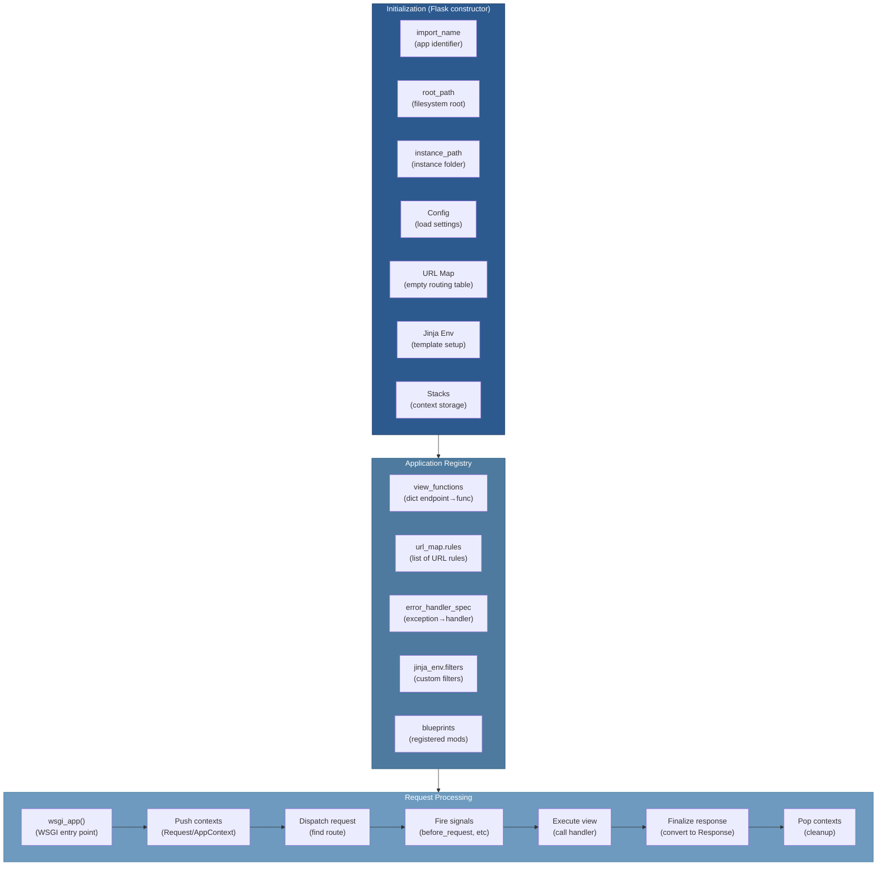

# 02 — Application Core

## Relevant Source Files

- `src/flask/app.py` — Flask application class (1625 lines, primary)
- `src/flask/sansio/app.py` — HTTP-agnostic App base class
- `src/flask/sansio/scaffold.py` — Shared logic for Flask and Blueprint
- `src/flask/config.py` — Configuration management
- `src/flask/wrappers.py` — Request and Response objects
- `src/flask/__init__.py` — Public API exports

## TL;DR

The `Flask` class is the heart of every Flask application. It implements the WSGI interface, manages the routing system, handles configuration, integrates Jinja2 templating, and orchestrates the entire request/response lifecycle. When instantiated with `Flask(__name__)`, it initializes routing tables, context stacks, signal handlers, and configuration management. The app acts as a central registry where you register routes, error handlers, template filters, and other application components.

## Overview

The `Flask` class in `src/flask/app.py:L109-L1625` is the main entry point for Flask applications. It extends the HTTP-agnostic `App` class from `src/flask/sansio/app.py` with WSGI-specific features.

### Design Pattern: Registry

Flask uses a **registry pattern**. The app object collects and stores:
- **Routes** (URL rules → view functions)
- **Error handlers** (exception type → error handler function)
- **Template filters/globals** (custom Jinja2 functionality)
- **Blueprints** (modular application components)
- **Signal listeners** (event handlers)
- **Configuration** (settings and environment variables)

This centralized registry allows Flask to maintain a single source of truth for application configuration.

### Inheritance Hierarchy

```
Flask (WSGI-specific)
  ↓ inherits from
App (HTTP-agnostic)
  ↓ inherits from
Scaffold (shared with Blueprint)
```

This three-level hierarchy allows code reuse between Flask and Blueprint while keeping HTTP concerns (WSGI) separate from application logic.

## Architecture Diagram



## Key Concepts

| Concept | Description | Source |
|---------|-------------|--------|
| **Flask class** | Main app object; WSGI entry point and registry | `src/flask/app.py:L109-L1625` |
| **App class** | HTTP-agnostic base; routing, signals, config logic | `src/flask/sansio/app.py:L1-L500` |
| **Scaffold class** | Shared decorator/method logic for Flask and Blueprint | `src/flask/sansio/scaffold.py:L1-L400` |
| **Config object** | Hierarchical configuration management | `src/flask/config.py:L40-L200` |
| **URL Map** | Werkzeug routing engine; maps URL patterns to endpoints | `src/flask/app.py:L300-L350` |
| **view_functions** | Dict mapping endpoint names to view function callables | `src/flask/app.py:L700-L750` |
| **error_handler_spec** | Dict mapping exception classes to error handler functions | `src/flask/app.py:L800-L850` |
| **jinja_env** | Jinja2 Environment for template rendering | `src/flask/app.py:L900-L950` |
| **context stacks** | Thread-local stacks for RequestContext and AppContext | `src/flask/app.py:L1050-L1100` |

## Component Reference

| Component | Type | Responsibility | Source |
|-----------|------|-----------------|--------|
| `Flask` | class | Main application object; WSGI interface, routing, config | `src/flask/app.py:L109-L1625` |
| `__init__()` | method | Initialize app, config, routing, templates, contexts | `src/flask/app.py:L250-L450` |
| `wsgi_app()` | method | WSGI entry point; orchestrates request → response | `src/flask/app.py:L570-L630` |
| `add_url_rule()` | method | Register a URL rule and associate with view function | `src/flask/app.py:L1300-L1380` |
| `route()` | method | Decorator factory for registering routes | `src/flask/app.py:L1400-L1450` |
| `dispatch_request()` | method | Match request URL to view function and execute | `src/flask/app.py:L650-L700` |
| `match_request()` | method | Match request URL to routing rules | `src/flask/app.py:L600-L650` |
| `finalize_response()` | method | Convert view function return to Response object | `src/flask/app.py:L700-L750` |
| `error_handler()` | method | Register exception handler | `src/flask/app.py:L800-L850` |
| `register_blueprint()` | method | Register Blueprint with app | `src/flask/app.py:L1200-L1250` |
| `run()` | method | Run development server (via Werkzeug) | `src/flask/app.py:L1550-L1625` |
| `Config` | class | Configuration object; merges defaults, files, env | `src/flask/config.py:L40-L200` |

## How It Works

### Flask Initialization

Creating a Flask application:

```python
app = Flask(__name__)
```

The `__init__()` method (`src/flask/app.py:L250-L450`) performs these steps:

1. **Store import metadata**
   ```
   self.import_name = import_name      # Module name for resource resolution
   self.root_path = root_path or ...   # Filesystem root
   self.instance_path = instance_path  # Instance folder for writable data
   ```

2. **Initialize configuration**
   ```
   self.config = Config(self.root_path, instance_path)
   self.config.from_object(DEFAULT_CONFIG)
   ```

3. **Create routing system**
   ```
   self.url_map = Map()                # Werkzeug URL map
   self.view_functions = {}            # Dict of endpoint → function
   self.error_handler_spec = {}        # Dict of exception → handler
   ```

4. **Set up Jinja2 templating**
   ```
   self.jinja_env = Environment(
       loader=FileSystemLoader(self.template_folder),
       autoescape=True
   )
   ```

5. **Initialize context stacks**
   ```
   self.app_ctx_stack = LocalStack()       # Thread-local AppContext stack
   self.request_ctx_stack = LocalStack()   # Thread-local RequestContext stack
   ```

6. **Register default error handlers**
   ```
   self.register_error_handler(HTTPException, ...)
   self.register_error_handler(Exception, ...)
   ```

7. **Prepare signal system**
   ```
   # Initialize signal dispatcher
   self.signal_context_stack = LocalStack()
   ```

### Route Registration

Routes are registered using the decorator pattern:

```python
@app.route('/users/<int:user_id>')
def get_user(user_id):
    return {'id': user_id}
```

The `route()` method (`src/flask/app.py:L1400-L1450`) is a decorator factory:

```python
def route(self, rule, **options):
    def decorator(f):
        self.add_url_rule(rule, endpoint=f.__name__, view_func=f, **options)
        return f
    return decorator
```

The `add_url_rule()` method (`src/flask/app.py:L1300-L1380`) performs URL registration:

1. **Parse URL rule**
   ```
   # rule = '/users/<int:user_id>'
   # Creates a Werkzeug Rule object with converters
   ```

2. **Generate endpoint name** (default is function name)
   ```
   endpoint = options.get('endpoint') or f.__name__
   ```

3. **Create Werkzeug Rule**
   ```
   rule = Rule(rule, endpoint=endpoint, ...)
   self.url_map.add(rule)
   ```

4. **Store view function**
   ```
   self.view_functions[endpoint] = view_func
   ```

5. **Register HTTP methods**
   ```
   methods = options.get('methods') or ['GET']
   # Store methods info for OPTIONS handling
   ```

### WSGI Interface

The `wsgi_app()` method (`src/flask/app.py:L570-L630`) implements the WSGI callable interface:

```python
def wsgi_app(self, environ, start_response):
    """
    WSGI application entry point.
    environ: WSGI environment dict
    start_response: Callable to send HTTP status/headers
    """
    # 1. Create request context from environ
    ctx = self.request_ctx_class(self, environ)

    # 2. Push contexts
    ctx.push()

    try:
        # 3. Get WSGI response callable
        response = self.full_dispatch_request()
    except Exception as e:
        # 4. Handle unhandled exceptions
        response = self.handle_exception(e)
    finally:
        # 5. Pop contexts
        ctx.pop()

    # 6. Return WSGI response
    return response(environ, start_response)
```

### Request Dispatch

The `full_dispatch_request()` method (`src/flask/app.py:L650-L700`) orchestrates the request handling flow:

```python
def full_dispatch_request(self):
    try:
        # 1. Fire before_request signals
        request_started.send(self)
        for func in self.before_request_funcs:
            result = func()
            if result is not None:
                return self.finalize_response(result)

        # 2. Match request URL to routing rule
        rule, args = self.match_request()

        # 3. Call view function
        rv = self.dispatch_request(rule, args)

    except HTTPException as e:
        # 4. Handle HTTP exceptions (404, 405, etc.)
        return self.handle_http_exception(e)
    except Exception as e:
        # 5. Handle application exceptions
        return self.handle_exception(e)
    finally:
        # 6. Fire after_request signals
        response = ...  # Previous response
        for func in self.after_request_funcs:
            response = func(response)
        request_finished.send(self, response=response)

    # 7. Finalize response
    return self.finalize_response(rv)
```

### View Function Execution

The `dispatch_request()` method (`src/flask/app.py:L700-L750`) calls the matched view function:

```python
def dispatch_request(self, rule, args):
    """Execute the view function for the matched rule."""
    endpoint = rule.endpoint
    view_func = self.view_functions[endpoint]
    return view_func(**args)
```

The view function's return value can be:
- **String** → Converted to Response with content-type text/html
- **Dict** → Converted to JSON response
- **Response object** → Returned as-is
- **Tuple** → (body, status_code, headers)
- **None** → Empty response

### Response Finalization

The `finalize_response()` method (`src/flask/app.py:L700-L750`) converts return values to Response objects:

```python
def finalize_response(self, rv):
    """Convert view function return value to a Response object."""
    if isinstance(rv, Response):
        return rv
    if isinstance(rv, dict):
        return self.json.dumps(rv)
    if isinstance(rv, str):
        return Response(rv, mimetype='text/html')
    if isinstance(rv, tuple):
        return Response(*rv)
    return Response(rv)
```

### Configuration Management

Flask supports hierarchical configuration:

```python
# 1. Default config
app.config['DEBUG'] = False

# 2. Config from file
app.config.from_pyfile('config.py')

# 3. Environment variables
app.config.from_prefixed_env('FLASK_')

# 4. Direct assignment
app.config.update(TESTING=True)
```

The Config object (`src/flask/config.py:L40-L200`) extends dict and loads configuration from:
- `.env` files (if python-dotenv is installed)
- YAML files (if PyYAML is installed)
- Python files (exec'd in the config namespace)
- Environment variables
- Direct code assignment

## Error Handling

Flask provides a flexible error handling system:

```python
@app.errorhandler(404)
def not_found(error):
    return {'error': 'Not found'}, 404

@app.errorhandler(ValueError)
def handle_value_error(error):
    return {'error': str(error)}, 400
```

Error handlers are registered via `error_handler()` decorator or `register_error_handler()` method. They can handle:
- **HTTP status codes** (404, 500, etc.) — Werkzeug HTTPException
- **Python exceptions** (ValueError, TypeError, etc.)
- **Custom exceptions**

## Blueprints

Blueprints provide modular application structure. See [05-blueprints.md](05-blueprints.md) for detailed documentation.

Quick example:

```python
bp = Blueprint('api', __name__, url_prefix='/api')

@bp.route('/users')
def list_users():
    return []

app.register_blueprint(bp)  # Routes: /api/users
```

## Gotchas & Conventions

> ⚠️ **Gotcha**: The `import_name` parameter should be your package name, not `__file__`. Use `Flask(__name__)` in module-level code.
>
> If you instantiate Flask inside a function or method, pass the module name explicitly:
> ```python
> app = Flask('myapp')  # Not Flask(__name__)
> ```
> This is crucial for resource resolution. See `src/flask/app.py:L300-L350`.

> 📌 **Convention**: View function endpoint names default to the function name. Use explicit endpoint names for duplicate function names:
> ```python
> @app.route('/users', endpoint='list_users')
> def get_all_users():
>     return []
> ```
> See `src/flask/app.py:L1350`.

> 💡 **Tip**: The `current_app` proxy lets you access the active Flask app from anywhere:
> ```python
> from flask import current_app
> print(current_app.config['DEBUG'])
> ```
> This uses thread-local context variables. See `src/flask/globals.py`.

## Cross-References

- **Parent**: [01 — Overview](01-overview.md)
- **Related**: [03 — Request/Response Cycle](03-request-response-cycle.md)
- **Related**: [04 — Routing System](04-routing-system.md)
- **Related**: [05 — Blueprints](05-blueprints.md)
- **Related**: [06 — Context Management](06-context-management.md)
- **Related**: [10 — Configuration](10-configuration.md)
