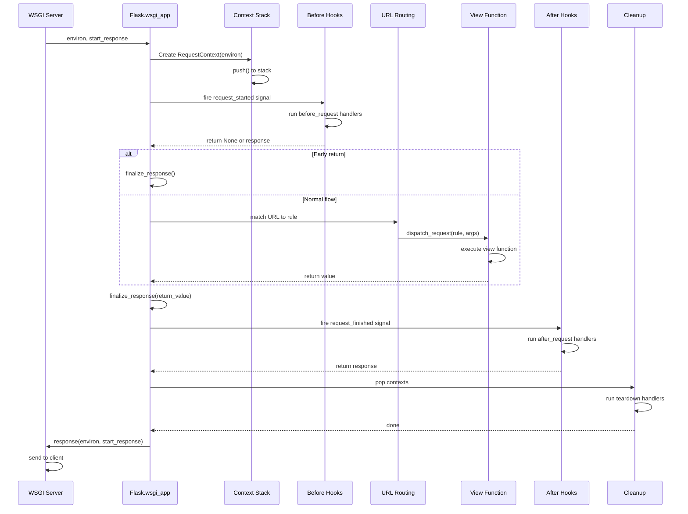

# 03 — Request and Response Cycle

## Relevant Source Files

- `src/flask/app.py` — Core request dispatch and response handling (L570-L750)
- `src/flask/wrappers.py` — Request and Response wrapper classes
- `src/flask/ctx.py` — Request and application context management
- `src/flask/helpers.py` — Helper functions for response generation (make_response, etc.)
- `src/flask/sansio/app.py` — HTTP-agnostic dispatch logic

## TL;DR

A Flask request flows through: WSGI entry point → context creation → pre-request signals → URL routing → view execution → post-request signals → response finalization → context cleanup. Each step is orchestrated by methods in the Flask class. The context stack makes request-specific data (request, session, g) available as thread-local proxies throughout the request lifetime. Exceptions are caught and handled by registered error handlers before response finalization.

## Overview

The request-response cycle is the core operation mode of a Flask application. Understanding this flow is essential for debugging, optimizing, and extending Flask applications.

### Request Processing Flow

Every HTTP request undergoes these phases:

1. **WSGI Entry Point** — Server calls `Flask.wsgi_app(environ, start_response)`
2. **Context Setup** — Request and app contexts pushed onto thread-local stacks
3. **Pre-request Processing** — User-defined `before_request` handlers execute
4. **Request Dispatch** — URL routing, view function lookup and execution
5. **Response Handling** — View return value converted to Response
6. **Post-request Processing** — User-defined `after_request` handlers execute
7. **Context Cleanup** — Contexts popped, cleanup functions called
8. **Response Return** — WSGI response callable returned to web server

## Architecture Diagram



## Key Concepts

| Concept | Description | Source |
|---------|-------------|--------|
| **WSGI application** | Callable that accepts (environ, start_response) | `src/flask/app.py:L570` |
| **RequestContext** | Holds request-scoped data; wraps WSGI environ | `src/flask/ctx.py:L200-L350` |
| **AppContext** | Holds app-scoped data during request handling | `src/flask/ctx.py:L100-L200` |
| **Context stack** | Thread-local stack of active contexts | `src/flask/ctx.py:L350-L400` |
| **URL routing** | Werkzeug URL map matching | `src/flask/app.py:L600-L650` |
| **View function** | User-defined handler for a route | `src/flask/app.py:L700-L750` |
| **Error handler** | Custom handler for exceptions | `src/flask/app.py:L800-L850` |
| **Response object** | Werkzeug Response wrapper; WSGI callable | `src/flask/wrappers.py:L100-L257` |
| **Signal** | Event fired at lifecycle milestones | `src/flask/signals.py` |

## Component Reference

| Component | Type | Responsibility | Source |
|-----------|------|-----------------|--------|
| `wsgi_app()` | method | WSGI entry point; orchestrates request handling | `src/flask/app.py:L570-L630` |
| `full_dispatch_request()` | method | Main dispatch method; handles signals, routing, error handling | `src/flask/app.py:L650-L700` |
| `preprocess_request()` | method | Execute before_request handlers | `src/flask/app.py:L700-L720` |
| `dispatch_request()` | method | Execute matched view function | `src/flask/app.py:L720-L750` |
| `finalize_response()` | method | Convert return value to Response object | `src/flask/app.py:L750-L800` |
| `process_response()` | method | Execute after_request handlers | `src/flask/app.py:L800-L820` |
| `do_teardown_request()` | method | Execute teardown_request handlers | `src/flask/app.py:L820-L840` |
| `handle_exception()` | method | Handle unhandled exceptions, call error handlers | `src/flask/app.py:L840-L900` |
| `RequestContext` | class | Request scope; holds request, session, g | `src/flask/ctx.py:L200-L350` |
| `Request` | class | HTTP request wrapper; Werkzeug extension | `src/flask/wrappers.py:L1-L100` |
| `Response` | class | HTTP response wrapper; WSGI callable | `src/flask/wrappers.py:L100-L257` |

## How It Works

### WSGI Entry Point

```python
# src/flask/app.py:L570-L630
def wsgi_app(self, environ, start_response):
    """
    The actual WSGI application. This is not bound to an instance
    to allow better unloading and better testability.
    """
    ctx = self.request_ctx_class(self, environ)
    error: BaseException | None = None

    try:
        try:
            # Push request context
            ctx.push()
            # Full request dispatch
            response = self.full_dispatch_request()
        except Exception as e:
            error = e
            response = self.handle_exception(e)
        finally:
            # Pop context, run teardown
            ctx.pop(error)

    except Exception:
        self.logger.exception(...)
        raise

    # Return WSGI response
    return response(environ, start_response)
```

### Context Pushing

When `ctx.push()` is called in `src/flask/ctx.py:L250-L300`:

1. **Push RequestContext to stack**
   ```python
   _request_ctx_stack.push(self)
   ```

2. **Push AppContext if not already on stack**
   ```python
   if not has_app_context():
       app_ctx = self.app.app_ctx_class(self.app)
       app_ctx.push()
   ```

3. **Initialize request-scoped objects**
   ```python
   self.request = self.app.request_class(self.environ)
   self.session = self.app.session_interface.new_session()
   g.__dict__ = {}  # Clear g namespace
   ```

4. **Fire signals**
   ```python
   appcontext_pushed.send(self.app)
   ```

### Pre-Request Processing

Before the view function executes, `preprocess_request()` in `src/flask/app.py:L700-L720` runs:

```python
def preprocess_request(self, ctx):
    # Fire request_started signal
    request_started.send(self, _async_wrapper=...)

    # Run before_request handlers
    for handler in self.before_request_funcs:
        result = handler()
        if result is not None:
            # Early return; skip view execution
            return result

    return None
```

Users register before_request handlers:

```python
@app.before_request
def setup_auth():
    g.user = get_current_user()
    if not g.user:
        return redirect('/login')
```

### URL Routing and Dispatch

The `dispatch_request()` method in `src/flask/app.py:L720-L750`:

```python
def dispatch_request(self, ctx):
    # 1. Match URL to routing rule
    rule = ctx.match_request()

    # 2. Get endpoint from rule
    endpoint = rule.endpoint

    # 3. Get view function
    view_func = self.view_functions[endpoint]

    # 4. Execute with URL arguments
    return view_func(**ctx.url_rule.arguments)
```

The URL matching happens in `RequestContext.match_request()` in `src/flask/ctx.py:L280-L320`:

```python
def match_request(self):
    try:
        # Use Werkzeug's MapAdapter to match URL
        adapter = self.app.url_map.bind_to_environ(self.environ)
        rule, args = adapter.match(return_rule=True)
        return rule, args
    except (RequestRedirect, HTTPException) as e:
        # Handle 301, 304, 404, 405, etc.
        raise e
```

### Response Finalization

The `finalize_response()` method in `src/flask/app.py:L750-L800` converts the view return value to a Response object:

```python
def finalize_response(self, ctx, rv):
    """Ensure the response is a Response object."""

    # If already a Response, return as-is
    if isinstance(rv, Response):
        return rv

    # If dict or list, convert to JSON
    if isinstance(rv, (dict, list)):
        return jsonify(rv)

    # If string, wrap in Response
    if isinstance(rv, str):
        return Response(rv, mimetype='text/html')

    # If tuple, unpack as (body, status, headers)
    if isinstance(rv, tuple):
        return Response(*rv)

    # Otherwise wrap in Response
    return Response(rv)
```

### Post-Request Processing

After the view executes, `process_response()` in `src/flask/app.py:L800-L820` runs:

```python
def process_response(self, ctx, response):
    # 1. Run after_request handlers
    for handler in self.after_request_funcs:
        response = handler(response)

    # 2. Fire request_finished signal
    request_finished.send(self, response=response, _async_wrapper=...)

    return response
```

Users register after_request handlers:

```python
@app.after_request
def add_headers(response):
    response.headers['X-Custom-Header'] = 'value'
    return response
```

### Context Cleanup

When `ctx.pop()` is called in `src/flask/ctx.py:L320-L350`:

```python
def pop(self, exc=None):
    try:
        # Run request teardown handlers
        self.app.do_teardown_request(self, exc)
        # Fire signal
        request_tearing_down.send(self.app, exc=exc, _async_wrapper=...)
    finally:
        # Remove from stack
        _request_ctx_stack.pop()

        # Also pop app context if we created it
        if app_ctx_stack.top is not None:
            app_ctx_stack.pop()
```

Users register teardown handlers:

```python
@app.teardown_request
def close_db(exc=None):
    db.connection.close()
```

### Error Handling

If an exception occurs, `handle_exception()` in `src/flask/app.py:L840-L900` is called:

```python
def handle_exception(self, exc):
    # 1. Check if exception should be re-raised
    exc_type = type(exc)

    # 2. Look up registered error handler
    handler = self.error_handler_spec.get(exc_type)

    if handler:
        # 3. Call error handler
        return handler(exc)

    # 4. If no handler, return default 500 response
    return self.handle_http_exception(
        InternalServerError(original_exception=exc)
    )
```

Users register error handlers:

```python
@app.errorhandler(ValueError)
def handle_value_error(exc):
    return {'error': str(exc)}, 400

@app.errorhandler(404)
def not_found(exc):
    return render_template('404.html'), 404
```

## Data Flow

### Request Object Lifecycle

1. **Created** in `RequestContext.push()` from WSGI environ
2. **Available** as `request` proxy throughout request handling
3. **Populated** with form data, JSON, files from request parsing
4. **Cleaned up** when `RequestContext.pop()` is called

### Session Lifecycle

1. **Loaded** from signed cookie by session interface
2. **Available** as `session` proxy during request
3. **Modifications** tracked (Flask knows what changed)
4. **Saved** as signed cookie in response by `after_request` handler

### g Object Lifecycle

1. **Initialized** to empty namespace in `RequestContext.push()`
2. **Used** to store request-scoped data: `g.user = current_user`
3. **Available** as `g` proxy throughout request
4. **Discarded** when `RequestContext.pop()` is called

## Gotchas & Conventions

> ⚠️ **Gotcha**: Before/after request handlers run EVEN IF an exception occurs.
>
> If you need different behavior on error, check the exception context:
> ```python
> @app.after_request
> def cleanup(response):
>     # This runs even on 404, 500, etc.
>     # You can detect errors by checking response status
>     if response.status_code >= 400:
>         # Handle error response
>         pass
>     return response
> ```
> See `src/flask/app.py:L800-L820`.

> 📌 **Convention**: Teardown handlers receive an optional `exc` parameter for error context:
> ```python
> @app.teardown_appcontext
> def cleanup(exc=None):
>     if exc is not None:
>         # An exception occurred; handle cleanup differently
>         rollback_transaction()
>     else:
>         commit_transaction()
> ```
> See `src/flask/ctx.py:L320-L350`.

> 💡 **Tip**: Use `before_request` for setup (auth, loading resources) and `after_request` for response modification (headers, compression).
>
> Use `teardown_request` for cleanup that must happen regardless of success/failure.

## Cross-References

- **Parent**: [01 — Overview](01-overview.md)
- **Related**: [02 — Application Core](02-application-core.md)
- **Related**: [04 — Routing System](04-routing-system.md)
- **Related**: [06 — Context Management](06-context-management.md)
- **Related**: [11 — Error Handling](11-error-handling.md)
