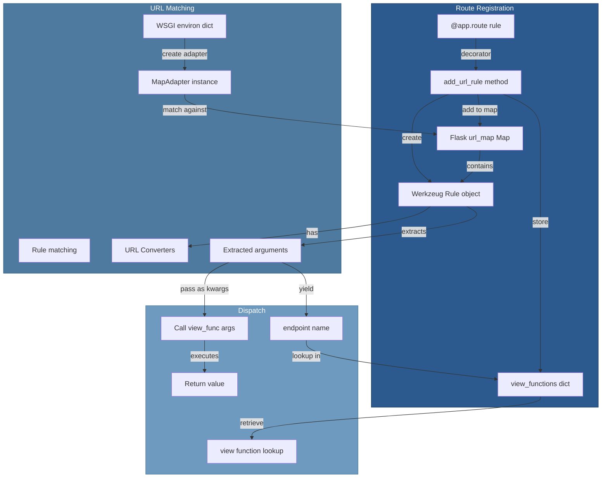

# 04 — Routing System

## Relevant Source Files

- `src/flask/app.py` — Route registration and matching (L1300-L1450)
- `src/flask/sansio/scaffold.py` — Shared routing logic for Flask and Blueprint
- `src/flask/ctx.py` — Request context URL matching (L280-L320)
- Werkzeug routing module — External dependency for URL mapping

## TL;DR

Flask uses Werkzeug's URL routing engine to map HTTP requests to view functions. Routes are registered via the `@app.route()` decorator, which calls `add_url_rule()` to create a URL Rule and store the view function. URL patterns support variable parts with type converters (e.g., `<int:user_id>`). When a request arrives, Werkzeug's MapAdapter matches the URL against rules and returns matched arguments for the view function.

## Overview

Flask's routing system provides a clean, declarative way to map URLs to view functions. It's built on Werkzeug's routing module, which handles the complex logic of URL matching, converters, and HTTP method dispatch.

### Key Components

1. **URL Rules** — Werkzeug Rule objects defining URL patterns
2. **URL Map** — Werkzeug Map object holding all rules
3. **URL Converters** — Convert URL parts to Python types (int, uuid, path, etc.)
4. **MapAdapter** — Performs URL matching against the map
5. **Endpoints** — Unique identifiers for routes (used by url_for)

### Route Syntax

Flask supports several URL pattern syntaxes:

```python
@app.route('/')                           # Static route
@app.route('/users')
@app.route('/users/<user_id>')            # Dynamic segment, string by default
@app.route('/users/<int:user_id>')        # Integer converter
@app.route('/users/<uuid:user_id>')       # UUID converter
@app.route('/files/<path:filename>')      # Path converter (allows /)
@app.route('/posts/<string:slug>')        # Explicit string converter
@app.route('/api/<int:version>/users')    # Multiple variables
def get_user(user_id):
    ...
```

## Architecture Diagram



## Key Concepts

| Concept | Description | Source |
|---------|-------------|--------|
| **URL Rule** | Werkzeug Rule; defines URL pattern, methods, converters | `src/flask/app.py:L1300` |
| **URL Map** | Werkzeug Map; collection of all URL rules | `src/flask/app.py:L300` |
| **URL Converter** | Converts URL string segment to Python type | Werkzeug routing |
| **MapAdapter** | Werkzeug adapter; performs URL matching | `src/flask/ctx.py:L280` |
| **Endpoint** | Unique identifier for a route (used by url_for) | `src/flask/app.py:L1350` |
| **view_functions** | Dict mapping endpoint → view function | `src/flask/app.py:L700` |
| **url_for()** | Generate URL from endpoint and arguments | `src/flask/helpers.py:L400` |
| **Variable part** | URL segment that captures variable data | `<int:id>` |
| **Converter** | Type converter for variable parts | `int`, `uuid`, `path`, etc. |

## Component Reference

| Component | Type | Responsibility | Source |
|-----------|------|-----------------|--------|
| `route()` | method | Decorator factory for registering routes | `src/flask/app.py:L1400-L1450` |
| `add_url_rule()` | method | Register URL rule with Flask | `src/flask/app.py:L1300-L1380` |
| `url_map` | property | Werkzeug Map object holding all rules | `src/flask/app.py:L300` |
| `view_functions` | dict | Maps endpoint name to view function | `src/flask/app.py:L700` |
| `MapAdapter` | class (Werkzeug) | Matches URL against rules | `werkzeug.routing` |
| `Rule` | class (Werkzeug) | Defines single URL pattern | `werkzeug.routing` |
| `BaseConverter` | class (Werkzeug) | Base class for URL converters | `werkzeug.routing` |
| `url_for()` | function | Generate URL from endpoint name | `src/flask/helpers.py:L400-L500` |

## URL Converters

Flask includes these built-in URL converters (from Werkzeug):

| Converter | Regex | Example | Matched Type |
|-----------|-------|---------|--------------|
| `string` | `[^/]+` | `foo` | str |
| `int` | `\d+` | `42` | int |
| `float` | `\d+\.\d+` | `3.14` | float |
| `uuid` | UUID regex | `550e8400-e29b-41d4-a716-446655440000` | uuid.UUID |
| `path` | `.+` | `path/to/file` | str (allows `/`) |
| `any` | `\|` | Lists values | str |

Example usage:

```python
@app.route('/users/<int:user_id>')
def get_user(user_id):
    # user_id is an int, not a string
    # Invalid IDs (non-numeric) result in 404
    return {'id': user_id}

@app.route('/files/<path:filepath>')
def get_file(filepath):
    # filepath includes directory separators
    # /files/docs/readme.txt → filepath='docs/readme.txt'
    return send_file(filepath)
```

### Custom Converters

You can create custom URL converters by subclassing `BaseConverter`:

```python
from werkzeug.routing import BaseConverter

class DateConverter(BaseConverter):
    regex = r'\d{4}-\d{2}-\d{2}'

    def to_python(self, value):
        return datetime.strptime(value, '%Y-%m-%d').date()

    def to_url(self, value):
        return value.strftime('%Y-%m-%d')

app.url_map.converters['date'] = DateConverter

@app.route('/events/<date:event_date>')
def get_events(event_date):
    # event_date is a date object
    return {'date': event_date.isoformat()}
```

## How It Works

### Route Registration

When you use the `@app.route()` decorator:

```python
@app.route('/users/<int:user_id>', methods=['GET', 'POST'])
def get_user(user_id):
    return {'id': user_id}
```

This is equivalent to:

```python
def get_user(user_id):
    return {'id': user_id}

app.add_url_rule('/users/<int:user_id>', 'get_user', get_user,
                  methods=['GET', 'POST'])
```

The `route()` method in `src/flask/app.py:L1400-L1450`:

```python
def route(self, rule, **options):
    """A decorator that is used to register a view function for
    a given URL rule.
    """
    def decorator(f):
        endpoint = options.pop("endpoint", None)
        self.add_url_rule(rule, endpoint, f, **options)
        return f
    return decorator
```

The `add_url_rule()` method in `src/flask/app.py:L1300-L1380`:

```python
def add_url_rule(self, rule, endpoint=None, view_func=None, **options):
    """Registers a URL rule.

    By default the view function is looked up from the module
    in which this function is called.
    """
    # 1. Use function name as endpoint if not specified
    if endpoint is None:
        endpoint = view_func.__name__

    # 2. Get HTTP methods from options
    methods = options.pop('methods', None)
    if methods is None:
        methods = ['GET']
    methods = set(methods)

    # 3. Create URL Rule with Werkzeug
    rule_obj = Rule(rule, methods=methods, endpoint=endpoint, ...)

    # 4. Add rule to URL map
    self.url_map.add(rule_obj)

    # 5. Store view function
    self.view_functions[endpoint] = view_func
```

### URL Matching

When a request arrives at `RequestContext.match_request()` in `src/flask/ctx.py:L280-L320`:

```python
def match_request(self):
    """This is called by the request context to get the request
    matching handled.
    """
    try:
        # 1. Create MapAdapter from WSGI environ
        adapter = self.app.url_map.bind_to_environ(self.environ)

        # 2. Match URL to a rule
        rule, args = adapter.match(return_rule=True)

        # 3. Store rule and arguments in context
        self.url_rule = rule
        self.url_args = args

        return rule, args

    except RequestRedirect as e:
        # Handle redirects (301, 307, etc.)
        raise e

    except RoutingException as e:
        # Handle 404, 405, etc.
        raise e
```

### Dispatch to View Function

After matching, `dispatch_request()` in `src/flask/app.py:L720-L750` calls the view:

```python
def dispatch_request(self, ctx):
    """Does the request dispatching."""
    rule = ctx.url_rule

    # 1. Get endpoint from rule
    endpoint = rule.endpoint

    # 2. Look up view function
    view_func = self.view_functions[endpoint]

    # 3. Execute view with URL arguments
    return view_func(**ctx.url_args)
```

### URL Generation

Use `url_for()` to generate URLs from endpoints:

```python
from flask import url_for

# Assuming route defined as:
# @app.route('/users/<int:user_id>')
# def get_user(user_id): ...

url = url_for('get_user', user_id=42)
# Returns: '/users/42'

url = url_for('get_user', user_id=42, _external=True)
# Returns: 'http://localhost:5000/users/42' (full URL)

url = url_for('get_user', user_id=42, _method='POST')
# Returns: '/users/42' (with POST method hint)
```

The `url_for()` function in `src/flask/helpers.py:L400-L500` works by:

1. Getting the current request context (or app context)
2. Looking up the endpoint in the URL map
3. Using MapAdapter.build() to generate the URL
4. Handling optional parameters and query strings

## Advanced Features

### Subdomain Routing

```python
@app.route('/profile', subdomain='user')
def profile(subdomain='user'):
    return f'User {subdomain} profile'
    # Accessible at: user.example.com/profile
```

### HTTP Methods

```python
@app.route('/users', methods=['GET', 'POST'])
def list_users():
    if request.method == 'POST':
        return create_user()
    return get_all_users()
```

### Host Matching

```python
app = Flask(__name__)
app.url_map.host_matching = True
app.config['SERVER_NAME'] = 'example.com'

@app.route('/api', host='api.example.com')
def api():
    return {}
```

### Trailing Slash Behavior

```python
@app.route('/users/')    # Trailing slash required
def list_users():
    return []

@app.route('/posts')     # No trailing slash
def list_posts():
    return []
```

By default, Flask redirects:
- `/users` → `/users/` (301 redirect)
- `/posts/` → `/posts` (308 redirect)

## Gotchas & Conventions

> ⚠️ **Gotcha**: Endpoint names must be unique across the entire application.
>
> If two routes have the same function name and you don't specify endpoint explicitly, the second one overwrites the first:
> ```python
> @app.route('/users')
> def index():      # endpoint='index'
>     return "Users"
>
> @app.route('/posts')
> def index():      # endpoint='index' OVERWRITES previous route!
>     return "Posts"
>
> # Solution: use explicit endpoint names
> @app.route('/users', endpoint='list_users')
> def index():
>     ...
> ```
> See `src/flask/app.py:L1350`.

> 📌 **Convention**: Use function name = endpoint name; only specify endpoint explicitly when needed:
> ```python
> @app.route('/users', endpoint='list_users')  # Explicit when different
> def list_users():
>     ...
> ```

> 💡 **Tip**: Use `url_for()` instead of hardcoding URLs:
> ```python
> # Bad: hardcoded URL
> return redirect('/users/42')
>
> # Good: generated from route
> return redirect(url_for('get_user', user_id=42))
>
> # This handles host matching, subdomains, and auto-updating when routes change
> ```

## Cross-References

- **Parent**: [01 — Overview](01-overview.md)
- **Related**: [02 — Application Core](02-application-core.md)
- **Related**: [03 — Request/Response Cycle](03-request-response-cycle.md)
- **Related**: [05 — Blueprints](05-blueprints.md)
- **Related**: [09 — Sessions and Cookies](09-sessions-and-cookies.md)
