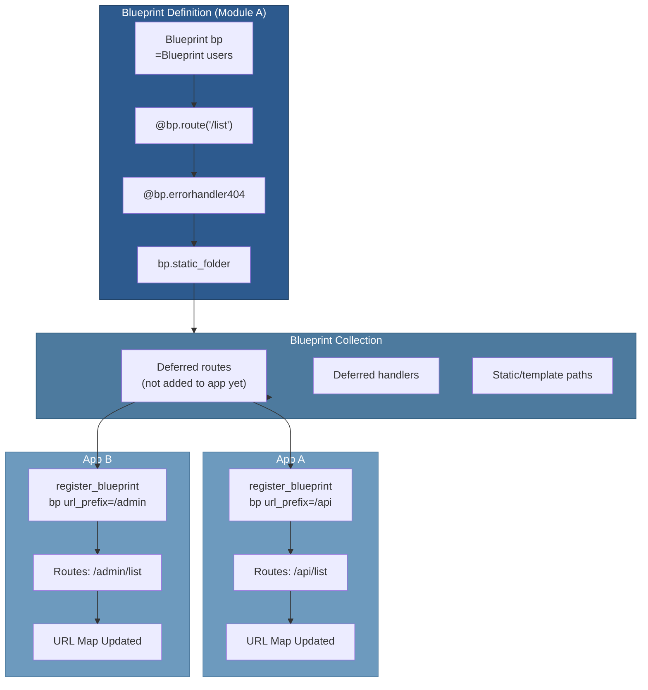
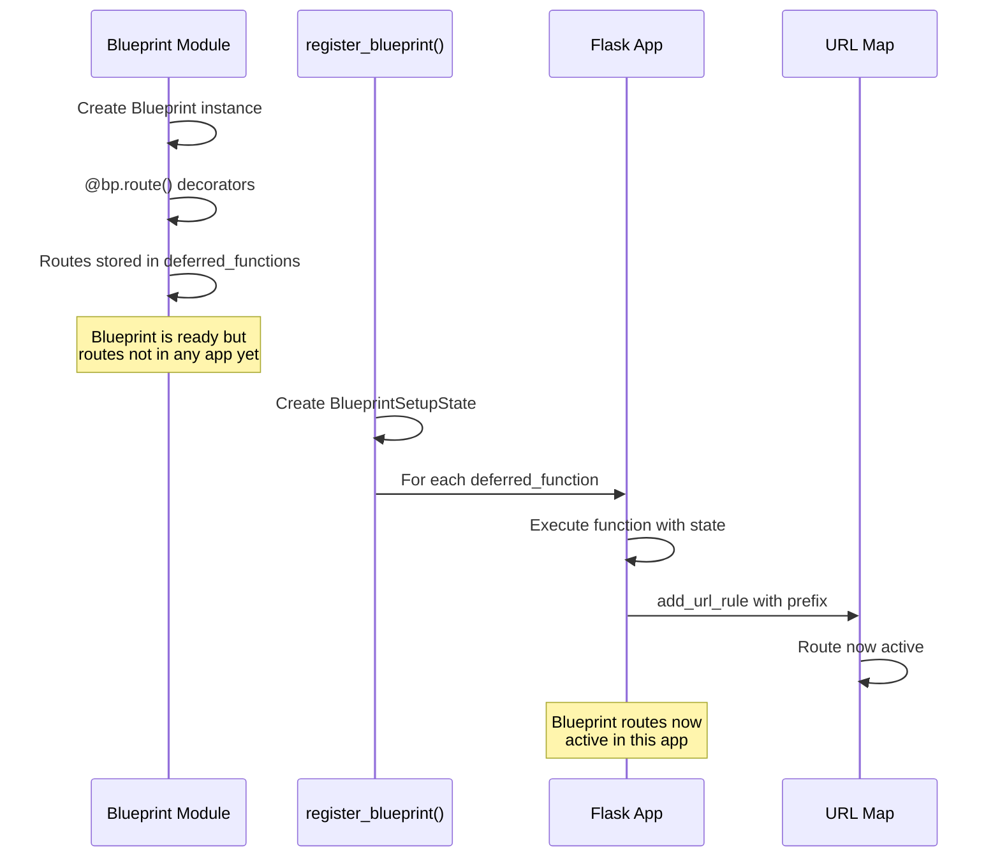

# 05 — Blueprints

## Relevant Source Files

- `src/flask/blueprints.py` — Flask-specific Blueprint (128 lines)
- `src/flask/sansio/blueprints.py` — HTTP-agnostic Blueprint implementation
- `src/flask/sansio/scaffold.py` — Shared Scaffold base class
- `src/flask/app.py` — Blueprint registration (L1200-L1250)

## TL;DR

Blueprints are reusable, self-contained application modules. They collect routes, error handlers, static files, and templates before being registered with a Flask app. Unlike routes registered directly on the app, blueprint routes are deferred until registration time, allowing the same blueprint to be used in multiple apps or instantiated with different prefixes. Blueprints follow the same decorator pattern as Flask apps (@bp.route, @bp.errorhandler, etc.).

## Overview

Blueprints solve the problem of organizing large Flask applications into logical, reusable components. They represent a design pattern where application functionality is modularized without creating tightly coupled code.

### Why Blueprints?

1. **Organization** — Group related routes and handlers
2. **Reusability** — Register the same blueprint in multiple apps
3. **Prefix handling** — Routes automatically prepended with `url_prefix`
4. **Isolated configuration** — Each blueprint can have its own error handlers
5. **Static/template paths** — Blueprints can serve static files and templates

### Blueprint vs Flask

Both Flask and Blueprint inherit from `Scaffold`, sharing decorator methods:

```
Scaffold (src/flask/sansio/scaffold.py)
  ├─ Flask (WSGI-specific app)
  └─ Blueprint (reusable module)
```

The key difference: Flask applies routing immediately; Blueprints defer routing until `register_blueprint()` is called.

## Architecture Diagram



## Key Concepts

| Concept | Description | Source |
|---------|-------------|--------|
| **Blueprint** | Reusable app module; defers routing until registration | `src/flask/blueprints.py:L18-L128` |
| **url_prefix** | Path prefix for all routes in blueprint | `src/flask/blueprints.py:L30` |
| **static_folder** | Blueprint's static file directory | `src/flask/blueprints.py:L25` |
| **template_folder** | Blueprint's template directory | `src/flask/blueprints.py:L27` |
| **BlueprintSetupState** | Context during blueprint registration | `src/flask/sansio/blueprints.py:L1-L100` |
| **Deferred registration** | Routes stored until blueprint registered with app | `src/flask/sansio/blueprints.py:L200` |
| **register_blueprint()** | Register blueprint with Flask app | `src/flask/app.py:L1200-L1250` |

## Component Reference

| Component | Type | Responsibility | Source |
|-----------|------|-----------------|--------|
| `Blueprint` | class | Reusable module; collects routes and handlers | `src/flask/blueprints.py:L18-L128` |
| `__init__()` | method | Initialize blueprint with name and paths | `src/flask/blueprints.py:L19-L50` |
| `route()` | method | Register route (deferred until app registration) | `src/flask/sansio/scaffold.py:L200` |
| `errorhandler()` | method | Register error handler (deferred) | `src/flask/sansio/scaffold.py:L250` |
| `before_request()` | method | Register before_request handler (deferred) | `src/flask/sansio/scaffold.py:L280` |
| `after_request()` | method | Register after_request handler (deferred) | `src/flask/sansio/scaffold.py:L290` |
| `static_folder` | property | Path to static files | `src/flask/blueprints.py:L55-L70` |
| `template_folder` | property | Path to templates | `src/flask/blueprints.py:L71-L85` |
| `cli` | attribute | Click command group for CLI commands | `src/flask/blueprints.py:L49` |
| `BlueprintSetupState` | class | Context during blueprint registration | `src/flask/sansio/blueprints.py:L1-L100` |
| `register_blueprint()` | method | Register blueprint with Flask app | `src/flask/app.py:L1200-L1250` |

## How It Works

### Creating a Blueprint

```python
# myapp/api.py
from flask import Blueprint

bp = Blueprint('api', __name__, url_prefix='/api')

@bp.route('/users')
def list_users():
    return {'users': []}

@bp.route('/users/<int:user_id>')
def get_user(user_id):
    return {'id': user_id}

@bp.errorhandler(404)
def not_found(error):
    return {'error': 'Not found'}, 404
```

The `Blueprint.__init__()` in `src/flask/blueprints.py:L19-L50`:

```python
def __init__(
    self,
    name: str,
    import_name: str,
    static_folder: str | None = None,
    static_url_path: str | None = None,
    template_folder: str | None = None,
    url_prefix: str | None = None,
    ...
) -> None:
    # Call parent Scaffold.__init__
    super().__init__(
        name,
        import_name,
        static_folder,
        static_url_path,
        template_folder,
        url_prefix,
        ...
    )

    # Create Click command group for CLI commands
    self.cli = AppGroup()
    self.cli.name = self.name
```

### Deferred Registration

When you use decorators on a blueprint:

```python
@bp.route('/users')
def list_users():
    return []
```

The `route()` method from `Scaffold` in `src/flask/sansio/scaffold.py:L200-L250`:

```python
def route(self, rule, **options):
    def decorator(f):
        endpoint = options.pop("endpoint", None)
        # IMPORTANT: For blueprints, add to deferred list
        self.add_url_rule(rule, endpoint, f, **options)
        return f
    return decorator
```

The blueprint's `add_url_rule()` in `src/flask/sansio/scaffold.py:L300-L350`:

```python
def add_url_rule(self, rule, endpoint=None, view_func=None, **options):
    """Deferred URL rule registration."""
    if self.deferred_functions is None:
        # Direct app registration
        self.deferred_functions = []

    # Store rule definition for later
    def deferred(state):
        state.add_url_rule(rule, endpoint, view_func, **options)

    self.deferred_functions.append(deferred)
```

### Registering with Flask App

In your main app file:

```python
# myapp/__init__.py
from flask import Flask
from myapp.api import bp

app = Flask(__name__)
app.register_blueprint(bp)  # Routes become: /api/users, /api/users/<int:user_id>
```

The `register_blueprint()` method in `src/flask/app.py:L1200-L1250`:

```python
def register_blueprint(self, blueprint, **options):
    """Register a :class:`~flask.Blueprint` on the application.

    Keyword arguments passed to this function override the defaults
    set when creating the :class:`~flask.Blueprint`.
    """
    first_bp_registration = False

    # 1. Get or create blueprint registry
    if blueprint.name in self.blueprints:
        existing_bp = self.blueprints[blueprint.name]
        if existing_bp is not blueprint:
            raise ValueError(...)
    else:
        self.blueprints[blueprint.name] = blueprint
        first_bp_registration = True

    # 2. Create BlueprintSetupState (context for registration)
    state = BlueprintSetupState(
        self, blueprint, options, first_bp_registration
    )

    # 3. Record import for debug info
    blueprint.record(lambda s: None)

    # 4. Execute all deferred functions
    for deferred in blueprint.deferred_functions:
        deferred(state)

    # 5. Handle static files
    if blueprint.has_static_folder:
        self.add_url_rule(
            f'{blueprint.static_url_path}/<path:filename>',
            f'{blueprint.name}.static',
            blueprint.send_static_file
        )
```

### BlueprintSetupState

The `BlueprintSetupState` class in `src/flask/sansio/blueprints.py:L1-L100` is the context object passed to deferred functions:

```python
class BlueprintSetupState:
    def __init__(self, app, blueprint, options, first_registration):
        self.app = app
        self.blueprint = blueprint
        self.options = options
        self.first_registration = first_registration

    def add_url_rule(self, rule, endpoint, view_func, **options):
        """Add URL rule to the app with blueprint prefix."""
        # Get url_prefix from options
        url_prefix = self.options.get('url_prefix')

        # Build full rule with prefix
        if url_prefix:
            rule = url_prefix + rule

        # Add to app's URL map
        self.app.add_url_rule(
            rule,
            f'{self.blueprint.name}.{endpoint}',
            view_func,
            **options
        )
```

### Multiple Registration

The same blueprint can be registered multiple times with different prefixes:

```python
app = Flask(__name__)

api_bp = Blueprint('api', __name__)

@api_bp.route('/status')
def status():
    return {'status': 'ok'}

# Register with different prefixes
app.register_blueprint(api_bp, url_prefix='/v1')    # /v1/status
app.register_blueprint(api_bp, url_prefix='/v2')    # /v2/status
```

### Nested Blueprints

Blueprints can be registered with other blueprints:

```python
from flask import Blueprint

# Main blueprint
main_bp = Blueprint('main', __name__)

# Sub blueprint
admin_bp = Blueprint('admin', __name__, url_prefix='/admin')

@admin_bp.route('/users')
def list_users():
    return []

# Register sub-blueprint with main
main_bp.register_blueprint(admin_bp)

# Register main with app
app.register_blueprint(main_bp)
# Routes: /admin/users
```

### Static Files and Templates

Blueprints can serve static files and templates:

```python
bp = Blueprint('blog', __name__,
               static_folder='static',
               static_url_path='/static',
               template_folder='templates')

@bp.route('/')
def index():
    # Loads from templates/index.html (blueprint's template folder)
    return render_template('index.html')
```

When registered with a prefix:

```python
app.register_blueprint(bp, url_prefix='/blog')
# Static files: /blog/static/<filename>
# Templates resolved relative to bp.template_folder
```

### Error Handlers in Blueprints

Blueprint error handlers apply only to routes in that blueprint:

```python
bp = Blueprint('api', __name__)

@bp.errorhandler(404)
def not_found(error):
    return {'error': 'API resource not found'}, 404

@bp.errorhandler(ValueError)
def handle_value_error(error):
    return {'error': str(error)}, 400
```

### Blueprint CLI Commands

Blueprints can define CLI commands:

```python
bp = Blueprint('admin', __name__)

@bp.cli.command('init-db')
def init_db():
    """Initialize the database."""
    print("Initializing database...")

app.register_blueprint(bp)

# Available as: flask admin init-db
```

## Data Flow



## Gotchas & Conventions

> ⚠️ **Gotcha**: Blueprint endpoint names include the blueprint name.
>
> If your blueprint is named 'api' and has a route with endpoint 'users', the full endpoint becomes 'api.users':
> ```python
> api_bp = Blueprint('api', __name__)
>
> @api_bp.route('/users', endpoint='users')
> def list_users():
>     return []
>
> # url_for('api.users') ✓
> # url_for('users') ✗ (KeyError)
> ```
> See `src/flask/app.py:L1220`.

> 📌 **Convention**: Organize blueprints by feature:
> ```
> myapp/
>   __init__.py
>   api/
>     __init__.py  # defines api_bp
>     routes.py
>     handlers.py
>   admin/
>     __init__.py  # defines admin_bp
>     routes.py
>   templates/
>   static/
> ```

> 💡 **Tip**: Use `url_for` with blueprint endpoints:
> ```python
> # Bad: hardcoded blueprint prefix
> return redirect('/api/users')
>
> # Good: generated from blueprint endpoint
> return redirect(url_for('api.list_users'))
> ```
> This automatically includes the registered prefix.

## Cross-References

- **Parent**: [01 — Overview](01-overview.md)
- **Related**: [02 — Application Core](02-application-core.md)
- **Related**: [04 — Routing System](04-routing-system.md)
- **Related**: [15 — CLI System](15-cli-system.md)
