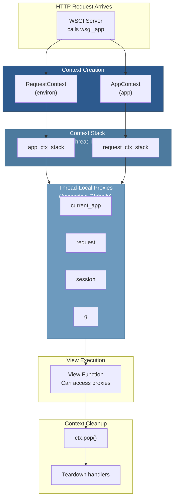

# 06 — Context Management

## Relevant Source Files

- `src/flask/ctx.py` — Context classes and management (540 lines)
- `src/flask/globals.py` — Thread-local proxies (77 lines)
- `src/flask/app.py` — Context initialization (L1050-L1100)

## TL;DR

Flask uses a context stack system to make request-specific data (request, session, g) and app-specific data available globally via thread-local proxies. The `RequestContext` holds request-scoped data; the `AppContext` holds app-scoped data. Both are pushed onto thread-local stacks when a request arrives and popped when it completes. This allows request-handling code anywhere in the application to access context data without passing objects through function parameters.

## Overview

Context management is how Flask provides global access to request-specific data without polluting the global namespace. It's implemented using Python's threading module for thread-safety and works with async contexts via contextvars.

### The Problem Context Solves

```python
# Without context: pass objects through every function
def view_handler():
    user = get_user_from_request(request)
    posts = get_user_posts(user)
    return render_posts(posts)

def get_user_from_request(request):
    # Need request parameter everywhere
    ...

def get_user_posts(user):
    # Need user parameter everywhere
    ...

def render_posts(posts):
    # Need posts parameter everywhere
    ...
```

```python
# With context: access data globally via proxies
def view_handler():
    posts = get_user_posts()  # Access current_user via context
    return render_posts(posts)

def get_user_posts():
    user = current_user  # Get from context (proxy)
    ...

def render_posts(posts):
    # No parameters needed; access context directly
    ...
```

Context enables the second pattern, making code cleaner and more Pythonic.

## Architecture Diagram



## Key Concepts

| Concept | Description | Source |
|---------|-------------|--------|
| **RequestContext** | Holds request-scoped data (request, session, g) | `src/flask/ctx.py:L200-L350` |
| **AppContext** | Holds app-scoped data during request | `src/flask/ctx.py:L100-L200` |
| **Context stack** | Thread-local stack of active contexts | `src/flask/ctx.py:L350-L400` |
| **Proxy object** | Thread-local proxy that redirects to context data | `src/flask/globals.py` |
| **LocalStack** | Thread-local stack for context isolation | Werkzeug utility |
| **current_app** | Proxy to active Flask app | `src/flask/globals.py:L10-L30` |
| **request** | Proxy to active Request object | `src/flask/globals.py:L35-L50` |
| **session** | Proxy to active session dict | `src/flask/globals.py:L55-L70` |
| **g** | Proxy to request-scoped namespace | `src/flask/globals.py:L75-L90` |

## Component Reference

| Component | Type | Responsibility | Source |
|-----------|------|-----------------|--------|
| `RequestContext` | class | Holds request-scoped data; WSGI environ wrapper | `src/flask/ctx.py:L200-L350` |
| `__init__()` | method | Initialize context from WSGI environ | `src/flask/ctx.py:L210-L250` |
| `push()` | method | Push context to stack; make proxies available | `src/flask/ctx.py:L260-L300` |
| `pop()` | method | Pop context; run teardown handlers | `src/flask/ctx.py:L310-L350` |
| `match_request()` | method | Match request URL to routing rule | `src/flask/ctx.py:L280-L320` |
| `AppContext` | class | Holds app-scoped data during request | `src/flask/ctx.py:L100-L200` |
| `_AppCtxGlobals` | class | Namespace for g object | `src/flask/ctx.py:L30-L100` |
| `current_app` | proxy | Thread-local proxy to active Flask app | `src/flask/globals.py:L10-L30` |
| `request` | proxy | Thread-local proxy to active Request | `src/flask/globals.py:L35-L50` |
| `session` | proxy | Thread-local proxy to active session | `src/flask/globals.py:L55-L70` |
| `g` | proxy | Thread-local proxy to app context globals | `src/flask/globals.py:L75-L90` |

## How It Works

### RequestContext Initialization

When a request arrives, `RequestContext` is created:

```python
# src/flask/ctx.py:L200-L250
class RequestContext:
    """The request context."""

    def __init__(self, app, environ):
        self.app = app
        self.environ = environ
        self.request = None
        self.session = None
        ...

    def push(self):
        """Pushes a new context to the current stack."""
        # Get the thread-local stack
        top = _request_ctx_stack.top

        # Check if AppContext exists; create if not
        if top is None or top.app != self.app:
            app_ctx = self.app.app_ctx_class(self.app)
            app_ctx.push()

        # Push this context
        _request_ctx_stack.push(self)

        # Create request object
        self.request = self.app.request_class(self.environ)

        # Initialize session
        self.session = self.app.session_interface.new_session()

        # Initialize g namespace
        self.g = _AppCtxGlobals()

        # Fire signals
        appcontext_pushed.send(self.app)
```

### Making Proxies Available

The proxies (current_app, request, session, g) work through Werkzeug's LocalProxy class:

```python
# src/flask/globals.py:L10-L30
def _cv_request():
    """Return the active RequestContext or None."""
    top = _request_ctx_stack.top
    if top is not None:
        return top
    # No request context; raise error if accessed
    raise RuntimeError('Working outside of request context.')

# Create proxy to request context
_request_ctx = LocalProxy(_cv_request)

# Create proxies for nested attributes
request = LocalProxy(lambda: _request_ctx.request)
session = LocalProxy(lambda: _request_ctx.session)
g = LocalProxy(lambda: _request_ctx.g)

# current_app uses _cv_app context var
_cv_app = ContextVar('flask.app_ctx')

def _get_app():
    """Return the active Flask app."""
    try:
        return _cv_app.get()
    except LookupError:
        raise RuntimeError('Working outside of application context.')

current_app = LocalProxy(_get_app)
```

### Context Pushing Details

When `RequestContext.push()` executes:

```python
# 1. Push RequestContext to thread-local stack
_request_ctx_stack.push(self)

# 2. If no AppContext on stack, create and push one
if not has_app_context():
    app_ctx = AppContext(self.app)
    app_ctx.push()

# 3. Initialize request-scoped objects
self.request = Request(self.environ)
self.session = {}  # Will be loaded from cookie
self.g = _AppCtxGlobals()

# 4. Fire appcontext_pushed signal
appcontext_pushed.send(self.app)

# 5. After this, proxies like request, session, g work
```

### Accessing Context Data

```python
from flask import current_app, request, session, g

# Inside a view function
@app.route('/users/<int:user_id>')
def get_user(user_id):
    # All of these work because we're in a request context
    app = current_app  # Access active Flask app
    req = request      # Access current Request
    sess = session     # Access current session
    user_data = g.user # Access request-scoped variable

    return {'user': user_data}

# Set request-scoped data
@app.before_request
def setup_auth():
    g.user = get_current_user()
    g.user_id = g.user.id if g.user else None
```

### Context Popping

When the request completes, `RequestContext.pop()` is called:

```python
# src/flask/ctx.py:L310-L350
def pop(self, exc=None):
    """Removes the request context from the stack."""
    try:
        # Run request teardown handlers
        self.app.do_teardown_request(self, exc)

        # Fire request_tearing_down signal
        request_tearing_down.send(self.app, exc=exc)
    finally:
        # Remove from stack
        _request_ctx_stack.pop()

        # Pop AppContext if we created it
        if _app_ctx_stack.top is not None:
            _app_ctx_stack.pop()
```

### Thread Safety

The LocalStack and ContextVar approach ensures thread safety:

```python
# Each thread has its own stack
# Thread 1
_request_ctx_stack.push(ctx1)  # Thread 1 stack: [ctx1]

# Thread 2 (different thread)
_request_ctx_stack.push(ctx2)  # Thread 2 stack: [ctx2]

# In Thread 1: request refers to ctx1
# In Thread 2: request refers to ctx2
# No conflicts because each thread has isolated storage
```

### AppContext

The `AppContext` holds app-scoped data:

```python
# src/flask/ctx.py:L100-L200
class AppContext:
    """The application context."""

    def __init__(self, app):
        self.app = app
        self.g = _AppCtxGlobals()  # Namespace for app-level data

    def push(self):
        """Push context to stack."""
        _app_ctx_stack.push(self)
        # Make current_app available
        _cv_app.set(self.app)

    def pop(self, exc=None):
        """Pop context from stack."""
        try:
            self.app.do_teardown_appcontext(self, exc)
        finally:
            _app_ctx_stack.pop()
```

AppContext is useful for app-level resources that aren't tied to requests:

```python
# In shell context or batch processing
with app.app_context():
    # current_app is now available
    db = get_db()  # Can access app config
    db.init_app(current_app)
```

## Working Outside Request Context

Sometimes you need to access app data outside a request:

```python
# ✗ This fails: no request context
def batch_job():
    config = current_app.config  # RuntimeError!

# ✓ Use app context
def batch_job():
    with app.app_context():
        config = current_app.config  # Works!

# ✓ Use request context (includes app context)
def batch_job():
    with app.test_request_context():
        config = current_app.config  # Works!
        request.path  # Also works
```

## Gotchas & Conventions

> ⚠️ **Gotcha**: Accessing proxies outside a context raises RuntimeError.
>
> Common mistake:
> ```python
> # This will fail if called outside request/app context
> def helper_function():
>     return current_app.config['SECRET_KEY']  # RuntimeError!
>
> # Solution: pass the app as parameter
> def helper_function(app):
>     return app.config['SECRET_KEY']
>
> # Or use app context
> with app.app_context():
>     return current_app.config['SECRET_KEY']
> ```
> See `src/flask/globals.py:L20-L30`.

> 📌 **Convention**: Use `g` for request-scoped data, not global variables:
> ```python
> # Bad: global variable
> _user = None
>
> @app.before_request
> def load_user():
>     global _user
>     _user = get_current_user()
>
> # Good: use g
> @app.before_request
> def load_user():
>     g.user = get_current_user()
> ```

> 💡 **Tip**: Understand when you have what context:
> ```
> View function:        RequestContext + AppContext ✓
> before_request:       RequestContext + AppContext ✓
> after_request:        RequestContext + AppContext ✓
> teardown_request:     RequestContext + AppContext ✓
> CLI command:          AppContext only (no RequestContext)
> Batch job:            AppContext only (use app.app_context())
> Module-level code:    No context (import time)
> ```

## Cross-References

- **Parent**: [01 — Overview](01-overview.md)
- **Related**: [02 — Application Core](02-application-core.md)
- **Related**: [03 — Request/Response Cycle](03-request-response-cycle.md)
- **Related**: [07 — Globals and Proxies](07-globals-and-proxies.md)
- **Related**: [14 — Testing Framework](14-testing-framework.md)
