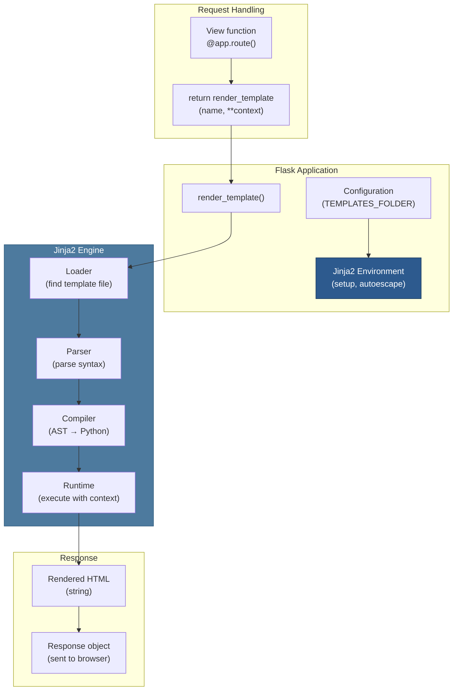

# 08 — Templating System

## Relevant Source Files

- `src/flask/templating.py` — Jinja2 integration (212 lines)
- `src/flask/app.py` — Template configuration (L900-L950)
- Jinja2 package — External templating engine

## TL;DR

Flask integrates Jinja2, a powerful and intuitive templating engine, for server-side HTML rendering. Templates are HTML files with variable substitution, conditionals, loops, and filters. Flask's `render_template()` function loads templates from a configurable folder, passes context data, and returns the rendered HTML. Automatic HTML escaping prevents XSS attacks.

## Overview

Templating allows you to generate dynamic HTML by combining static markup with data from your application. Jinja2 provides:

- **Variable substitution**: `{{ user.name }}`
- **Control flow**: `...`
- **Loops**: `...`
- **Filters**: `{{ text|uppercase }}`
- **Inheritance**: Base templates with blocks for extension
- **Auto-escaping**: Protection against XSS by default

## Architecture Diagram



## Key Concepts

| Concept | Description | Source |
|---------|-------------|--------|
| **Template** | HTML file with Jinja2 syntax; contains {{ }}  {# #} | `templates/` folder |
| **Context** | Dict of variables passed to template | `render_template(**context)` |
| **Jinja2 Environment** | Engine that loads, compiles, and renders templates | `src/flask/templating.py:L1-L50` |
| **Autoescape** | Automatic HTML entity encoding to prevent XSS | `src/flask/templating.py:L20` |
| **Filter** | Function to transform variable values | `` |
| **Test** | Function to test variable values in conditionals | `` |
| **Block** | Named region in template for extension | `...` |
| **Macro** | Reusable template fragment | `...` |

## Component Reference

| Component | Type | Responsibility | Source |
|-----------|------|-----------------|--------|
| `render_template()` | function | Load template, render with context, return HTML string | `src/flask/templating.py:L90-L130` |
| `render_template_string()` | function | Render template from string (not file) | `src/flask/templating.py:L135-L150` |
| `jinja_env` | property | Jinja2 Environment instance | `src/flask/app.py:L900-L950` |
| `template_folder` | property | Path to templates directory | `src/flask/app.py:L850-L880` |
| `Jinja2 Environment` | class (Jinja2) | Configures template loading, autoescape, filters | `jinja2.Environment` |
| `FileSystemLoader` | class (Jinja2) | Loads templates from filesystem | `jinja2.FileSystemLoader` |
| `jinja_options` | dict | Configuration for Jinja2 Environment | `src/flask/app.py:L950-L1000` |

## How It Works

### Template Environment Setup

When Flask is initialized, it creates a Jinja2 Environment:

```python
# src/flask/app.py:L900-L950
def create_jinja_environment(self):
    """Create the Jinja environment."""
    options = dict(
        self.jinja_options,
        loader=FileSystemLoader(
            os.path.join(self.root_path, self.template_folder)
        ),
        autoescape=select_autoescape(),  # Enable XSS protection
    )
    env = Environment(**options)

    # Register custom filters
    env.filters['url_for'] = url_for
    env.filters['get_flashed_messages'] = get_flashed_messages
    # ... more filters

    return env

self.jinja_env = create_jinja_environment()
```

### Rendering Templates

The `render_template()` function in `src/flask/templating.py:L90-L130`:

```python
def render_template(template_name_or_list, **context):
    """Render a template with the given context."""
    # 1. Get current app
    app = current_app

    # 2. Load template from jinja_env
    template = app.jinja_env.get_template(template_name_or_list)

    # 3. Render with context
    return template.render(context)
```

Example usage:

```python
from flask import render_template

@app.route('/users/<int:user_id>')
def get_user(user_id):
    user = User.query.get(user_id)
    # Render template with context
    return render_template('user.html', user=user)
```

Template file (`templates/user.html`):

```html
<!DOCTYPE html>
<html>
<head>
    <title>{{ user.name }}</title>
</head>
<body>
    <h1>{{ user.name }}</h1>
    <p>Email: {{ user.email }}</p>
</body>
</html>
```

### Template Syntax

#### Variable Substitution

```jinja2
{{ variable }}          {# Print variable #}
{{ user.name }}         {# Print attribute #}
{{ items[0] }}          {# Print index #}
{{ variable | filter }} {# Apply filter #}
```

#### Conditionals

```jinja2

    <p>Admin user</p>

    <p>Moderator user</p>

    <p>Regular user</p>

```

#### Loops

```jinja2

    <li>{{ item.name }}</li>


{# Loop with index #}

    <li>{{ i }}: {{ item }}</li>


{# Else clause if list empty #}

    <li>{{ item }}</li>

    <li>No items</li>

```

#### Comments

```jinja2
{# This is a comment; won't be in output #}
```

#### Filters

Built-in filters:

```jinja2
{{ text | upper }}           {# Uppercase #}
{{ text | lower }}           {# Lowercase #}
{{ text | replace('a', 'b')}} {# Replace #}
{{ items | length }}         {# List length #}
{{ items | join(', ') }}     {# Join list #}
{{ value | default('N/A') }} {# Default value #}
{{ html | safe }}            {# Don't escape (danger!) #}
```

### Custom Filters

Register custom filters:

```python
@app.template_filter('reverse')
def reverse_filter(value):
    return value[::-1]

# Or register directly
app.jinja_env.filters['reverse'] = reverse_filter
```

Template usage:

```jinja2
{{ 'hello' | reverse }}  {# Outputs: olleh #}
```

### Template Inheritance

Base template (`templates/base.html`):

```html
<!DOCTYPE html>
<html>
<head>
    <title>Default Title</title>
</head>
<body>
    <nav>
        Default Nav
    </nav>
    <main>
        
    </main>
    <footer>
        © 2024
    </footer>
</body>
</html>
```

Child template (`templates/user.html`):

```html


{{ user.name }}'s Profile


    <h1>{{ user.name }}</h1>
    <p>Email: {{ user.email }}</p>

```

### Macros

Reusable template fragments:

```jinja2
{# Define macro #}

    <div class="post">
        <h3>{{ post.title }}</h3>
        <p>{{ post.content }}</p>
        <p>By {{ post.author.name }}</p>
    </div>


{# Use macro #}

    {{ render_post(post) }}

```

### Auto-Escaping

By default, all variable substitution is HTML-escaped to prevent XSS:

```python
# In template
{{ user_input }}  {# HTML entities encoded #}

# If user_input is: <script>alert('xss')</script>
# Output: &lt;script&gt;alert(&#39;xss&#39;)&lt;/script&gt;
```

To disable escaping for safe content:

```jinja2
{# Render user_input without escaping (dangerous!) #}
{{ user_input | safe }}

{# Or in Python #}
from markupsafe import Markup
html = Markup('<b>Safe HTML</b>')
return render_template('template.html', content=html)
```

### Static Files in Templates

Use `url_for()` to generate URLs for static files:

```jinja2
<link rel="stylesheet" href="{{ url_for('static', filename='style.css') }}">
<script src="{{ url_for('static', filename='app.js') }}"></script>

```

### Template Imports

Import macros from other templates:

```jinja2


{{ macros.render_post(post) }}
```

Or include entire templates:

```jinja2

<main>
    ...
</main>

```

## Configuration

Template configuration in Flask:

```python
app = Flask(__name__, template_folder='templates')

# Or in config
app.config['TEMPLATE_FOLDER'] = 'templates'
app.config['TEMPLATES_AUTO_RELOAD'] = True  # Reload on change (dev)
app.config['EXPLAIN_TEMPLATE_LOADING'] = True  # Debug template loading
```

Jinja2-specific options:

```python
app.jinja_options = {
    'trim_blocks': True,     # Remove first newline after block
    'lstrip_blocks': True,   # Remove leading whitespace before block
}
```

## Gotchas & Conventions

> ⚠️ **Gotcha**: Variable assignment in templates is scoped to the template.
>
> ```jinja2
> 
> {{ x }}  {# Works: outputs 'hello' #}
> ```
>
> But changes don't persist to other templates or back to Python. Set variables in Python, not templates:
> ```python
> # Good: set in Python
> return render_template('template.html', x='hello')
> ```
> See [NEEDS INVESTIGATION]

> 📌 **Convention**: Always use `url_for()` for URL generation, not hardcoded paths:
> ```jinja2
> {# Bad #}
> <a href="/users/42">Profile</a>
>
> {# Good #}
> <a href="{{ url_for('get_user', user_id=42) }}">Profile</a>
> ```

> 💡 **Tip**: Use template inheritance to avoid code duplication:
> ```
> templates/
>   base.html       (layout, navigation)
>   user.html       (extends base.html)
>   post.html       (extends base.html)
>   admin/
>     base.html     (extends ../ base.html with extra nav)
> ```

## Cross-References

- **Parent**: [01 — Overview](01-overview.md)
- **Related**: [02 — Application Core](02-application-core.md)
- **Related**: [03 — Request/Response Cycle](03-request-response-cycle.md)
- **Related**: [04 — Routing System](04-routing-system.md)
