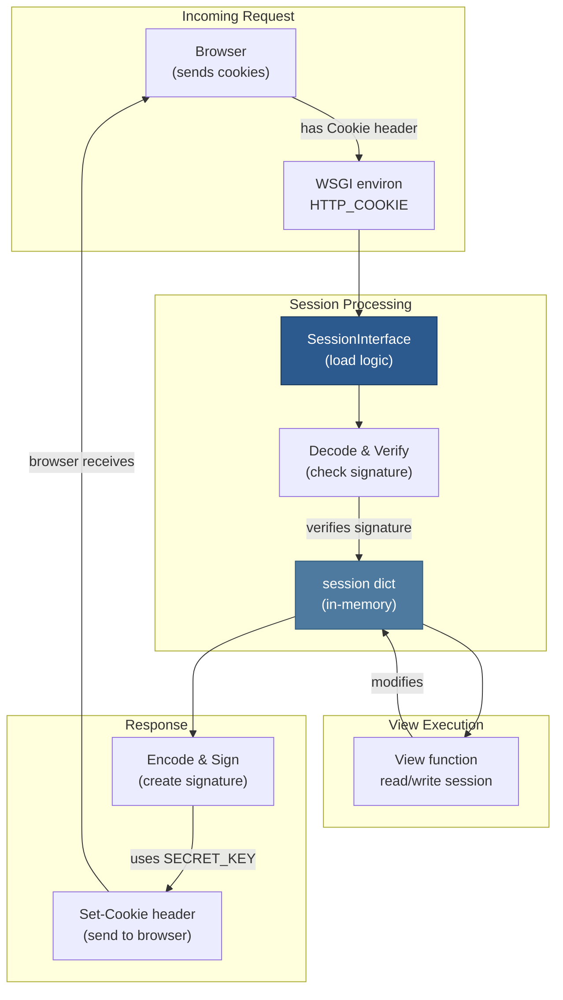

# 09 — Sessions and Cookies

## Relevant Source Files

- `src/flask/sessions.py` — Session handling (385 lines)
- `src/flask/wrappers.py` — Request object with cookie support (L1-L100)
- `src/flask/app.py` — Session configuration (L950-L1000)
- Werkzeug `datastructures.py` — Cookie and session utilities

## TL;DR

Flask provides a secure session system based on digitally signed cookies. The default `SecureCookieSessionInterface` stores user data in cookies signed with the app's SECRET_KEY, avoiding database lookups for session storage. Session data (dictionary) is automatically loaded from cookies on request and saved on response. Users cannot tamper with session data without the secret key.

## Overview

Sessions allow you to store per-user state across requests. Unlike databases, they're lightweight and require no server-side storage. Flask's default implementation uses signed cookies, making sessions both secure and simple.

### How Cookie-Based Sessions Work

1. **On request**: Flask loads the session cookie, verifies the signature using SECRET_KEY, and decodes the data
2. **During request**: Application code reads/modifies `session` dict
3. **On response**: Flask encodes the session, signs it with SECRET_KEY, and stores in a cookie
4. **On next request**: Cookie is sent by browser, signature verified, and data loaded

The client can see the session data (it's a cookie) but cannot modify it without knowing SECRET_KEY.

## Architecture Diagram



## Key Concepts

| Concept | Description | Source |
|---------|-------------|--------|
| **Session** | Dictionary of user data; secured with signature | `src/flask/ctx.py:L240` |
| **Cookie** | HTTP header sent by server; stored in browser | HTTP spec |
| **Session Interface** | Handles session loading/saving logic | `src/flask/sessions.py:L1-L100` |
| **SECRET_KEY** | Secret used to sign/verify session cookies | `src/flask/config.py` |
| **Signature** | HMAC hash proving cookie hasn't been tampered | Cryptography |
| **Session cookie** | HTTP cookie containing encrypted session data | `src/flask/config.py:L75` |
| **Permanent session** | Session that persists across browser restarts | `src/flask/sessions.py:L200` |

## Component Reference

| Component | Type | Responsibility | Source |
|-----------|------|-----------------|--------|
| `session` | proxy | Dict of session data; proxies to current RequestContext | `src/flask/globals.py:L55-L70` |
| `SessionInterface` | class (abstract) | Base class for session implementations | `src/flask/sessions.py:L1-L100` |
| `SecureCookieSessionInterface` | class | Default implementation using signed cookies | `src/flask/sessions.py:L100-L385` |
| `open_session()` | method | Load session from request cookies | `src/flask/sessions.py:L150-L200` |
| `save_session()` | method | Save session to response cookies | `src/flask/sessions.py:L250-L350` |
| `get_signing_serializer()` | method | Create serializer for cookie signing | `src/flask/sessions.py:L125-L145` |
| `SECRET_KEY` | config | Key used to sign cookies | `src/flask/app.py:L210` |
| `SESSION_COOKIE_NAME` | config | Cookie name (default: 'session') | `src/flask/app.py:L218` |
| `SESSION_COOKIE_HTTPONLY` | config | Prevent JavaScript access (default: True) | `src/flask/app.py:L221` |
| `PERMANENT_SESSION_LIFETIME` | config | Session expiration (default: 31 days) | `src/flask/app.py:L213` |

## How It Works

### Secret Key Setup

Before using sessions, you must set a SECRET_KEY:

```python
app = Flask(__name__)
app.config['SECRET_KEY'] = 'your-secret-key-here'

# In production, load from environment:
app.config['SECRET_KEY'] = os.environ.get('SECRET_KEY')
```

Without SECRET_KEY, sessions won't work and Flask will warn you.

### Session Loading

On request, `SecureCookieSessionInterface.open_session()` in `src/flask/sessions.py:L150-L200`:

```python
def open_session(self, app, request):
    """Load the session from the request."""
    # 1. Get serializer (uses SECRET_KEY)
    s = self.get_signing_serializer(app)
    if s is None:
        return None

    # 2. Get session cookie from request
    cookie_name = app.config['SESSION_COOKIE_NAME']
    cookie_value = request.cookies.get(cookie_name)

    if not cookie_value:
        # No cookie; create empty session
        return {}

    # 3. Verify signature and decode
    try:
        data = s.loads(cookie_value)
        return data
    except (BadSignature, UnicodeDecodeError):
        # Cookie tampered with or corrupted
        return {}
```

### Using Session Data

In view functions, access the session dictionary:

```python
from flask import session

@app.route('/login', methods=['POST'])
def login():
    username = request.form['username']
    password = request.form['password']

    if verify_password(username, password):
        # Store user info in session
        session['user_id'] = get_user_id(username)
        session['username'] = username
        return redirect('/')
    else:
        return 'Invalid credentials'

@app.route('/')
def home():
    # Read from session
    if 'user_id' in session:
        username = session['username']
        return f'Hello, {username}!'
    else:
        return 'Not logged in'

@app.route('/logout')
def logout():
    # Clear session
    session.clear()
    return redirect('/')
```

### Session Saving

After the view executes, `SecureCookieSessionInterface.save_session()` in `src/flask/sessions.py:L250-L350`:

```python
def save_session(self, app, session, response):
    """Save the session to the response."""
    # 1. Get session cookie name
    name = app.config['SESSION_COOKIE_NAME']

    # 2. If session is empty and permanent is false, delete cookie
    if not session:
        if name in response.delete_cookie:
            response.delete_cookie(
                name,
                domain=app.config['SESSION_COOKIE_DOMAIN'],
                path=app.config['SESSION_COOKIE_PATH']
            )
        return

    # 3. Prepare cookie options
    httponly = app.config.get('SESSION_COOKIE_HTTPONLY', True)
    secure = app.config.get('SESSION_COOKIE_SECURE', False)
    samesite = app.config.get('SESSION_COOKIE_SAMESITE')

    # 4. Set expiration if session is permanent
    if session.get('permanent'):
        lifetime = app.permanent_session_lifetime
        expires = datetime.utcnow() + lifetime
    else:
        expires = None

    # 5. Encode and sign session data
    s = self.get_signing_serializer(app)
    val = s.dumps(dict(session))

    # 6. Set cookie in response
    response.set_cookie(
        name,
        val,
        expires=expires,
        httponly=httponly,
        secure=secure,
        samesite=samesite,
        domain=app.config['SESSION_COOKIE_DOMAIN'],
        path=app.config['SESSION_COOKIE_PATH']
    )
```

### Permanent Sessions

By default, sessions expire when the browser closes. For persistent sessions:

```python
from datetime import timedelta
from flask import session

@app.route('/login')
def login():
    # ... validate credentials ...
    session['user_id'] = user_id
    session.permanent = True  # Session survives browser close
    app.permanent_session_lifetime = timedelta(days=7)  # 7-day expiration
    return redirect('/')
```

### Session Modification Detection

Flask automatically detects session changes:

```python
@app.route('/set-theme')
def set_theme():
    theme = request.args.get('theme')
    session['theme'] = theme  # Modified → cookie will be updated
    return {'theme': theme}

@app.route('/get-theme')
def get_theme():
    theme = session.get('theme', 'light')
    return {'theme': theme}  # Unmodified → cookie unchanged
```

## Cookie Configuration

### Cookie Security Options

```python
app.config['SESSION_COOKIE_SECURE'] = True   # Only send over HTTPS
app.config['SESSION_COOKIE_HTTPONLY'] = True  # Prevent JS access (XSS protection)
app.config['SESSION_COOKIE_SAMESITE'] = 'Strict'  # CSRF protection
app.config['SESSION_COOKIE_DOMAIN'] = '.example.com'  # Subdomain sharing
app.config['SESSION_COOKIE_PATH'] = '/'  # Cookie path
app.config['MAX_COOKIE_SIZE'] = 4093  # Max cookie size in bytes
```

### Custom Session Storage

To use server-side sessions (database-backed):

```python
from flask.sessions import SessionInterface
from flask import session

class DatabaseSessionInterface(SessionInterface):
    def open_session(self, app, request):
        """Load session from database."""
        session_id = request.cookies.get('session_id')
        if session_id:
            data = db.sessions.find_one({'_id': session_id})
            return data or {}
        return {}

    def save_session(self, app, session, response):
        """Save session to database."""
        session_id = session.get('_id') or os.urandom(16).hex()
        session['_id'] = session_id
        db.sessions.replace_one({'_id': session_id}, session, upsert=True)
        response.set_cookie('session_id', session_id)

app.session_interface = DatabaseSessionInterface()
```

## Gotchas & Conventions

> ⚠️ **Gotcha**: Sessions are not encrypted; only signed.
>
> The session cookie is visible to anyone with network access. Don't store sensitive data like passwords or credit cards in sessions:
> ```python
> # Bad: stores password in cookie
> session['password'] = password
>
> # Good: store only user ID
> session['user_id'] = user_id
> # Look up user data from database on each request
> ```
> See `src/flask/sessions.py:L100-L150`.

> 📌 **Convention**: Always set SECRET_KEY in production:
> ```python
> # Production
> app.config['SECRET_KEY'] = os.environ['SECRET_KEY']
>
> # Development (if needed)
> if app.debug:
>     app.config['SECRET_KEY'] = 'dev-secret-key'
> ```

> 💡 **Tip**: Use session only for authentication state, not for large data:
> ```python
> # Bad: stores full user object
> session['user'] = {'id': 1, 'name': 'Alice', ...many fields...}
>
> # Good: store minimal identifier
> session['user_id'] = 1
> # Look up full user data from database
> user = User.query.get(session['user_id'])
> ```

## Cross-References

- **Parent**: [01 — Overview](01-overview.md)
- **Related**: [03 — Request/Response Cycle](03-request-response-cycle.md)
- **Related**: [06 — Context Management](06-context-management.md)
- **Related**: [07 — Globals and Proxies](07-globals-and-proxies.md)
- **Related**: [14 — Testing Framework](14-testing-framework.md)
