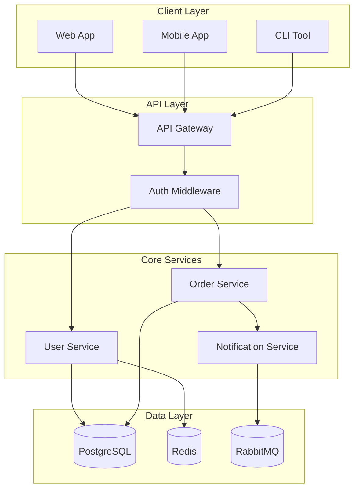
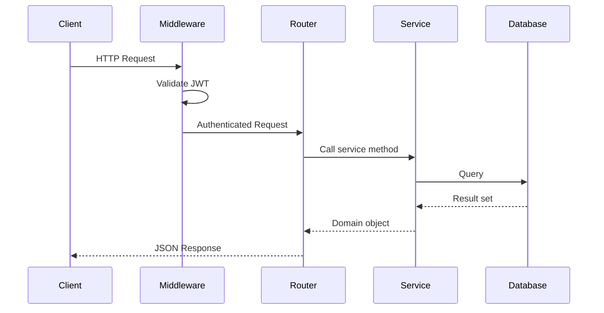
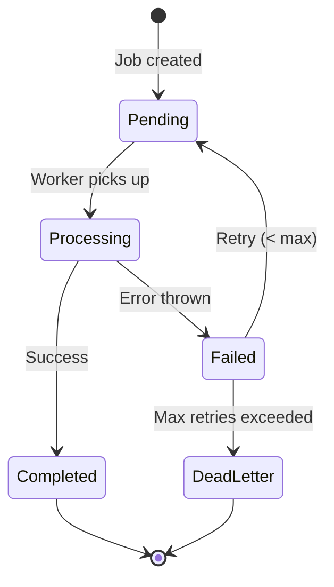
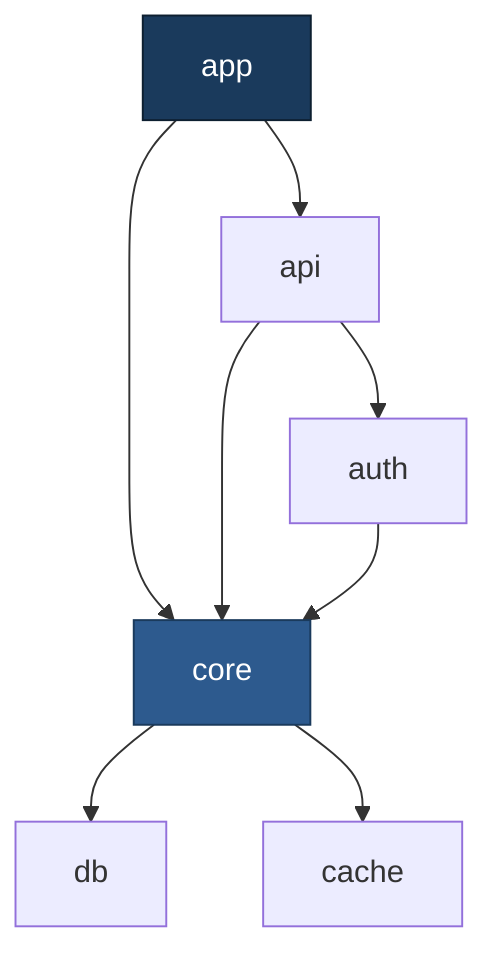
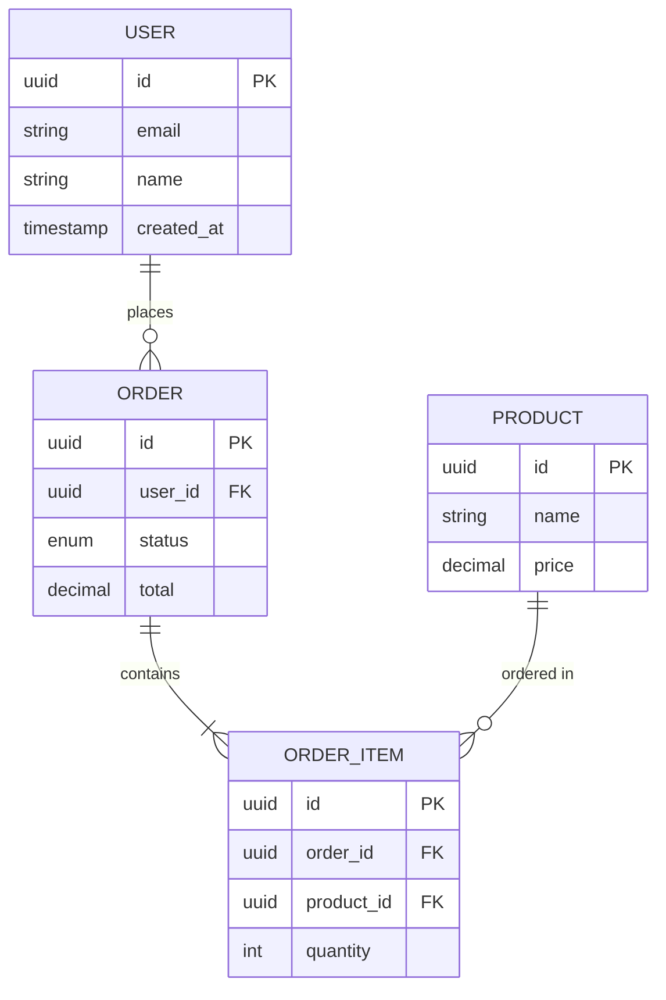
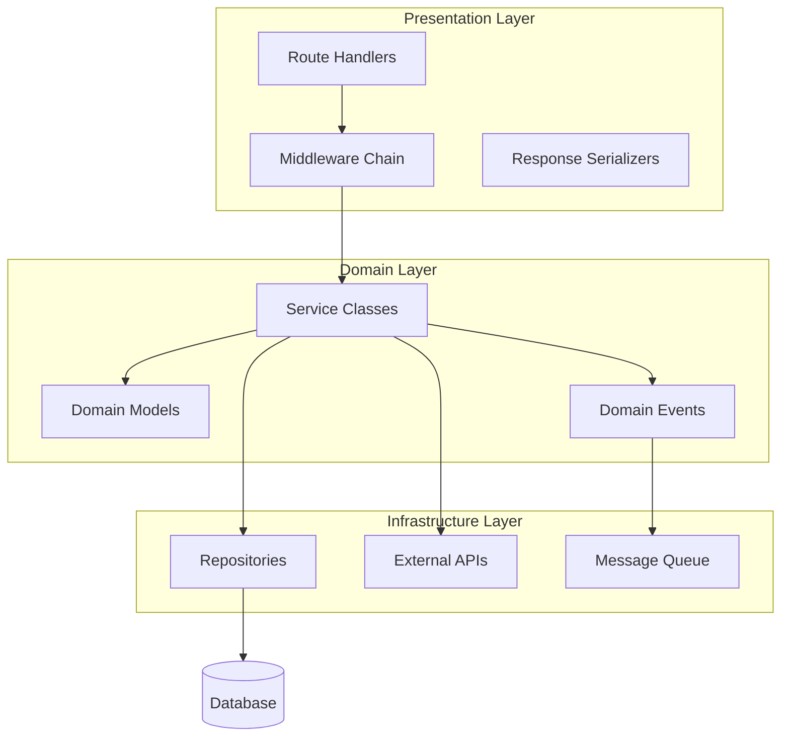
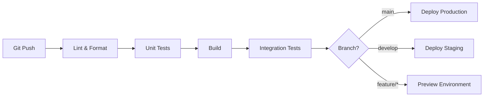
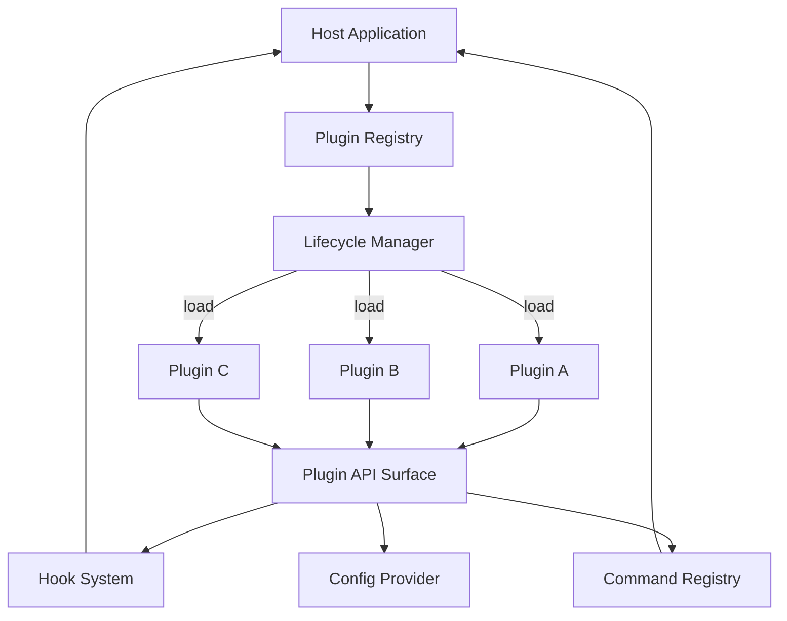

# Diagram Patterns Reference

Choose the right Mermaid diagram type based on what you're documenting. Every major system (3+ interacting components) needs at least one diagram.

## Diagram Selection Guide

| Scenario | Diagram Type | When to Use |
|----------|-------------|-------------|
| System/component relationships | `graph TD` | Overview pages, dependency maps |
| Request/event lifecycle | `sequenceDiagram` | API flows, message passing, multi-step processes |
| Class/interface hierarchy | `classDiagram` | OOP-heavy systems, type hierarchies |
| State machines | `stateDiagram-v2` | Workflow engines, connection lifecycle, job states |
| Build/CI/deploy pipeline | `flowchart LR` | DevOps pages, build system docs |
| Data model relationships | `erDiagram` | Database schema, data layer docs |
| Component containment | `graph TD` with subgraphs | Monorepo structure, layered architecture |

## Pattern 1: High-Level Architecture (Overview Page)

Use for: Page 1 — Overview. Shows all major systems and their relationships.

## Pattern 2: Request Lifecycle (API / Service Pages)

Use for: Any multi-step process involving handoffs between components. Label every arrow with what's being passed.

## Pattern 3: State Machine (Workflow / Lifecycle Pages)

Use for: Job queues, connection states, order workflows, build pipelines. Label transitions with the trigger event.

## Pattern 4: Dependency / Module Graph (Package Structure Pages)

Use for: Package dependency graphs, module relationships. Highlight the "hub" module that everything depends on.

## Pattern 5: Data Model (Database / Schema Pages)

Use for: Data layer documentation. Include PKs, FKs, and relationship cardinality.

## Pattern 6: Layered Architecture with Subgraphs

Use for: Showing architectural layers and the rules about which direction dependencies flow.

## Pattern 7: CI/CD Pipeline

Use for: Build & Development pages. Shows the pipeline from commit to deployment.

## Pattern 8: Plugin / Extension System

Use for: Extension systems, middleware chains, plugin architectures.

---

## Diagram Quality Rules

1. **Label every arrow** with the data or action being performed
2. **Use subgraphs** to group related components — it dramatically improves readability
3. **One concept per diagram** — split complex systems into multiple focused diagrams
4. **Consistent naming**: PascalCase for classes/services, camelCase for functions, UPPER_SNAKE for constants
5. **Optimize for dark mode** — avoid very light fill colors. Use medium blues, greens, grays
6. **Keep it scannable** — if a diagram has more than 15 nodes, break it into sub-diagrams on child pages
7. **Direction matters**: TD (top-down) for hierarchies and layers, LR (left-right) for flows and pipelines
8. **Shape semantics**: rectangles for processes, cylinders `[( )]` for storage, diamonds `{ }` for decisions, rounded `( )` for start/end
